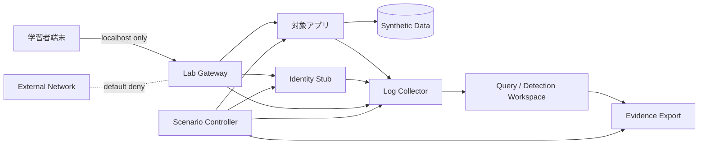

# 演習環境アーキテクチャ

## 1. 目的

演習を、実在第三者、本番環境、実データから切り離し、再現可能な証拠と成果物を作れる環境にする。

## 2. 標準実行環境

- Host: Windows 11 + WSL2 Ubuntu 24.04を第一候補
- Runtime: rootless Podman
- Orchestration: Podman Compose互換またはQuadlet。実装時に一つへ固定
- Storage: 演習専用ディレクトリ
- Network: 演習専用bridge。外向き通信は既定で無効
- Time: UTC保存、表示時にJSTへ変換
- Data: 合成データのみ
- Secrets: ダミー値のみ。`.env` は生成し、Gitへ登録しない

Docker互換環境も任意対応とするが、rootlessと隔離の安全要件を緩和しない。

## 3. 論理構成



### コンポーネント

| コンポーネント | 役割 |
|---|---|
| Lab Gateway | localhostからの入口、対象以外への通信制限 |
| Target Application | 意図的に設計したWeb/API/Agent演習対象 |
| Identity Stub | 合成ユーザー、Role、Token、Federation Eventを提供 |
| Synthetic Data | 架空企業・架空顧客・架空Secret |
| Log Collector | HTTP、Application、Identity、Audit Eventを収集 |
| Query Workspace | 検知、ハンティング、タイムライン作成 |
| Scenario Controller | 初期化、イベント生成、状態検査、破棄 |
| Evidence Export | JSONL、CSV、Markdown、Hash Manifestを生成 |

## 4. 演習Tier

### Tier 0: Document-only

- Threat Model
- RoE
- CTI分析
- Source Evaluation
- Executive Brief

実行環境を必要としない。

### Tier 1: Observation

- HTTP・Identity・Applicationログの読み取り
- 合成イベントの検索
- Timeline作成
- Detection Queryのテスト

対象への攻撃操作を行わない。

### Tier 2: Controlled Validation

- ローカルの意図的脆弱アプリに対する最小影響検証
- 合成アカウント間の認可差確認
- 無害な入力による挙動・ログ差の観測
- Control Validation

公開本文の標準上限とする。

### Tier 3: Optional Specialist Lab

- Malware Analysis
- Reverse Engineering
- Fuzzing
- Memory Corruption

本書の必修対象外。別の隔離設計と専門レビューが必要であり、原則として既存または将来の専門書へ委譲する。

## 5. データ設計

### 予約済み例示値

- Domains: `corp.example`, `lab.test`, `invalid.example`
- IPv4: `192.0.2.0/24`, `198.51.100.0/24`, `203.0.113.0/24`
- IPv6: `2001:db8::/32`
- Emails: `analyst@example.test`

### 合成データのルール

- 実在人物・企業の名称を混ぜない
- 生成規則とSeedを記録する
- 個人情報に見える値へ `synthetic: true` を付与する
- 演習ごとに期待イベントと不在イベントを定義する
- 同じデータセットから異なる仮説を検証できるようにする

## 6. Evidence Contract

各演習は次を出力する。

```text
evidence/<run-id>/
├── manifest.json
├── environment.json
├── scenario.json
├── events.jsonl
├── queries/
├── findings/
├── screenshots/        # 必要な場合のみ、秘密を含めない
├── hashes.sha256
└── report.md
```

`manifest.json` には、Run ID、開始・終了時刻、教材版、コンテナdigest、Scenario Seed、実行者、時刻基準、生成物を記録する。

## 7. ライフサイクル

```text
preflight
  → initialize
  → verify isolation
  → load synthetic data
  → start collection
  → execute scenario
  → export evidence
  → validate expected signals
  → destroy
  → verify cleanup
```

各段階が失敗した場合は次へ進めない。

## 8. 安全ゲート

### Preflight

- rootlessである
- 対象ポートがlocalhostへ限定される
- 外向き通信テストが失敗する
- mount先が演習ディレクトリ内である
- ダミーSecretだけが存在する

### Runtime

- CPU、Memory、Disk上限
- 実行時間上限
- Unexpected egress監視
- Signal collection health

### Cleanup

- Container、Network、Volumeが削除された
- Hostに不要なプロセスがない
- Credential fileが残っていない
- Evidenceだけが指定場所へ残る

## 9. 必修ラボ候補

| Lab | 主題 | Tier | 成果物 |
|---|---|---:|---|
| 0 | 環境と隔離の検証 | 1 | Lab Safety Record |
| 1 | HTTP・Identity・Application Signal | 1 | Signal Flow Diagram |
| 2 | 認証・認可の仮説評価 | 2 | Finding Report |
| 3 | Cloud/CI/CD合成権限グラフ | 0/1 | Attack Path Review |
| 4 | Telemetry Coverage | 1 | Coverage Map |
| 5 | Detection Engineering | 1 | Rule + Validation Record |
| 6 | Threat Hunt | 1 | Hunt Report |
| 7 | Incident Timeline | 1 | Timeline + RCA |
| 8 | OSINTとSource Evaluation | 0 | Evidence Table |
| 9 | CTIとStructured Analysis | 0 | CTI Report |
| 10 | AI Agent Security | 1/2 | Agent Threat Model |
| 11 | 統合ケース | 0〜2 | 最終ポートフォリオ |

## 10. 実装順序

1. Manifest SchemaとSafety Preflight
2. 合成データ生成
3. ログ収集とEvidence Export
4. Tier 1の観測ラボ
5. Tier 2の最小影響評価ラボ
6. 統合ケース

脆弱アプリの種類を先に増やさず、証拠・初期化・破棄・検知検証を先に成立させる。
