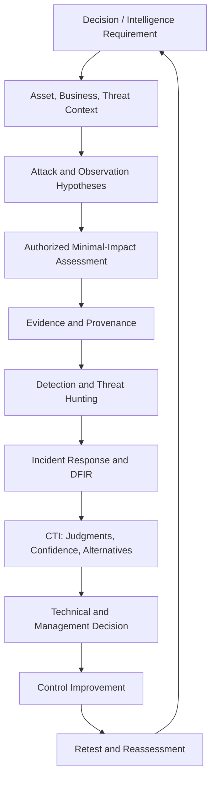

# Concept Map

## 四つの視点

| 視点 | 中心となる問い | 主な成果物 |
|---|---|---|
| 攻撃者 | 何を達成し、どの境界を越えるか | Attack Path、Behavior Map |
| 防御者 | どこで防止・観測・封じ込めるか | Telemetry Map、Detection、Control Plan |
| 分析者 | 何が事実で、どの説明が最も妥当か | Evidence Table、CTI Report |
| 意思決定者 | 何をいつ選び、どの残存リスクを負うか | Executive Brief、Risk Acceptance |

本書では、各成果物の入力と出力を追跡し、単独のツール操作やIOC一覧で学習を完了しない。
