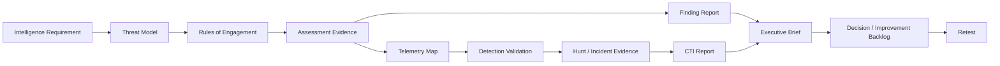

# 第0章　本書の読み方

## この章の位置付け

本書は、攻撃手法を順番に覚える本ではない。攻撃者の行動を理解し、許可された範囲で評価し、観測・検知・対応・分析・意思決定へつなげるための統合書である。

個々の技術は既存専門書と往復して学ぶ。本書では、分野間をつなぐ判断、証拠、成果物を中心に扱う。

## 学習目標

この章を終えると、次を実行できる。

- 自分の役割と目的に合う読書ルートを選ぶ
- 本書で作成する成果物の流れを説明する
- 演習可能な対象と禁止対象を区別する
- 既存専門書へ進み、本書の統合工程へ戻る方法を説明する
- `Learning Route Plan` を作成する

## 前提知識

Linux、TCP/IP、HTTP、Gitの基礎を前提とする。全てに熟達している必要はない。不足部分は、ポータルのLinux、インフラ、認証、クラウド、コンテナ書籍で補う。

## 1. 四種類の読者ルート

### 1.1 インフラ・クラウド技術者

推奨順:

```text
第0〜8章
  → 第12〜17章
  → 第19〜22章
  → 第23〜29章
```

Web・APIの詳細は必要に応じて第11章と `pentest-learning-book` へ進む。

### 1.2 開発・DevOps技術者

推奨順:

```text
第0〜8章
  → 第9〜17章
  → 第21〜22章
  → 第27〜29章
```

認証・認可の詳細は `practical-auth-book`、クラウド・コンテナの実装は関連専門書で補う。

### 1.3 SOC・CSIRT・セキュリティ分析者

推奨順:

```text
第0〜8章
  → 第16〜26章
  → 第9〜15章
  → 第27〜29章
```

先に観測・分析・対応を理解し、その後に攻撃評価の成立条件を学ぶ。

### 1.4 CTO・CISO・技術経営者

推奨順:

```text
第0〜5章
  → 第7章
  → 第15章
  → 第19章
  → 第22〜29章
```

詳細手順を全て実行する必要はない。ただし、RoE、Finding、CTI Report、Executive Briefの品質を判定できることを目標にする。

## 2. 成果物の流れ

本書の学習単位は章ではなく成果物である。



一つの成果物だけを完成させても、全体としては不十分である。例えば、脆弱性を発見しても、実際の資産への影響、検知可能性、修正優先度、残存リスクが示されなければ、意思決定には使いにくい。

## 3. 本書でいう「演習」

演習は、次のいずれかに限定する。

- 合成文書・合成ログを使う分析
- 自己所有の隔離ラボ
- 明示的に演習用として提供された対象
- 架空組織・架空キャンペーンのケーススタディ

第三者の公開Webサイトは、公開されているからといって演習対象ではない。検索結果に表示されたサーバ、GitHub上で見つけたSecret、インターネット上の管理画面を試してはならない。

## 4. 既存専門書との往復

本書は、詳細手順を意図的に委譲する。

```text
本書で目的・判断・成果物を理解する
  → 専門書で詳細技術を学ぶ
  → 許可されたラボで検証する
  → 本書へ戻り、検知・分析・経営判断へ接続する
```

専門書を先に読み切る必要はない。現在の成果物を完成させるために必要な範囲を学び、統合工程へ戻る。

## 5. 学習記録

各章で、最低限次を記録する。

| 項目 | 内容 |
|---|---|
| Question | 何を判断しようとしたか |
| Scope | 対象と対象外 |
| Evidence | 何を観測したか |
| Assumptions | 何を仮定したか |
| Judgment | 何を判断したか |
| Confidence | どの程度確信しているか |
| Gaps | 何が分からないか |
| Action | 次に何をするか |
| Safety | どの境界と停止条件を適用したか |

ツール名やコマンド履歴だけを学習記録にしない。

## 6. Learning Route Plan

次のテンプレートを埋める。

```markdown
# Learning Route Plan

- 現在の役割:
- 目標とする役割:
- 6か月後に作成できるようにする成果物:
- 強い前提知識:
- 補強が必要な前提知識:
- 最初に読む章:
- 委譲先の専門書:
- 使用するラボ:
- 禁止する対象・操作:
- 月次レビュー日:
- 学習の証拠:
```

## よくある誤解

### 「攻撃ツールを使えればホワイトハッカーである」

ツール操作は一部にすぎない。権限、スコープ、影響抑制、証拠、報告、修正、再評価までが業務である。

### 「公開情報なら自由に収集・利用できる」

公開状態と、目的外利用、個人情報集約、能動アクセス、再配布の適法性・妥当性は別問題である。

### 「ATT&CKのCoverage率が高ければ安全である」

Mappingが存在することと、必要Telemetryが取得でき、ルールが有効で、対応できることは別である。

### 「確信度が低い分析は価値がない」

情報ギャップと結論を変える条件が明示されていれば、不確実な状況でも意思決定に使える。

## 章のまとめ

- 本書は攻撃・防御・分析・経営判断をつなぐ統合書である
- 学習単位は成果物である
- 演習は許可された隔離環境と合成データに限定する
- 詳細技術は既存専門書で補い、本書へ戻って統合する
- 最初の成果物は `Learning Route Plan` である

## 次に学ぶこと

第1章で、Security Assessment、Detection、Incident Response、CTIを一つの意思決定ループとして整理する。

## 参考文献・Source Note ID

- `SRC-NICE-001`: 能力を職種名ではなくTask、Knowledge、Skill、成果物で扱うための参照
- `SRC-ATTACK-001`: ATT&CKの版と用語の参照

版と確認日は[Source Baseline](../references/reference-baseline.md)を参照する。
