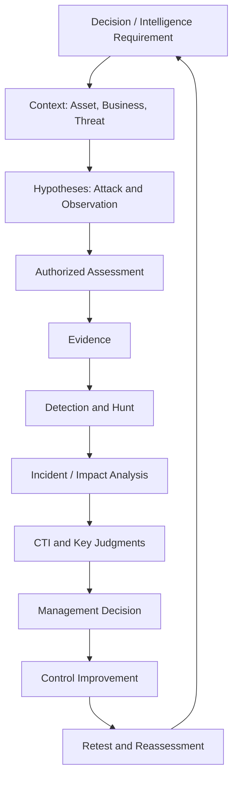

# 第1章　攻撃・防御・インテリジェンスを一つの業務として捉える

## この章の位置付け

セキュリティ分野では、「ホワイトハッカー」「SOC」「CSIRT」「脅威インテリジェンス」などの職種名が先に提示されることが多い。しかし、職種名だけでは、誰が何を入力として受け取り、どの成果物を作り、誰の判断を支えるかが明確にならない。

本章では、職種名ではなく、**判断・証拠・成果物の流れ**から全体を組み立てる。

## 学習目標

- Security Assessment、Detection、Incident Response、CTIの役割を区別できる
- 攻撃者、防御者、分析者、意思決定者の視点を接続できる
- 情報、観測、証拠、分析、判断を区別できる
- Threat-Informed Decision Loopを自組織へ適用できる
- `Integrated Security Workflow Map` を作成できる

## 前提知識

Linux、ネットワーク、Web、Cloudのいずれかについて、構成要素とログの基本を理解していることを前提とする。ATT&CK、NIST CSF、Incident Response、CTIの詳細知識は不要である。

## 導入ケース

架空企業A社は、顧客向けWebサービスと社内SaaSを運用している。ある日、同業他社を標的とする攻撃キャンペーンの報告を受け取った。報告には、攻撃者がクラウドIdentityとOAuthアプリの権限を悪用する可能性が記載されている。

A社には次の問いが発生する。

1. 報告はA社にも関係するのか
2. A社に同じ攻撃経路が存在するのか
3. 存在する場合、どこまで影響するのか
4. 現在のログで検知できるのか
5. すでに侵害されていないか
6. 何を、どの順で改善するべきか
7. 経営層は、停止、改修、監視強化、リスク受容のどれを選ぶべきか

この一連の問いは、単一の「ハッキング技術」では解けない。

## 1. 職種名より業務機能を見る

### 1.1 Security Assessment

Security Assessmentは、対象にどのような弱点、誤設定、攻撃経路が存在し、どの条件で影響が生じるかを評価する。

主な入力:

- 対象システムと業務要件
- Threat Model
- Rules of Engagement
- 設計、設定、コード、資産情報

主な出力:

- Evidence
- Finding
- Attack Path
- Remediation Proposal
- Retest Result

評価の目的は「侵入に成功すること」ではない。意思決定に必要な範囲で、成立条件と影響を安全に確認することである。

### 1.2 Detection and Threat Hunting

Detection Engineeringは、脅威行動を観測可能なSignalへ変換し、検知ロジックをテスト可能な形にする。

Threat Huntingは、既存のアラートだけに依存せず、攻撃仮説に基づいて環境を探索する。

主な入力:

- ATT&CK Behavior
- Assessment Evidence
- Telemetry
- IncidentやCTIから得た仮説

主な出力:

- Detection Hypothesis
- Data Requirement
- QueryまたはRule
- Validation Result
- Collection Gap
- Detection Backlog

「ルールを書いた」ことではなく、必要なイベントが取得され、期待する攻撃行動を検知でき、正常動作との区別を説明できることが成果である。

### 1.3 Incident Response and DFIR

Incident Responseは、疑わしい事象を安全かつ組織的に処理し、影響を抑え、復旧し、学習する。

DFIRは、証拠から何が起きたかを再構成し、侵入経路、影響範囲、原因、不確実性を明らかにする。

主な入力:

- Alert
- User Report
- Telemetry
- Asset Context
- CTI

主な出力:

- Incident Classification
- Timeline
- Scope Assessment
- Containment and Recovery Plan
- Root Cause Analysis
- Lessons Learned

### 1.4 Cyber Threat Intelligence

CTIは、脅威に関する情報を、特定の判断に使える分析へ変換する。

主な入力:

- Intelligence Requirement
- 一次資料、観測、ログ、報告
- 攻撃者、Campaign、Infrastructure、TTPに関する情報
- 組織固有の資産・露出・事業文脈

主な出力:

- Key Judgments
- Confidence
- Evidence and Source Evaluation
- Alternative Hypotheses
- Indicators and Signposts
- Technical Recommendations
- Strategic Implications

IOCの一覧や記事の要約だけでは、CTIとして不十分である。誰が何を判断するための分析かが必要になる。

## 2. 四つの視点

### 攻撃者の視点

- 何を達成しようとするか
- どの前提条件を利用するか
- どの信頼境界を越えるか
- どの権限、データ、Control Planeを狙うか

### 防御者の視点

- どこで防止できるか
- どこで観測できるか
- どのコントロールが有効か
- 失敗した場合にどこで封じ込めるか

### 分析者の視点

- 何が確認事実か
- 何を仮定しているか
- どの代替説明があるか
- 情報源はどの程度信頼できるか
- どの程度確信しているか

### 意思決定者の視点

- 何をいつ決める必要があるか
- 放置した場合の損失は何か
- 改修、監視、停止、移行、受容の選択肢は何か
- 必要な費用、時間、残存リスクは何か

四つの視点は、同じ事実を異なる目的で読む。

## 3. 情報、観測、証拠、分析、判断

| 段階 | 意味 | 例 |
|---|---|---|
| 情報 | 取得した内容 | ベンダー報告に特定TTPが記載されている |
| 観測 | 自環境またはラボで見えた事象 | OAuth同意イベントが記録された |
| 証拠 | 問いとの関係、取得条件、完全性を説明できる観測 | 時刻同期済み監査ログと設定Snapshot |
| 分析 | 証拠と仮定を使って説明を比較する | 正常な管理作業より、権限悪用仮説が整合する |
| 判断 | 期限と責任者を持つ選択 | 該当連携を停止し、対象Tokenを失効する |

ログが存在するだけでは証拠にならない。何を示し、何を示さず、取得漏れがどこにあるかを説明する必要がある。

## 4. Threat-Informed Decision Loop



### 4.1 Requirement

最初の問いは「どのツールを使うか」ではなく、「誰が何をいつまでに判断するか」である。

A社の例:

> CTOは48時間以内に、対象OAuth連携を停止すべきか判断する。

この問いによって、必要な情報、許容する不確実性、評価範囲が変わる。

### 4.2 Context

同じ脆弱性やTTPでも、資産、権限、露出、事業への依存により意味が異なる。

必要な文脈:

- 対象サービス
- データ分類
- Identityと権限
- 外部公開面
- 代替手段
- 顧客・法令・契約上の制約

### 4.3 Hypotheses

仮説は、検証可能な形にする。

悪い例:

> 攻撃されるかもしれない。

改善例:

> 特定のOAuthアプリが過大な権限を持ち、管理者同意が不正に取得された場合、顧客データへアクセスできる。監査ログには同意イベントとToken利用が残るはずである。

攻撃仮説と観測仮説を対にする。

### 4.4 Authorized Assessment

検証前に、対象、操作、データ、時間、停止条件を定める。必要な証拠を得るための最小操作を選ぶ。

### 4.5 Evidence

証拠は、結論を支えるだけでなく、反証可能性を残す。

- 設定Snapshot
- 合成アカウントによる挙動差
- Audit Event
- Source Code
- Policy Evaluation
- Timeline

### 4.6 Detection and Hunt

Assessmentで成立した攻撃経路を、観測と検知へ変換する。

- どのイベントが必要か
- どのフィールドが必要か
- 正常な管理操作とどう区別するか
- Eventが取得されない場合、何を改善するか

### 4.7 Incident and Impact Analysis

過去ログを調べ、同じ行動が存在したか、影響がどこまで及ぶかを評価する。見つからない場合も、「侵害がなかった」と断定せず、観測可能期間とログ欠落を明記する。

### 4.8 CTI and Key Judgments

外部脅威情報と自環境の証拠を統合する。

例:

- 当該CampaignがA社を直接標的にしている証拠はない
- ただし、報告されたTTPと同型の権限経路がA社に存在する
- 現在のログでは一部のToken利用を追跡できない
- したがって、標的判断とは独立に、権限縮小とTelemetry追加が必要である

### 4.9 Management Decision

決定は、分析の正しさを待って無期限に延期しない。選択肢、期限、残存リスクを明示する。

| 選択肢 | 利点 | 不利益 | 残存リスク |
|---|---|---|---|
| 連携を即時停止 | 攻撃面を早く除去 | 業務影響 | 既存Tokenの確認が別途必要 |
| 権限縮小 + 監視強化 | 業務継続 | 改修・監視負荷 | 未観測行動が残る可能性 |
| 現状維持 | 変更負荷がない | 露出継続 | 侵害時の影響が大きい |

### 4.10 Improvement and Retest

改善後に、コントロールと検知を再検証する。Issueを閉じたことではなく、攻撃経路が減り、必要Signalが取得され、判断が更新されたことを確認する。

## 5. 成果物間の契約

| 成果物 | 入力 | 次工程へ渡すもの |
|---|---|---|
| Threat Model | 資産、Data Flow、脅威 | Attack Path、Trust Boundary |
| RoE | 判断目的、対象、リスク | 許可範囲、停止条件 |
| Finding | 検証証拠 | 根本原因、影響、対策 |
| Telemetry Map | Attack Behavior | 必要Event、Gap |
| Detection Record | Rule、合成Event | 検知結果、限界 |
| Incident Timeline | Event、Artifact | 侵入経路、影響範囲 |
| CTI Report | 外部情報、自環境証拠 | Key Judgments、Confidence |
| Executive Brief | Finding、CTI、事業文脈 | 選択肢、推奨、残存リスク |

成果物の受け渡しが曖昧だと、チーム間で同じ調査を繰り返すか、重要な仮定が失われる。

## 6. よくある分断

### 6.1 Pentestが報告書で終了する

FindingがSIEM、Detection、Threat Modelへ反映されないため、次回も同じ攻撃経路を手作業で発見する。

### 6.2 SOCがアラート処理だけになる

アラート件数の削減が目的化し、どの攻撃仮説を検知しているかが失われる。

### 6.3 CTIがニュース配信になる

受信者の判断、資産、期限と接続されず、読まれて終わる。

### 6.4 経営判断がCVSSだけに依存する

外部露出、実悪用、資産価値、Attack Path、代替統制を反映できない。

### 6.5 AIが不確実性を消す

AI要約が複数情報源を一つの確定事実に統合し、出典の違い、矛盾、情報ギャップを失わせる。

## 7. 安全な演習

### 課題

架空企業A社のケースについて、次を一枚の図と表にする。

1. 判断主体と期限
2. Intelligence Requirement
3. 主要資産とTrust Boundary
4. 攻撃仮説
5. 観測仮説
6. 許可された検証
7. 必要Telemetry
8. CTIのKey Judgment
9. 経営上の選択肢
10. 再評価条件

### 禁止

- 実在OAuthアプリや実テナントを調査しない
- 実Tokenを取得・利用しない
- 実在攻撃主体への帰属を行わない

## 8. 作成する成果物

### Integrated Security Workflow Map

```markdown
# Integrated Security Workflow Map

## Decision Requirement
- Decision owner:
- Deadline:
- Decision:

## Context
- Critical assets:
- Trust boundaries:
- Business constraints:

## Hypotheses
- Attack hypothesis:
- Observation hypothesis:
- Alternative explanation:

## Authorized Validation
- In scope:
- Out of scope:
- Stop conditions:

## Evidence and Detection
- Evidence required:
- Telemetry required:
- Collection gaps:

## Intelligence
- Key judgment:
- Confidence:
- Information gaps:

## Decision and Reassessment
- Options:
- Recommended action:
- Residual risk:
- Reassessment trigger:
```

## 評価基準

- 判断対象と技術調査が接続している
- 攻撃仮説と観測仮説が対になっている
- 検証が許可範囲と最小影響を満たす
- 事実、仮定、判断が分離されている
- 結論を変える情報が明記されている
- 改善後の再評価条件がある

## 章のまとめ

- Security Assessment、Detection、IR、CTIは、別々の職種ではなく同じ判断ループの機能として接続できる
- 情報、観測、証拠、分析、判断を区別する
- 攻撃仮説と観測仮説を対にする
- 成果物間の入力と出力を明確にする
- 最終目的は侵入成功ではなく、リスクを理解し、抑え、判断できる状態を作ることである

## 次に学ぶこと

第2章では、技術的に可能な操作と、許可・契約・法・倫理の範囲で実施できる操作を分離する。

## 参考文献・Source Note ID

- `SRC-NICE-001`: NICE Framework
- `SRC-ATTACK-001`: MITRE ATT&CK
- `SRC-CSF-001`: NIST Cybersecurity Framework 2.0
- `SRC-IR-001`: NIST SP 800-61 Rev.3
- `SRC-ICD203-001`: Analytic Standards

版と確認日は[Source Baseline](../references/reference-baseline.md)を参照する。
