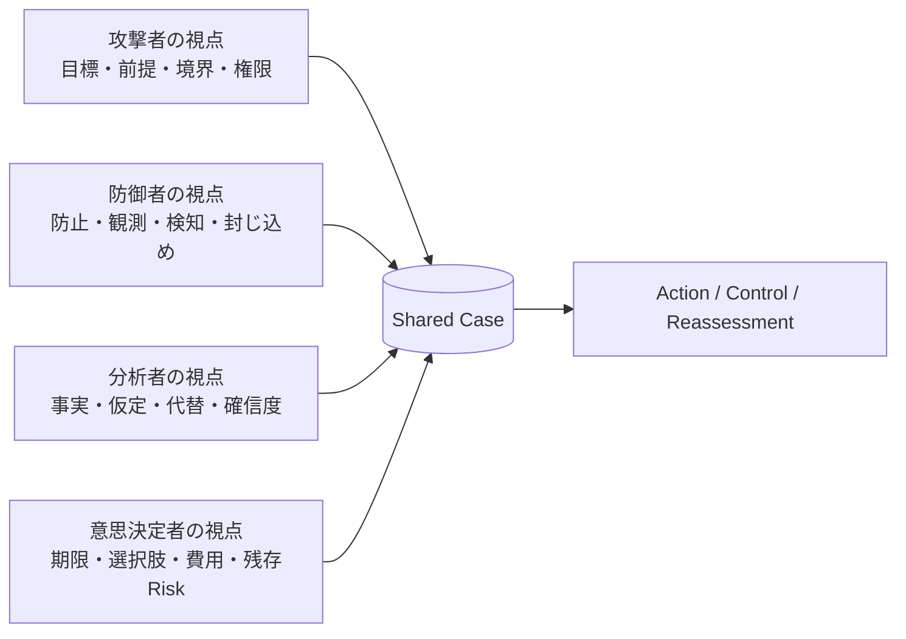
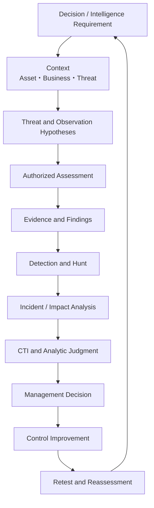
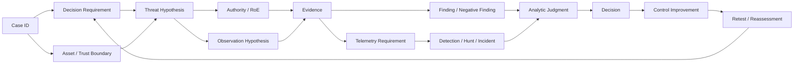

# 第1章　攻撃・防御・インテリジェンスを一つの業務として捉える

## この章の位置付け

セキュリティ分野では、「ホワイトハッカー」「SOC」「CSIRT」「脅威インテリジェンス」などの職種名が先に提示されることが多い。しかし、職種名だけでは、誰が何を入力として受け取り、どの成果物を作り、誰の判断を支えるかが明確にならない。

本章では、職種名ではなく、**判断、仮説、証拠、成果物、責任の流れ**から全体を組み立てる。

本書の中心は、攻撃手法を大量に覚えることではない。次の状態を作ることである。

> 関連する脅威を理解し、許可された範囲で成立条件を確認し、観測と検知へ変換し、影響と不確実性を分析し、責任者が期限内に判断し、改善後に再評価できる。

この章は、以後の全章で使用するCase ID、Hypothesis ID、Evidence ID、Decision IDの関係を定義する基準章でもある。

## 学習目標

- Security Assessment、Detection Engineering、Threat Hunting、Incident Response / DFIR、Cyber Threat Intelligenceの責任を区別できる
- 各機能が担当しないことを説明できる
- 攻撃者、防御者、分析者、意思決定者の四つの視点を接続できる
- 情報、観測、証拠、分析判断、意思決定を区別できる
- Threat-Informed Decision Loopを自組織へ適用できる
- 共通Case IDと成果物IDを使ってHandoff Contractを定義できる
- 件数指標とOutcome metricを区別できる
- `Integrated Security Workflow Map`を、具体的な`Integrated Security Case Map`として作成できる

## 前提知識

Linux、ネットワーク、Web、Cloudのいずれかについて、構成要素とLogの基本を理解していることを前提とする。ATT&CK、NIST CSF、Incident Response、CTIの詳細知識は不要である。

本章では個別の侵害手順を扱わない。詳細技術は後続章と既存専門書へ委譲し、ここでは機能間の接続、証拠、判断、再評価を扱う。

## 本章が所有する範囲

本書では、既存書籍との重複を避けるため、内容を`OWN`、`BRIDGE`、`DELEGATE`に分ける。

### OWN

本章が中心的な説明責任を持つ。

- Threat-Informed Decision Loop
- 共通Caseと識別子の関係
- 業務機能の責任と非責任
- Handoff Contract
- Outcome metric
- Integrated Security Case Map
- 技術成果物を意思決定へ変換する方法

### BRIDGE

本章では接続に必要な範囲を説明し、詳細は後続章または専門書へつなぐ。

- Security Assessment
- Detection EngineeringとThreat Hunting
- Incident ResponseとDFIR
- Cyber Threat Intelligence
- Rules of Engagement
- Evidence readiness
- Management decisionとRisk acceptance

### DELEGATE

本章では個別手順を再録しない。

- Web、API、Identity、Cloud、Containerの詳細なPentest手順
- OSやNetworkのHardening手順
- OAuth、OIDC、SAML、Kerberosの実装詳細
- 個別ProductのSIEM QueryやEDR操作
- Malware解析、Exploit開発、回避手法
- 一般的な障害対応と復旧Runbook

詳細な責任分担は[既存書籍との境界](../CROSS_BOOK_MAP.md)を参照する。

## 導入ケース

架空のExample Commerce社は、顧客向けWebサービスと社内SaaSを運用している。ある日、同業他社を標的とする攻撃Campaignの報告を受け取った。報告には、Cloud IdentityとOAuthアプリの権限が悪用される可能性が記載されている。

Example Commerce社には次の問いが発生する。

1. 外部報告は自社にも関係するのか
2. 自社に同型の攻撃経路が存在するのか
3. 存在する場合、どこまで影響するのか
4. 現在のTelemetryで検知できるのか
5. すでに同型の事象が発生していないか
6. 何を、どの順で改善するべきか
7. 経営層は、停止、改修、監視強化、Risk acceptanceのどれを選ぶべきか

この一連の問いは、単一の「ハッキング技術」では解けない。

- 外部報告を読むだけでは、自社への関連性が分からない。
- 診断するだけでは、継続的な検知が成立しない。
- Alertを見るだけでは、根本原因や事業影響が分からない。
- Actor名を付けるだけでは、何を決めるべきか分からない。
- 改修Issueを閉じるだけでは、Controlが有効になったか分からない。

必要なのは、同じCaseを複数の機能が引き継ぎ、共通の証拠と識別子を使って判断まで接続する仕組みである。

## 1. 職種名より業務機能を見る

組織図上の名称は会社によって異なる。小規模組織では一人が複数機能を担い、大規模組織では一つの機能が複数Teamへ分かれる。

NICE FrameworkはCybersecurity workをTask、Knowledge、Skillなどの構成要素で扱う。本書も、肩書ではなく、入力、処理、出力、責任で機能を捉える。`SRC-NICE-001`

### 1.1 Security Assessment

Security Assessmentは、対象にどのような弱点、誤設定、攻撃経路が存在し、どの条件で影響が生じるかを、許可された範囲で評価する。

主な入力:

- Decision Requirement
- 対象Systemと業務要件
- Threat Model
- Rules of Engagement
- 設計、設定、Code、Asset情報
- 関連するThreat behavior

主な出力:

- Evidence
- Finding
- Attack Path
- Control Gap
- Remediation proposal
- Retest result

Assessmentの目的は「侵入に成功すること」ではない。意思決定に必要な範囲で、成立条件、影響、観測点、対策を安全に確認することである。

Assessmentは次を担当しない。

- 許可範囲外の探索
- 事業Riskの最終受容
- Alertの常時監視
- 不十分な証拠によるActor attribution
- 改修が有効であるという未検証の保証

### 1.2 Detection Engineering

Detection Engineeringは、Threat behaviorを観測可能なSignalへ変換し、Detection logicをTest可能で保守可能な形にする。

主な入力:

- Threat Hypothesis
- ATT&CK等で記述したBehavior
- Assessment Evidence
- Telemetry
- IncidentやCTIから得た仮説

主な出力:

- Detection Hypothesis
- Data Requirement
- QueryまたはRule
- Test fixture
- Validation result
- Collection Gap
- Detection backlog
- Triage guidance

成果は「Ruleを書いたこと」ではない。必要なEventが取得され、期待するBehaviorを検知でき、正常動作との区別、適用範囲、限界を説明できることである。

Detection Engineeringは次を担当しない。

- すべてのThreatを単一Ruleで検知すること
- Logがない環境での断定
- Alert件数だけによる有効性評価
- Incidentの最終Scope確定
- Control ownerに代わるRisk acceptance

### 1.3 Threat Hunting

Threat Huntingは、既存Alertだけに依存せず、検証可能な仮説に基づいて環境を探索する。

主な入力:

- Hunt Hypothesis
- Telemetry Coverage
- Known Detection Gap
- Assessment、Incident、CTIから得たPivot

主な出力:

- Hunt result
- Evidence Artifact
- Negative Finding
- New Detection requirement
- Collection Gap
- Escalation candidate

Huntで対象事象が見つからなかった場合、直ちに「侵害はなかった」と結論してはいけない。検索期間、Data source、Field、保持期間、Sampling、Queryの限界を記録する。

### 1.4 Incident Response and DFIR

Incident Responseは、疑わしい事象を組織的に処理し、影響を抑え、復旧し、学習する。

DFIRは、複数のEvidenceから何が起きたかを再構成し、侵入経路、影響範囲、原因、不確実性を明らかにする。

主な入力:

- Alert
- User report
- Telemetry
- Asset context
- CTI
- Rules of EngagementまたはIncident authority

主な出力:

- Incident classification
- Timeline
- Scope assessment
- Containment and recovery plan
- Root Cause Analysis
- Lessons learned
- Evidence and Telemetry requirements

NIST SP 800-61 Rev.3はIncident Responseを、準備された単独手順ではなく、Cybersecurity Risk Managementへ統合する考え方で整理している。本書では、IRの結果をGovern、Identify、Protect、Detect、Respond、Recoverの改善へ戻す。`SRC-CSF-001` `SRC-IR-001`

IR / DFIRは次を担当しない。

- Evidenceがない期間についての不存在証明
- 法務、Privacy、広報、経営の最終判断の代行
- Root cause未確認のままの恒久対策保証
- 技術的類似だけによるActor attribution

### 1.5 Cyber Threat Intelligence

CTIは、Threatに関する情報を、特定の利用者が期限内に判断できる分析へ変換する。

主な入力:

- Intelligence Requirement
- 一次資料、観測、Log、報告
- Actor、Campaign、Infrastructure、TTPに関する情報
- 組織固有のAsset、露出、事業文脈
- Assessment、Detection、IncidentのEvidence

主な出力:

- Key Judgments
- Confidence
- Evidence and Source Evaluation
- Alternative Hypotheses
- Indicators and Signposts
- Information Gaps
- Technical recommendations
- Strategic implications

IOCの一覧や記事の要約だけではCTIとして不十分である。誰が何を判断するための分析か、事実と判断をどう分けたか、何が結論を変えるかが必要になる。分析基準として、Source quality、不確実性、仮定、代替分析、論理的説明を明示する。`SRC-ICD203-001`

CTIは次を担当しない。

- 情報量の多さを分析品質とみなすこと
- Campaign名やActor名の付与を目的化すること
- 確信度を省略した断定
- Decision ownerに代わる事業判断
- 不足EvidenceをAI要約で埋めること

### 1.6 Management Decision and Risk Ownership

意思決定者は、技術Teamの結論を受け取るだけではない。判断対象、期限、許容する不確実性、選択肢、残存Riskを明示する。

主な入力:

- Decision Requirement
- Finding、Incident、CTI、Business context
- Cost、時間、停止影響、代替手段
- Residual Risk

主な出力:

- Decision Record
- Priority
- Resource allocation
- Risk acceptanceまたはRisk treatment
- Communication scope
- Reassessment Trigger

意思決定者は技術的事実を改変してはならず、技術Teamは事業判断を暗黙に代行してはならない。

## 2. 業務機能の責任と非責任

### T-01-01　業務機能の責任と非責任

| 機能 | 主責任 | 受け取るもの | 渡すもの | 担当しないこと |
|---|---|---|---|---|
| Assessment | 成立条件、影響、Control Gapの確認 | Scope、RoE、Hypothesis、Asset context | Evidence、Finding、Attack Path | 常時監視、Riskの最終受容 |
| Detection Engineering | BehaviorをSignalとTestへ変換 | Hypothesis、Telemetry、Evidence | Rule、Test、Coverage、Gap | Incident Scopeの最終確定 |
| Threat Hunting | 仮説に基づく探索 | Hunt Hypothesis、Coverage、Pivot | Finding、Negative Finding、Gap | 不十分なCoverageでの不存在断定 |
| IR / DFIR | 封じ込め、復旧、事実再構成 | Alert、Evidence、Authority | Timeline、Scope、RCA、改善要求 | 経営・法務判断の代行 |
| CTI | Threat情報を判断可能な分析へ変換 | Requirement、Source、内部Evidence | Judgment、Confidence、Alternatives | Actor名の付与自体の目的化 |
| Decision owner | 選択、優先順位、Risk ownership | 技術・分析成果物、事業制約 | Decision、資源、期限、再評価条件 | 技術的事実の書換え |
| Control owner | 改善の実装と検証 | Decision、Finding、Acceptance criteria | Control、Retest Evidence | Issue closeだけによる完了宣言 |

この表は組織図ではない。一人が複数行を担当してもよい。ただし、同じ人物が担当する場合でも、Evidenceを作る役割、判断する役割、最終Reviewを行う役割を文書上で分ける。

## 3. 四つの視点を共有Caseへ接続する

### F-01-01　四つの視点と共有Case



文章代替:

1. 攻撃者の視点は、達成目標、必要な前提条件、越える信頼境界、狙う権限をCaseへ登録する。
2. 防御者の視点は、防止点、観測点、Detection、Containmentを同じCaseへ登録する。
3. 分析者の視点は、事実、仮定、代替仮説、情報ギャップ、確信度を登録する。
4. 意思決定者の視点は、期限、選択肢、費用、残存Risk、再評価条件を登録する。
5. 四つの視点は別々の報告書で終了せず、共通CaseからAction、Control improvement、Reassessmentへ進む。

### 攻撃者の視点

- 何を達成しようとするか
- どの前提条件を利用するか
- どのTrust Boundaryを越えるか
- どのIdentity、Data、Control Planeを狙うか
- どの操作が観測される可能性があるか

### 防御者の視点

- どこで防止できるか
- どこで観測できるか
- どのControlが有効か
- 失敗した場合にどこで封じ込めるか
- どのTelemetry Gapが判断を妨げるか

### 分析者の視点

- 何が確認事実か
- 何を仮定しているか
- どのAlternative Hypothesisがあるか
- SourceとEvidenceはどの程度信頼できるか
- どの程度確信しているか
- 何が結論を変えるか

### 意思決定者の視点

- 何をいつまでに決める必要があるか
- 放置した場合の損失は何か
- 改修、監視、停止、移行、受容の選択肢は何か
- 必要な費用、時間、残存Riskは何か
- いつ判断を再評価するか

四つの視点は、同じEvidenceを異なる目的で読む。そのため、共有Caseには元Evidenceと分析判断を混在させず、IDで関係付ける。

## 4. 情報、観測、証拠、分析判断、意思決定

| 段階 | 意味 | Example Commerce社の例 |
|---|---|---|
| 情報 | 取得した内容 | Vendor報告に特定TTPが記載されている |
| 観測 | 自環境またはLabで見えた事象 | OAuth同意Eventが記録された |
| 証拠 | 問いとの関係、取得条件、完全性、限界を説明できる観測 | 時刻同期済みAudit Logと設定Snapshot |
| 分析判断 | Evidence、Source、仮定、代替説明を比較した結論 | 正常な管理作業より権限悪用仮説が整合する |
| 意思決定 | 期限と責任者を持つ選択 | 連携を一時停止し、権限縮小後に再開する |

Logが存在するだけではEvidenceにならない。何を示し、何を示さず、取得漏れがどこにあるかを説明する必要がある。

同様に、Evidenceがあっても、自動的にDecisionが決まるわけではない。停止による損失、代替手段、法的義務、顧客影響、復旧時間を含めて選択する必要がある。

## 5. Threat-Informed Decision Loop

ATT&CKは、実際に観測されたAdversary behaviorを共通言語で記述するために利用できる。ただし、Technique数の多さやCoverage率だけでRiskを決めるものではない。Asset context、Observation、Control、Decision Requirementへ接続する。`SRC-ATTACK-001`

### F-01-02　Threat-Informed Decision Loop



文章代替:

1. 判断主体、判断内容、期限を定義する。
2. Asset、Business、ThreatのContextを整理する。
3. Threat HypothesisとObservation Hypothesisを対にする。
4. 許可された最小操作で成立条件を確認する。
5. EvidenceとFindingを作る。
6. 必要Telemetry、Detection、Huntへ変換する。
7. Incidentと影響範囲を評価する。
8. 外部情報と内部Evidenceを統合し、Confidence付きAnalytic Judgmentを作る。
9. Decision ownerが選択肢とResidual Riskを記録する。
10. Controlを改善し、RetestとReassessmentの結果を次のRequirementへ戻す。

### 5.1 Requirement

最初の問いは「どのToolを使うか」ではなく、「誰が何をいつまでに判断するか」である。

Example Commerce社の例:

> CTOは48時間以内に、対象OAuth連携を停止すべきか、権限縮小と監視強化で継続すべきか判断する。

この問いによって、必要な情報、許容する不確実性、評価範囲、停止条件が変わる。

### 5.2 Context

同じVulnerabilityやTTPでも、Asset、Identity、権限、露出、事業依存により意味が異なる。

必要なContext:

- 対象ServiceとBusiness process
- Data classification
- Identityと権限
- Trust Boundary
- 外部公開面
- 代替手段
- 顧客、法令、契約上の制約
- Recovery objective

### 5.3 Threat and Observation Hypotheses

Threat Hypothesisは、成立条件と影響を検証可能な形にする。

悪い例:

> 攻撃されるかもしれない。

改善例:

> OAuthアプリが業務要件を超える権限を持ち、Credentialが不正利用された場合、顧客Dataへ広範にAccessできる。

Observation Hypothesisは、その仮説が成立した場合に何が見えるはずかを定義する。

> 設定Snapshotには過大Scopeが存在する。Admin consent、Credential変更、Token利用に対応するEventがAudit Logへ残るはずである。

Threat HypothesisとObservation Hypothesisを対にすることで、単なる想像をTest planへ変換できる。

### 5.4 Authorized Assessment

検証前に、対象、操作、Data、時間、停止条件、Cleanupを定める。必要なEvidenceを得るための最小操作を選ぶ。

許可されていても、判断に不要な高影響操作は行わない。Proof of VulnerabilityとProof of Impactを区別し、十分なEvidenceが得られた時点で停止する。

### 5.5 Evidence and Finding

Evidenceは、結論を支えるだけでなく、反証可能性を残す。

- 設定Snapshot
- 合成Accountによる挙動差
- Audit Event
- Source Code
- Policy evaluation
- Timeline
- Hashと取得条件

FindingはEvidenceの要約ではない。Root condition、成立条件、Business impact、既存Control、Treatment option、Retest条件を持つ。

### 5.6 Detection and Hunt

Assessmentで確認したAttack Pathを、ObservationとDetectionへ変換する。

- どのEventが必要か
- どのFieldが必要か
- 正常な管理操作とどう区別するか
- Test fixtureは何か
- Eventが取得されない場合、誰がいつ改善するか

Huntで見つからなかった場合はNegative Findingとして記録し、検索期間とCoverageを併記する。

### 5.7 Incident and Impact Analysis

過去Logを調べ、同じBehaviorが存在したか、影響がどこまで及ぶかを評価する。見つからない場合も、「侵害がなかった」と断定せず、観測可能期間とLog欠落を明記する。

Incidentが確認された場合は、ContainmentとRecoveryだけで終了せず、Root cause、Control Gap、Detection Gap、Evidence readinessを次の改善へ渡す。

### 5.8 CTI and Analytic Judgment

外部Threat情報と自環境のEvidenceを統合する。

例:

- 当該Campaignが自社を直接標的にしているEvidenceはない
- ただし、報告されたBehaviorと同型の権限経路が自社に存在する
- 現在のTelemetryでは一部の利用を追跡できない
- したがって、標的判断とは独立に、権限縮小とTelemetry追加が必要である

この書き方では、Actor attributionとControl improvementを分離できる。帰属が不確実でも、関連するAttack Pathが確認されれば対策できる。

### 5.9 Management Decision

Decisionは、分析の完全性を待って無期限に延期しない。選択肢、期限、Residual Risk、Reassessment Triggerを明示する。

| 選択肢 | 利点 | 不利益 | Residual Risk |
|---|---|---|---|
| 連携を即時停止 | 攻撃面を早く除去 | Business impact | 既存Tokenや過去利用の確認が別途必要 |
| 権限縮小 + 監視強化 | 業務継続 | 改修・監視負荷 | 未観測Behaviorが残る可能性 |
| 現状維持 | 変更負荷がない | 露出継続 | Incident時の影響が大きい |

### 5.10 Improvement and Reassessment

改善後にControlとDetectionを再検証する。Issueを閉じたことではなく、Attack Pathが減り、必要Signalが取得され、Decisionが更新されたことを確認する。

Reassessment Triggerの例:

- ScopeやCredentialの変更
- Vendor仕様変更
- 新しい関連Threat情報
- Detection Alert
- Incident
- 定期Review期限
- Control test失敗

## 6. 共通Caseと識別子

Team間の分断は、文書の不足だけでなく、同じ対象を別名で扱うことから発生する。本書ではCase IDをRootとして、成果物をIDで接続する。

### 6.1 最小識別子Set

| ID | 対象 | 例 |
|---|---|---|
| Case ID | 一連の判断とEvidenceを束ねる単位 | `CASE-2026-001` |
| Decision Requirement ID | 判断主体、期限、問い | `DR-2026-001` |
| Asset ID | Asset、Service、Control Plane | `ASSET-2026-001` |
| Threat Hypothesis ID | 成立条件と影響の仮説 | `TH-2026-001` |
| Observation Hypothesis ID | 期待Signalと反証条件 | `OBS-2026-001` |
| Authority / RoE ID | 許可、禁止、停止条件 | `ROE-2026-001` |
| Evidence ID | 取得条件と完全性を持つArtifact | `EVD-2026-001` |
| Finding ID | Root conditionとBusiness impact | `FIND-2026-001` |
| Telemetry ID | 必要EventとField | `TEL-2026-001` |
| Detection / Hunt / Incident ID | 観測と対応の記録 | `DET-2026-001` |
| Analytic Judgment ID | Confidence付き判断 | `AJ-2026-001` |
| Decision ID | 選択肢とResidual Risk | `DEC-2026-001` |
| Control ID | 改善とVerification | `CTRL-2026-001` |
| Reassessment ID | 再評価の期限とTrigger | `REA-2026-001` |

IDの形式そのものより、関係が追跡できることが重要である。既存Ticket SystemのIDを利用してもよい。ただし、EvidenceやDecisionを本文中の曖昧な表現だけで参照しない。

### F-01-03　Integrated Security Case MapのTraceability



文章代替:

1. Case IDが一連の作業を束ねる。
2. Decision RequirementとAsset contextからThreat Hypothesisを作る。
3. Threat HypothesisにObservation HypothesisとAuthorityを接続する。
4. 許可された検証からEvidenceを取得する。
5. EvidenceからFinding、Negative Finding、Telemetry Requirementを作る。
6. Detection、Hunt、Incidentの結果をAnalytic Judgmentへ渡す。
7. Decision ownerが選択を記録し、Control improvementへつなぐ。
8. RetestとReassessmentの結果を次のDecision Requirementへ戻す。

### 6.2 状態遷移

Caseは次の状態を持つ。

```text
Draft
  → Active
  → Decision Recorded
  → Control Verification
  → Reassessment Due
  → Closed
```

`Closed`は、すべての不確実性が消えた状態ではない。Decision、Residual Risk、Control result、Reassessment Triggerが記録され、次の責任者が明確な状態である。

### 6.3 Integrated Security Workflow Mapとの関係

`book-config.json`では、学習成果として`Integrated Security Workflow Map`を`Case Map`へ適用できることを定義している。本章では、そのWorkflowを実際のCaseへ適用し、EvidenceとDecisionを保持する成果物を`Integrated Security Case Map`と呼ぶ。

- Workflow Map: 機能と流れの一般形
- Case Map: 特定Caseに対するID、Evidence、判断、責任の実体

読者はCase Mapを作ることで、Workflow Mapを実務へ適用する。

## 7. Handoff Contract

Team間の「連携不足」は、受渡し条件が定義されていない問題であることが多い。Handoff Contractは、提供側と受領側の間で、最低限必要な内容と差戻し条件を定義する。

### T-01-02　Handoff Contract

| From | To | 必須入力 | Acceptance criteria | 差戻し条件 |
|---|---|---|---|---|
| CTI | Assessment | Requirement、Behavior、Source quality、Confidence | 自社Assetへ適用可能な仮説がある | Actor名とIOCだけで判断目的がない |
| Assessment | Detection | Threat / Observation Hypothesis、Evidence、必要Event | Behavior、Data source、Fieldが特定される | 「不審なActivityを監視」のようにTest不能 |
| Detection / Hunt | IR | Case ID、Alert context、Coverage、Query version、Evidence | 時間範囲とGapが明記される | Coverage不明、時刻不明、Source不明 |
| IR / DFIR | CTI | Timeline、Scope、Observed TTP、Evidence limitation | 事実と推定が分離される | 未確認のActor attribution |
| CTI / Security | Decision owner | Judgment、Confidence、Alternatives、Options | 期限、選択肢、Residual Riskがある | 単一推奨だけでTrade-offがない |
| Decision owner | Control owner | Decision、Priority、Owner、Due date、Verification | 完了条件とRetest方法がある | 「監視強化」など具体性がない |
| Control owner | Reassessment owner | 実装Evidence、Test result、Known limitation | DecisionとFindingへ追跡できる | Issue closeだけでTest resultがない |

### 7.1 Handoffで保持するもの

- Case ID
- ProviderとConsumer
- 提供ArtifactとVersion
- Evidence IDとIntegrity情報
- Source classification
- 必須Field
- Acceptance criteria
- Rejection / return condition
- Deadline
- Data handling condition

### 7.2 差戻しを失敗とみなさない

Acceptance criteriaを満たさない成果物を差し戻すことは、Team間対立ではない。不完全な情報が次工程で確定事実へ変換されることを防ぐControlである。

## 8. Outcome metric

Security活動は件数で管理しやすい。

- Finding数
- Alert数
- Rule数
- IOC数
- Report数
- Closed ticket数

しかし、件数増加はRisk低減を意味しない。Alertを増やしても判断が遅くなれば逆効果である。Findingを増やしても同じRoot causeを繰り返していれば改善していない。

### T-01-03　Outcome metricと件数指標の区別

| 測定対象 | 件数指標の例 | Outcome metricの例 |
|---|---|---|
| Assessment | Finding数 | Critical Attack Pathの削減、Retest合格率 |
| Detection | Rule数、Alert数 | 対象Behaviorの検知可能性、Test成功率、Triage可能性 |
| Hunting | Query数 | 重要仮説のEvidence coverage、Gapの責任者と期限 |
| IR | Closed Incident数 | Containmentまでの時間、再発ControlのVerification |
| CTI | Report数、IOC数 | Decisionに利用された割合、判断期限への寄与 |
| Management | 会議数 | Decision latency、Residual Riskの明示率 |
| Governance | Closed Issue数 | Reassessment期限遵守率、再発率 |

### 8.1 推奨する共通Metric

#### Decision latency

Decision Requirementが登録されてからDecision Recordが承認されるまでの時間。

#### Critical hypothesis evidence coverage

優先度の高いHypothesisのうち、Evidence、Negative Finding、または責任者と期限を持つInformation Gapへ接続された割合。

#### Verified control improvement rate

実装済みと報告されたControlのうち、定義したRetestで有効性を確認できた割合。

#### Reassessment timeliness

期限が到来したReassessmentのうち、期限内に実施された割合。

### 8.2 Metricの注意点

- 単一Metricを個人評価へ直結させない。
- Coverageを増やすために低価値Hypothesisを追加しない。
- Decision latencyを短くするためにEvidence品質を下げない。
- 確信度「高」を目標値にしない。確信度「低」でも、期限内にGapとOptionを示せることがある。
- 数値とともにScope、期間、Data qualityを記録する。

## 9. 合成Caseで全体を確認する

第1章の合成記入例では、請求書連携OAuthアプリの過大権限を扱う。

[合成記入例：請求書連携OAuthアプリの権限見直し](../cases/ch01-integrated-security-case-example.md)

Caseの要点:

- CTOが48時間以内に継続、縮小、停止を判断する。
- Production Dataを使用せず、設定Reviewと合成Tenantだけで検証する。
- 過大Scopeは直接確認する。
- 過去の不正利用はTelemetry Gapにより断定しない。
- Actor attributionとは独立に、権限縮小と観測改善を決める。
- Control実装後にRetestと30日後のReassessmentを行う。

このCaseは、攻撃技法の再現ではなく、判断とEvidenceのTraceabilityを学ぶためのものである。

## 10. よくある分断と改善

### 10.1 Assessmentが報告書で終了する

問題:

FindingがSIEM、Detection、Threat Modelへ反映されず、次回も同じAttack Pathを手作業で発見する。

改善:

- Finding IDへThreat HypothesisとTelemetry Requirementを接続する。
- Detection ownerとRetest ownerを決める。
- CaseをDecision Recordedで終わらせず、Control Verificationへ移す。

### 10.2 SOCがAlert処理だけになる

問題:

Alert件数の削減が目的化し、どのThreat Hypothesisを検知しているかが失われる。

改善:

- AlertをCase ID、Detection ID、Threat Hypothesis IDへ接続する。
- False Positiveだけでなく、Data GapとFalse Negative riskを記録する。
- Ruleの存在ではなくTest resultを管理する。

### 10.3 CTIがNews配信になる

問題:

受信者のDecision、Asset、期限と接続されず、読まれて終わる。

改善:

- Intelligence Requirementを先に定義する。
- External ThreatとInternal Evidenceを分ける。
- Key Judgment、Confidence、Alternative、Signpostを記録する。

### 10.4 Management decisionがCVSSだけに依存する

問題:

外部露出、実悪用、Asset value、Attack Path、代替Control、停止影響を反映できない。

改善:

- Scoreを一つのInputとして扱う。
- Option、Cost、Residual Risk、DeadlineをExecutive Briefへ含める。
- Reassessment Triggerを定義する。

### 10.5 AIが不確実性を消す

問題:

AI要約が複数Sourceを一つの確定事実に統合し、Sourceの違い、矛盾、Information Gapを失わせる。

改善:

- Source IDとEvidence IDを保持する。
- Fact、Assumption、Judgment、RecommendationをFieldで分ける。
- AI出力をEvidenceとして扱わない。
- Alternative Hypothesisを人間がReviewする。

### 10.6 Issue closeがControl verificationを置き換える

問題:

設定変更やCode mergeだけで完了とし、Attack PathとDetectionが再検証されない。

改善:

- Control IDへVerification methodを持たせる。
- Retest Evidenceを必須にする。
- 未解決GapはReassessmentへ引き継ぐ。

## 11. 安全な演習

### 課題

架空組織のCaseについて、[Integrated Security Case Mapテンプレート](../templates/integrated-security-case-map.md)を使用し、次を記入する。

1. Decision owner、Decision、Deadline
2. 主要AssetとTrust Boundary
3. Threat Hypothesis
4. Observation Hypothesis
5. Authorityと禁止操作
6. 必要Evidence
7. TelemetryとCollection Gap
8. Detection、Hunt、Incidentの接続
9. Key Judgment、Confidence、Alternative Hypothesis
10. Decision optionとResidual Risk
11. Control improvementとRetest
12. Reassessment Trigger
13. Handoff Contract
14. Outcome metric

### 使用するData

- 合成組織
- `.example`または`.test` Domain
- 合成Account
- 無害化した設定Snapshot
- 合成Audit Event
- 文書用IP Addressが必要な場合は予約済み範囲

### 禁止

- 実在OAuthアプリや実Tenantを調査しない
- 実Tokenを取得・利用しない
- 第三者SystemへScan、認証試行、Accessを行わない
- 実在Actorへの帰属を行わない
- Production Dataを演習へ複製しない
- Detectionを試すためにMalware、Persistence、Evasionを実行しない

### Stop condition

次のいずれかが発生した場合は演習を停止する。

- 想定外の外向き通信
- 実Credentialまたは個人情報の混入
- 合成環境外への操作
- 許可されていない権限変更
- Cleanup不能なResource生成
- Evidence分類を判断できない状態

## 12. 作成する成果物

本章の中心成果物は`ART-10 Integrated Security Case Map`である。

- [空Template](../templates/integrated-security-case-map.md)
- [第1章の合成記入例](../cases/ch01-integrated-security-case-example.md)
- [成果物索引](../artifact-index.md)

Case Mapは各専門成果物を置き換えない。Finding Report、Detection Validation Record、Incident Timeline、CTI Report、Executive BriefをCase IDと関連IDで接続する。

### 最小完成条件

- Decision RequirementにOwnerとDeadlineがある
- Threat HypothesisとObservation Hypothesisが対になっている
- Authority、Scope、Stop conditionがある
- FindingとJudgmentがEvidence IDへ追跡できる
- Negative FindingにCoverageとGapがある
- DecisionにOptionとResidual Riskがある
- ControlにVerification methodがある
- Reassessment Triggerがある
- HandoffにAcceptance criteriaとReturn conditionがある

## 13. 評価基準

### 技術

- Asset、Trust Boundary、Identity、Data、Control Planeの関係が矛盾していない
- Threat Hypothesisに成立条件とImpactがある
- Observation Hypothesisが取得可能なSignalへ落ちている
- FindingがRoot conditionとEvidenceを持つ

### 安全性

- 明示的なAuthorityとScopeがある
- 高影響操作を必要としない
- Stop、Cleanup、Evidence retentionがある
- 実Credential、個人情報、第三者Targetを含まない

### Evidence

- Provenance、時刻、Integrity、Limitationがある
- Negative Findingが不存在証明として扱われていない
- SourceとInternal Evidenceが区別されている

### 分析

- Fact、Assumption、Judgmentが分かれている
- Alternative Hypothesisがある
- ConfidenceとBasisがある
- 結論を変える条件がある

### 意思決定

- Decision ownerとDeadlineがある
- 複数OptionとTrade-offがある
- Residual RiskとRisk ownerがある
- Action ownerとDue dateがある

### 継続改善

- Retest methodがある
- Outcome metricが件数だけではない
- Reassessment Triggerがある
- Handoff Contractがある

## よくある誤解

### 「統合する」とは一つの巨大Teamを作ることである

違う。専門性と独立性は維持する。統合するのは、Case、Evidence、識別子、Handoff、Decisionである。

### ATT&CKへMappingすればThreat-Informedになる

違う。ATT&CK MappingはBehaviorの共通言語であり、自組織のAsset、Exposure、Telemetry、Decisionへ接続して初めてThreat-Informedになる。

### Logを検索して何もなければ安全である

違う。Negative Findingは、検索範囲で対象事象を観測しなかったという結果であり、CoverageとGapを伴う。

### 確信度「高」になるまでDecisionしてはいけない

違う。期限と損失を考慮し、確信度「低」または「中」でも、Option、Gap、Residual Riskを明示してDecisionする場合がある。

### Controlを実装すればCaseを閉じられる

違う。Verification、Retest、Residual Risk、Reassessment Triggerが必要である。

## 章のまとめ

- Security Assessment、Detection Engineering、Threat Hunting、IR / DFIR、CTI、Management decisionは、同じ判断Loopの異なる機能として接続できる
- 職種名ではなく、入力、出力、責任、非責任を見る
- 攻撃者、防御者、分析者、意思決定者の四つの視点を共有Caseへ接続する
- 情報、観測、Evidence、Analytic Judgment、Decisionを区別する
- Threat HypothesisとObservation Hypothesisを対にする
- Case IDをRootとしてEvidence、Finding、Detection、Judgment、Decision、Reassessmentを追跡する
- Handoff Contractで受入条件と差戻し条件を定義する
- Finding数やAlert数ではなく、Decision latency、Evidence coverage、Verified control、ReassessmentをOutcome metricとして扱う
- 最終目的は侵入成功ではなく、Riskを理解し、抑え、期限内に判断し、改善後に再評価できる状態を作ることである

## 次に学ぶこと

第2章では、技術的に可能な操作と、許可、契約、法、倫理の範囲で実施できる操作を分離する。

第1章のCase Mapは、以後の章で次のように具体化される。

- 第9章: AuthorityとRules of Engagement
- 第11章: Web / APIのThreat and Observation Hypothesis
- 第16章: Telemetry Requirement
- 第17章: Detection Validation
- 第20章: TimelineとCausality
- 第25章: Alternative HypothesisとConfidence
- 第29章: Integrated Caseの最終DecisionとReassessment

## 参考文献・Source Note ID

- `SRC-NICE-001`: NICE Framework。職種名ではなくTask、Knowledge、Skill等でCybersecurity workを捉えるために参照する
- `SRC-ATTACK-001`: MITRE ATT&CK。Observed adversary behaviorの共通言語として参照する
- `SRC-CSF-001`: NIST Cybersecurity Framework 2.0。Governを含むRisk managementへの接続に参照する
- `SRC-IR-001`: NIST SP 800-61 Rev.3。Incident ResponseをCybersecurity Risk Managementへ統合するために参照する
- `SRC-ICD203-001`: Analytic Standards。Source quality、不確実性、仮定、代替分析、論理的説明の基準として参照する

Version、Status、確認日、次回Review日は[Source Baseline](../references/reference-baseline.md)を参照する。
