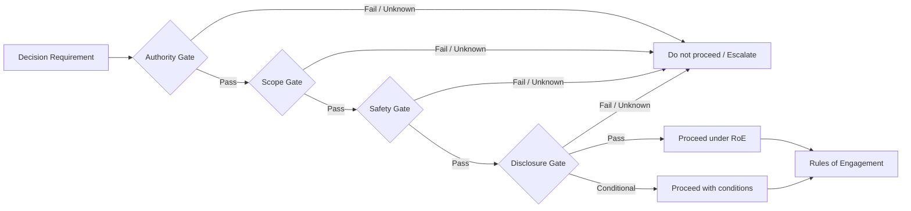

# 第2章　法、倫理、許可、責任ある開示

## この章の位置付け

セキュリティ評価では、技術的に実行できる操作と、実行してよい操作を分離しなければならない。接続できる、列挙できる、認証を試せる、設定を変更できるという事実は、その操作を行う権限があることを意味しない。

本章は個別事案への法的助言を提供しない。読者が評価を開始する前に、**Authority、Scope、Safety、Disclosure**の四つのGateを文書化し、不明点が残る場合に停止・差戻し・専門家相談を選べるようにする。

不正アクセス禁止法は不正アクセス行為等を禁止している。研究、教育、善意という目的だけで、明示的な許可を欠く操作が当然に許容されるとは扱わない。適用判断が必要な場合は、現行法令と契約を確認し、法務・専門家へ相談する。`SRC-JP-LAW-001`

脆弱性を発見した後の取扱いでは、IPAとJPCERT/CCが運用する情報セキュリティ早期警戒パートナーシップが、発見者、製品開発者、ウェブサイト運営者等の役割と推奨行為を整理している。発見情報を公開する前に、対象、連絡先、調整経路、情報管理を確認する。`SRC-IPA-VDP-001`

## 本章の責任境界

本書は、実務上のAuthorization Gateと後続工程へのHandoffに責任を持つ。本章は法的助言を提供せず、個別事案の法的判断と法令解釈は専門家へ委譲する。専門領域の詳細は委譲先に残すが、委譲先へのリンクを読まなくても、第2章の論旨と運用判断は単独で成立する。

### OWN

- `Authorization Checklist`
- Authority / Scope / Safety / Disclosureを開始可否を決める実務Gateとして運用すること
- 停止、Escalation、再Authorization、Rules of Engagement（RoE）へのHandoff
- 確認済み事実、仮定、未解決の法務・契約上の論点、判断責任者を分離すること

### BRIDGE

- 第8章の安全なLabとEvidence取扱い
- 第9章のRules of Engagement
- 第10章のReconnaissance / OSINT境界
- 第15章のFinding、Remediation、Retest、Responsible Disclosure
- 第19章のIncidentとPersonal Data対応

### DELEGATE

- 個別事案の法的助言と法令解釈
- 業界規制、契約法、紛争の網羅的な取扱い
- 詳細な攻撃技法、脆弱性の悪用、認証Protocol内部、Infrastructure Hardening

## 学習目標

- 技術的可能性、組織内承認、契約上の権限、法令・第三者権利を区別できる
- Authority、Scope、Safety、Disclosureの四つのGateを評価できる
- 書面による許可に必要な項目と不足時の停止条件を定義できる
- Personal Data、Secret、顧客Data、証拠の取扱いを事前に決められる
- 脆弱性発見後の連絡、調整、公開判断を段階化できる
- `Authorization Checklist`を作成し、Rules of EngagementへHandoffできる

## 前提知識

- 第0章の安全境界と成果物ベース学習
- 第1章のDecision Requirement、Case ID、Handoff Contract
- システム所有者、Data owner、管理者、委託者・受託者の基本的な関係

法律の条文解釈や訴訟実務の知識は前提としない。本章では、技術者が見落としやすい判断点を明示し、判断権限のある担当者へ正しく差し戻す方法を扱う。

## 導入ケース

架空企業A社は、請求書連携OAuthアプリの権限が広すぎる可能性を確認した。Security担当者は合成Tenantを使った設定Reviewを計画しているが、次が未確認である。

- 誰が検証を承認できるか
- SaaS Tenantと外部APIのどこまでがA社の管理範囲か
- 委託先が作成したアプリ設定を誰が変更できるか
- 合成Account以外のDataを参照してよいか
- 想定外の外部通信が発生した場合の停止連絡先
- 脆弱性が製品側にあると判明した場合の届出・公開経路

この状態でToolを起動してはいけない。最初に行う作業は、技術検証ではなくAuthorization判断である。

本章では、`CASE-2026-001`を`refines`する`AUTH-CASE-2026-001`として、この事前判断を記録する。

## 1. 四つのGate

### F-02-01　Authorization Decision Gate

図の読み方は次のとおりである。

1. Decision Requirementが曖昧なら、対象や手法を決めない。
2. Authority、Scope、Safety、Disclosureは独立したGateとして評価する。
3. 一つでも`Unknown`または`Fail`なら、Tool実行ではなく差戻しを行う。
4. `Proceed`は無制限な許可ではなく、RoEに記録された条件内だけで有効である。

### 1.1 Authority Gate

Authority Gateは、誰がその操作を許可できるかを確認する。

確認対象:

- System owner
- Data owner
- Access administrator
- Contracting party
- Customerまたは委託者
- Subcontractor
- Cloud / SaaS provider
- 外部APIや第三者Serviceの管理主体

同じ組織内でも、担当者がシステムを利用できることと、Security testを承認できることは別である。管理者権限を持つことも、業務上の承認権限を意味しない。

Authorityの証拠には、少なくとも次を含める。

- 承認者の役割
- 承認対象
- 承認期間
- 許可する操作
- 禁止する操作
- Data取扱条件
- 再委託・第三者Serviceの扱い
- 撤回方法

口頭了解やChatの一文だけでは、対象・期間・手法・Dataの境界が不明な場合がある。形式よりも、後から同じ範囲を再現できる具体性を重視する。

### 1.2 Scope Gate

Scope Gateは、対象を技術的識別子へ変換する。

- Domain、IP、Repository、Application、Tenant
- Environment: Production / Staging / Isolated Lab
- Account、Role、Service principal、Workload identity
- Data set、Log source、Configuration snapshot
- Time window
- Rate、Volume、Concurrency
- Allowed method
- Prohibited method

「当社システム」や「このサービス全体」という表現だけでは不十分である。外部CDN、Identity provider、Payment、Email、Storage、Monitoringなど、複数の管理主体が含まれる可能性がある。

ScopeはAsset inventoryと一致させる。対象外を明記し、DNSやRedirectで到達した別Domainを自動的に対象へ追加しない。

### 1.3 Safety Gate

Safety Gateは、許可された操作の中から、判断に必要な最小操作を選ぶ。

- Expected evidence
- Maximum impact
- Stop condition
- Emergency contact
- Rollback
- Cleanup
- Evidence retention
- Evidence access control
- Personal Data / Secret handling
- Production changeの可否

最小影響は「弱い検証」を意味しない。判断に必要な証拠を定義し、その証拠を得た時点で止めることを意味する。

たとえば設定上の過大権限を示すには、実Dataを取得せず、設定Exportと業務要件の差分で十分な場合がある。影響確認が必要でも、合成Data、Canary object、Read-only queryを優先する。

### 1.4 Disclosure Gate

Disclosure Gateは、発見情報の共有・調整・公開経路を事前に決める。

- Discovery owner
- 対象の製品開発者または運営者
- IPA / JPCERT/CC等の調整窓口
- 顧客・委託者への連絡条件
- 公開判断者
- Embargoまたは非公開期間
- 共有可能なEvidence
- 秘密情報・個人情報の除去
- 緊急性が高い場合のEscalation
- Reassessment trigger

届出や調整を行う場合、発見者、IPA / JPCERT/CC、製品開発者、ウェブサイト運営者等の役割を確認する。独自に公開時期を決める前に、現行の公式Guidelineと対象組織の窓口を確認する。`SRC-IPA-VDP-001`

## 2. 法、契約、組織権限、倫理を分離する

### T-02-01　許容性判断の層

| 層 | 問い | 証拠例 | 不明な場合 |
|---|---|---|---|
| 法令 | 当該操作・取得・利用・提供に適用される法令は何か | 現行法令、公式Guideline、法務見解 | 実施せず法務へEscalate |
| 契約 | 顧客、Provider、委託先との契約で許容されるか | 契約、利用規約、Statement of Work | 契約責任者へ差戻し |
| 組織権限 | 承認者は対象・Data・期間を承認できるか | 承認記録、職務権限、委任 | Ownerを特定するまで停止 |
| 技術Scope | 許可対象を識別子と操作へ変換できるか | Asset register、Target list、RoE | Scopeを再定義 |
| 倫理・安全 | 第三者や利用者へ不合理な影響を与えないか | Risk assessment、Stop / Cleanup plan | 手法変更または中止 |

一つの層がPassしても、他の層を自動的にPassさせない。たとえば契約にSecurity testingの記載があっても、第三者Tenantや実利用者Dataまで対象になるとは限らない。

## 3. 書面による許可

### 3.1 最低限必要な項目

書面には次を含める。

1. Decision Requirement
2. ApproverとAuthority basis
3. 対象と対象外
4. Environment、Account、Data
5. 許可操作と禁止操作
6. Test window、Rate、Volume
7. Expected evidence
8. Stop condition
9. Emergency contact
10. Rollback / Cleanup owner
11. Evidence classification、retention、sharing
12. Disclosure route
13. Expiration / Reauthorization condition

### 3.2 条件付き許可

すべての項目が完全でなければ常に中止、という意味ではない。判断に影響しない不足であり、Owner、期限、許容範囲が記録されている場合は`Proceed with conditions`を選べる。

例:

- Productionではなく合成Tenantに限定する
- Active scanを除外し、Configuration reviewだけを許可する
- Personal Dataを含むLogはSecurity担当が直接取得せず、Data ownerが集計する
- 外部APIへの通信を禁止し、Mock endpointを使う

条件をToolの設定へだけ埋め込まず、Authorization ChecklistとRoEへ明示する。

### 3.3 許可の失効

次の場合は、既存の許可を再利用しない。

- 対象System、Tenant、Ownerが変わった
- 手法、Rate、Data、時間帯が変わった
- Subcontractorや外部Providerが追加された
- 想定外の影響またはData参照が発生した
- 脆弱性が別製品・別組織に由来すると判明した
- 承認期間が終了した

## 4. Data、Secret、証拠の取扱い

### 4.1 Data minimization

検証に必要なDataを先に定義し、取得できるDataを後から集めない。

優先順位:

1. 合成Data
2. 無害化・集計Data
3. Canary object
4. Read-only configuration
5. 必要最小限の実Data

実Dataが必要な場合は、Data owner、利用目的、保存期間、Access control、削除方法を明示し、法務・Privacy担当の確認条件を定める。現行義務や業界固有規制の適用は個別に確認する。

### 4.2 Secret

Password、API key、Private key、Session、Cookie、Tokenを報告書へ貼り付けない。

- Secretの存在を示すEvidence ID
- 種類
- 発見場所
- Scope
- Rotation / Revocation owner
- 失効確認

を記録し、値自体はSecret管理経路で扱う。

### 4.3 Evidence

Evidenceは、結論を強く見せるために大量保存するものではない。

- Question supported
- Collector
- Collected at
- Integrity / hash
- Transformation
- Limitation
- Classification
- Retention
- Disposal

を記録する。取得時点のSnapshotと、後から行った加工を区別する。

## 5. 委託、再委託、Cloud / SaaS

### 5.1 委託者の許可だけでは足りない場合

受託者が運用する環境でも、Cloud provider、Managed service、Subcontractor、Customer tenantが関係する。委託者が業務を依頼できることと、第三者Infrastructureへ特定操作を許可できることは同じではない。

確認する項目:

- 契約当事者
- Serviceの責任分界
- ProviderのTesting policy
- Customer / tenant isolation
- Subcontracting clause
- Incident / disclosure contact
- Evidence exportの権限

### 5.2 Shared responsibilityを免責に使わない

「CloudなのでProvider責任」「設定なので利用者責任」と単純化しない。今回のDecision Requirementについて、誰がControlを所有し、誰がEvidenceを提供し、誰が変更を承認するかを記録する。

## 6. 脆弱性を発見したとき

### 6.1 発見と追加検証を分ける

想定外の脆弱性を発見したら、次を行う。

1. Stop conditionへ該当するか確認する
2. 追加操作を止める
3. 最小限のEvidenceを保全する
4. Scope ownerへ連絡する
5. 実施済み操作と未実施操作を記録する
6. Disclosure routeを確認する
7. 追加検証の再承認を得る

「本当に危険か確かめる」ために、横展開、実Data取得、永続化、回避、破壊へ進まない。

### 6.2 連絡・調整

連絡時には、断定と推測を分ける。

- 確認した事実
- 未確認の影響
- 再現条件
- 実施した最小操作
- Stop状態
- Evidenceの保管方法
- 推奨する緊急対応
- 公開していない情報

情報セキュリティ早期警戒パートナーシップは、国内で脆弱性関連情報を適切に流通させる枠組みを提供している。対象がソフトウェア製品かウェブサイトか、発見者・開発者・運営者の立場は何かを確認して利用する。`SRC-IPA-VDP-001`

### 6.3 公開は成果物の完成条件ではない

発見情報を公開すること自体を成功条件にしない。目的は、被害を増やさず、関係者が修正・緩和・通知・再評価できる状態を作ることである。

公開判断では次を分離する。

- 修正状況
- 悪用状況
- 利用者の保護に必要な情報
- 攻撃を容易にする詳細
- 契約・秘密・個人情報
- 調整状況
- 公益と追加Risk

## 7. 四つの視点

### 攻撃者の視点

攻撃者はAuthorityを必要としない。したがって、防御側が「実行できるから検証してよい」と考えること自体がRiskになる。

### 防御者の視点

防御者は、Controlだけでなく、許可された検証を安全に止められる運用を設計する。Emergency contactとCleanup ownerが不明な検証は開始しない。

### 分析者の視点

分析者は、法令・契約・Scopeに関する確認事実と仮定を分ける。法律名を挙げるだけで結論を補強せず、適用判断のOwnerと情報ギャップを記録する。

### 意思決定者の視点

意思決定者は、`Proceed`だけでなく、`Proceed with conditions`、`Do not proceed`、`Escalate`を選べる。期限が短くても、Authority不足をRisk受容で代替しない。

## 8. Handoff Contract

Authorization Checklistから第9章のRules of Engagementへ、次を渡す。

| Input | Acceptance criteria | Reject / return condition |
|---|---|---|
| Decision Requirement ID | Owner、期限、判断内容がある | 「安全性を確認する」等の抽象目的のみ |
| Authority evidence | 承認者、対象、期間、根拠がある | 承認者の権限が不明 |
| Target / data scope | 技術識別子と対象外がある | 外部依存やTenant境界が不明 |
| Method boundary | 許可・禁止・Rate・Volumeがある | Tool名だけで操作が不明 |
| Safety plan | Expected evidence、Stop、Contact、Cleanupがある | Stop / Cleanup owner不在 |
| Disclosure route | 連絡先、調整主体、公開判断者がある | 発見後の連絡先不明 |

受入条件を満たさない場合、第9章でRoEを作り始めず、第2章へ差し戻す。

## 9. 安全な演習

### 課題

合成Caseについて、`Authorization Checklist`を作成し、次のいずれかを選ぶ。

- Proceed
- Proceed with conditions
- Do not proceed
- Escalate

### 初期情報

- 対象: `billing-bridge.example`の合成Tenant
- 目的: OAuth permissionの設定Review
- 許可候補: Configuration export、合成Account、Mock endpoint
- 禁止候補: Production Token、顧客Data、外部API、第三者Tenant
- 未確認: 委託先が管理するApp credentialの変更権限

### 期待成果

- 不足項目を推測で埋めない
- 条件付き許可にする場合はCondition、Owner、期限を記録する
- RoEへ渡せる項目と差し戻す項目を分ける
- 脆弱性発見時の連絡経路を記録する

## 10. 作成する成果物

本章では`ART-13 Authorization Checklist`を作成する。

- 空テンプレート: [Authorization Checklist](../templates/authorization-checklist.md)
- 完全合成記入例: [OAuth連携評価前のAuthorization判断](../cases/ch02-authorization-decision-example.md)

## 11. 評価基準

| 観点 | Pass条件 |
|---|---|
| Decision | 誰が何をいつ判断するか明確 |
| Authority | 承認者、権限根拠、期間、撤回条件がある |
| Scope | Target、Environment、Account、Data、対象外が技術識別子で定義される |
| Method | 許可・禁止、Rate、Volume、Expected evidenceがある |
| Safety | Stop、Emergency contact、Rollback、Cleanup、Retentionがある |
| Disclosure | 発見後の連絡・調整・公開判断者がある |
| Uncertainty | Unknownを隠さず、Ownerと期限がある |
| Handoff | RoEの受入条件と差戻し条件がある |

## 12. よくある誤解

### 「善意の研究なら許可は不要」

目的だけでは対象・手法・Dataの権限を確定できない。明示的な許可がない操作を実施しない。

### 「管理者権限があるから承認できる」

技術権限と業務上の承認権限は別である。

### 「顧客が許可したのでCloud全体が対象」

Provider、外部Service、別Tenant、Subcontractorの境界を個別に確認する。

### 「脆弱性を見つけたので影響を最大まで実証する」

最小Evidenceを得たら停止し、追加検証は再承認を得る。

### 「届出すれば直ちに公開してよい」

届出、調整、修正、利用者保護、公開は異なる判断である。現行Guidelineと関係者の役割を確認する。`SRC-IPA-VDP-001`

## 章のまとめ

- 技術的可能性と実行許可を分離する
- Authority、Scope、Safety、Disclosureを独立Gateとして評価する
- 一つでもUnknownまたはFailなら、Tool実行ではなく停止・差戻し・Escalationを選ぶ
- 許可は対象、期間、手法、Data、Stop、Cleanup、Disclosureまで具体化する
- Personal Data、Secret、Evidenceは取得前に取扱条件を決める
- 脆弱性発見後は追加検証を止め、最小Evidenceと調整経路を確認する
- Authorization Checklistが受入条件を満たしてからRoEへ進む

## 次に学ぶこと

第3章では、職種名ではなくTask、Knowledge、Skill、Artifact evidenceに分解し、本書の学習成果を評価する。第8章では安全なLabとEvidence、第9章ではAuthorizationを具体的なRules of Engagementへ変換する。

## 参考文献・Source Note ID

- `SRC-JP-LAW-001`: 不正アクセス行為の禁止等に関する法律
- `SRC-IPA-VDP-001`: 情報セキュリティ早期警戒パートナーシップガイドライン

版、施行状態、確認日、次回確認日は[Source Baseline](../references/reference-baseline.md)を参照する。法令とGuidelineは公開直前にも再確認する。
