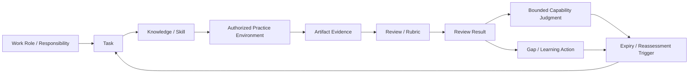

# 第3章　能力を分解し、証拠で学習する

## この章の位置付け

「セキュリティエンジニアである」「資格を持っている」「CTFで高得点を取った」という説明だけでは、どの業務を、どの条件で、どの品質まで実行できるかを判断できない。肩書や学習履歴は入口情報にはなるが、実行能力の結論を単独では支えない。

本章では、第0章の`ART-01 Learning Route Plan`を、Task、Knowledge、Skill、Practice Environment、Artifact Evidence、Review、Gap、Reassessmentへ分解する。第1章で整理した業務機能を「実行する仕事」へ変換し、第2章のAuthority / Scope / Safety / DisclosureをPractice開始前の必須条件とする。

本書が所有するのは、個人を順位付けする仕組みではない。**明示した条件で作られた複数の証拠から、限定されたCapability Judgmentを作り、期限または変更時に再評価する実務契約**である。

## 本章の責任境界

本書は、Capability Evidence Matrix、学習証拠のTraceability、Review、Gap、再評価の設計に責任を持つ。資格認定、人事評価、個別技術の詳細は委譲するが、委譲先を読まなくても、本章の中心論旨と`ART-14`の作成手順は単独で成立する。

### OWN

- `ART-14 Capability Evidence Matrix`
- Task / Knowledge / Skill / Practice / Artifact Evidenceの直接Traceability
- Review ResultとCapability Judgmentの分離
- Gap / Learning Action / Due date / Reassessmentの運用
- Capability claimへScope、Conditions、Reviewer、Limitations、Expiry、Reassessment Triggerを付ける契約

### BRIDGE

- 第0章の`ART-01 Learning Route Plan`
- 第1章の業務機能、Decision Requirement、Artifact loop
- 第2章のAuthorization Gateと安全なPracticeの前提
- 第8章の安全なLabとEvidence handling
- 第11章、第17章、第25章等で作成する章固有ArtifactとRubric
- 第29章の最終PortfolioとCapability再評価

### DELEGATE

- 個別資格試験の範囲、採点、認定判断は、資格発行主体の現行規程へ委譲する。資格名を本章のCapability Judgmentへ自動変換しない
- 人事評価、採用、昇進、報酬、労務上の判断は、組織の人事・法務・労務責任者へ委譲する。本章の合成Caseを従業員評価へ転用しない
- 詳細な攻撃評価技法は、許可・安全境界を含む実践方法を扱う[実務で使えるペネトレーションテスト大全](https://itdojp.github.io/pentest-learning-book/)へ委譲する
- 認証・認可の安全な設計とProtocol実装は、OAuth、OIDC、SAML等を扱う[実践 認証認可システム設計](https://itdojp.github.io/practical-auth-book/)へ委譲する
- Network、OS、Cloud、Containerの防御実装は、実装とHardeningを扱う[インフラエンジニアのための情報セキュリティ実装ガイド](https://itdojp.github.io/it-infra-security-guide-book/)へ委譲する

専門書で技術を補強した後は、本書へ戻り、許可されたPracticeで作成したArtifact、RubricによるReview、限界、再評価を`ART-14`へ記録する。

## 学習目標

この章を終えると、次を実行できる。

- Work RoleまたはResponsibilityをTaskへ分解できる
- Taskに必要なKnowledgeとSkillを区別できる
- Practice EnvironmentとArtifact Evidenceを定義できる
- 良いEvidence、弱いEvidence、危険なEvidence、結論不能なEvidenceを区別できる
- Review ResultとCapability Judgmentを分離できる
- Gap、Learning Action、Due date、Reassessment Triggerを定義できる
- `ART-14 Capability Evidence Matrix`を作成できる

## 前提知識

- 第0章のLearning Route Planと成果物ベース学習
- 第1章の業務機能、Handoff Contract、Decision Requirement
- 第2章のAuthority、Scope、Safety、Disclosure Gate

特定資格、CTF、Pentest Tool、SIEM Productの経験は前提にしない。演習は合成資料、既存のオフラインfixture、または明示的に許可された隔離環境だけを使う。

## 導入ケース

合成学習者Profile `SYNTH-LEARNER-003`は、「6か月後にSecurity Assessment、Detection、CTIを横断できるようになる」というLearning Route Planを持っている。しかし、次の記録だけでは目標達成を判定できない。

- Security担当という肩書
- 資格を一つ取得した事実
- CTFの合計得点
- 使用したToolの数
- 第0〜3章を読了した記録

不足しているのは、どのTaskを、どのAuthorityとPractice条件で実施し、どのArtifactを作り、誰がどのRubricでReviewし、何が未達で、いつ再評価するかというTraceabilityである。

本章では、このProfileを完全合成の独立Case `LEARN-CASE-2026-003`として扱う。実在する従業員、応募者、顧客、組織の評価ではない。公開ランキングにも使用しない。

## 1. Capability Evidenceの全体Trace

本章の中心Traceは次である。

```text
Work Role / Responsibility
→ Task
→ Knowledge / Skill
→ Practice Environment
→ Artifact Evidence
→ Review / Rubric
→ Gap / Learning Action
→ Reassessment
```

この正本Traceでは、`Review / Rubric`が個々のArtifactに対する評価活動を表し、その出力を`Review Result`とする。複数のReview Resultから作る`Capability Judgment`はTraceを上書きせず、`Gap / Learning Action`と並ぶ判断分岐として扱う。したがって、一つのResultを人物全体のCapabilityへ直結させない。

### F-03-01 Capability Evidence Trace



図の読み方は、左から右へ肩書を能力へ変換するのではなく、仕事をTaskへ分解し、許可された条件で作った証拠をRubricで評価する。Review Resultは一つのArtifactに対する結果であり、複数Evidenceと限界を統合したCapability Judgmentとは分ける。期限または変更TriggerでTaskへ戻り、再評価する。

## 2. 用語を分離する

### 2.1 Task

**Taskは、実行する仕事である。** 入力、期待する出力、完了条件、責任境界を観測可能な形で記述する。「Securityを理解する」のような状態ではなく、「合成ScenarioからAuthorization Checklistを作成し、差戻し条件を説明する」のように表す。

### 2.2 Knowledge

**Knowledgeは、Taskに必要な概念または情報である。** AuthorityとAccess controlの違い、Detectionに必要なTelemetry field、Source reliabilityの評価軸等が該当する。知っていると自己申告するだけでは、Taskを実行できる証拠にならない。

### 2.3 Skill

**Skillは、観測可能な行為を実行するCapacityである。** Scope条件をChecklistへ変換する、オフラインfixtureの結果を期待値と比較する、SourceとJudgmentを分離する等が該当する。Tool名はSkillではなく、行為を実現する手段の一つである。

### 2.4 Competency Area

**Competency Areaは、NICE Componentsにおける関連する能力領域のGroupingであり、個人が有能であることの証明ではない。** 対象領域を整理する索引として使い、Capability JudgmentはArtifact EvidenceとReviewから別に作る。

### 2.5 Work Role

**Work Roleは仕事のGroupingであり、Job titleでも個人でもない。** 一人が複数Work RoleのTaskを担う場合も、一つのTaskを複数Roleが分担する場合もある。組織の肩書をNICE Work Roleへ機械的に置換しない。

### 2.6 Artifact Evidence

**Artifact Evidenceは、明示した条件で作成され、第三者がReviewできる出力である。** Template記入結果、合成Datasetに対する分析記録、offline replay結果、設計判断と限界の記録等が該当する。作成条件、Source、版、時刻、変更履歴が不明なArtifactは証拠力が下がる。

### 2.7 Review Result

**Review Resultは、一つのArtifact Evidenceを宣言済みRubricで評価した結果である。** `Meets`、`Partially meets`、`Does not meet`、`Inconclusive`等を使えるが、Rubric、Reviewer、対象版がなければ再現できない。

### 2.8 Capability Judgment

**Capability Judgmentは、複数のEvidence itemに支えられた限定的な結論である。** 対象Task、Scope、Conditions、Reviewer、Limitations、Expiry、Reassessment Triggerを明記する。「Security全般ができる」のような無限定の結論は作らない。

### 2.9 Reassessment

**Reassessmentは、時間、Scope、Source、Role、Technology、Rubricの変更によって起動する後続Reviewである。** 一度の合格を無期限の能力証明にしない。

## 3. NICE Frameworkを使う範囲

NICE Frameworkは、Cybersecurity workを共通語彙で記述するための参照である。構造文書は`NIST SP 800-181 Rev.1`として確認した。`SRC-NICE-001` 別管理される現行Componentsは`v2.2.0`として確認し、Work Role、Competency Area、Task / Knowledge / Skill等を収録する。`SRC-NICE-COMP-001`

本章では、NICEを次の用途に限定する。

- Work RoleからTask候補を探す
- Taskに関係するKnowledge / Skillを整理する
- 組織や学習者間で用語を合わせる
- Components版とidentifierをEvidenceの前提として記録する

次の用途には使わない。

- identifierを一つ割り当てただけで個人の能力を証明する
- Work RoleをJob title、組織図、人物へ固定する
- NICE Components全件を本書の安定本文へ複製する
- 資格、採用、報酬、人事評価の結論を自動生成する

Chapter 3のTemplateと合成CaseでComponents identifierを使う場合、`NICE Framework Components v2.2.0`へ版を固定する。Sourceの版が変わった場合は、対応付けが維持されるかを再評価する。

`ART-14`では、Components identifierを使う場合だけ`NICE Components references`欄へ版とidentifierを記録する。対応を確認できないTaskへ推測でidentifierを割り当てず、`Not mapped`と理由を残す。Matrix内のTask ID、Knowledge reference、Skill referenceはArtifact内の追跡IDであり、NICE identifierと同一とは限らない。

## 4. Evidenceの品質を判定する

### T-03-01 Evidenceの四分類

| 分類 | 例 | 判定 |
|---|---|---|
| 良いEvidence | 合成Scenarioから作成したArtifact、前提、版、Rubric、Reviewer、限界が揃う | 対象TaskについてReview可能 |
| 弱いEvidence | 資格名、CTF得点、Tool一覧、章完了、自己申告だけがある | 補助情報にはなるが単独判断不可 |
| 危険なEvidence | 無許可の実Target操作、実Credential、PII、顧客Data、未調整脆弱性、攻撃量の競争 | 採用せず停止・隔離・Escalation |
| 結論不能なEvidence | Artifactはあるが条件、Source、版、Rubric、Reviewer、観測範囲が不明 | `Inconclusive`としてGapを記録 |

### 4.1 良いEvidence

良いEvidenceは、見栄えの良い成果物ではなく、問いと条件が追跡できる成果物である。

- Task IDと期待Artifactが対応する
- Practice Environmentが合成または明示的に許可されている
- Source、fixture、Componentsの版が固定される
- RubricとReviewer roleが事前に宣言される
- ResultだけでなくLimitationsとGapが残る
- ExpiryまたはReassessment Triggerがある

### 4.2 弱いEvidence

Job title、Certification、CTF score、Tool count、Chapter completionは、それぞれ一定の情報を持つ。しかし、単独では次が分からない。

- どのTaskを実行したか
- どの条件とAuthorityで実行したか
- 出力が再Review可能か
- 知識を別Contextへ適用できるか
- 失敗、限界、再評価条件を説明できるか

したがって、これらはMatrixのContext欄へ記録できるが、Artifact Evidence欄を置き換えない。

### 4.3 危険なEvidence

実Targetへの攻撃回数、取得したAccount数、回避できたControl数、収集した個人情報量を能力Metricにしてはならない。危険なEvidenceは能力を示すのではなく、Authority、Safety、Data handlingの失敗を示す。

次を検出した場合はEvidence作成を停止する。

- 対象または方法の許可が確認できない
- Production credential、Token、Cookie、Personal Data、Customer Dataが含まれる
- 最小Evidenceを超えて影響を拡大する必要がある
- 第三者Systemへの能動操作が必要になる
- 公開前の脆弱性情報を無調整で共有する必要がある

### 4.4 結論不能なEvidence

Evidenceが存在しても、観測範囲やRubricが不足すれば`Inconclusive`である。無理に`Complete`へ進めず、何を追加すれば結論が変わるかをGap / Learning Actionへ記録する。

## 5. 学習進行Levelを誤用しない

本書では、学習進行を説明する便宜上、次のLevelを使う。

### T-03-02 本書固有の学習進行

| Level | 観測可能な行為 | Evidence例 |
|---|---|---|
| observe | 完成ArtifactとReview過程を観察し、入力と出力を識別する | 注釈付きReview記録 |
| explain | Task、前提、判断、限界を自分の言葉で説明する | Trace説明と誤解訂正 |
| assess | 合成または許可済みEvidenceをRubricで評価する | Review ResultとGap |
| design | Task、Practice、Artifact、Rubric、Reassessmentを設計する | Capability Evidence Matrix |
| lead | 複数Reviewerの判断を統合し、停止・差戻し・再評価を運用する | Review dispositionと再評価計画 |

これは**本書固有の学習進行**であり、NISTが定めた普遍的なLevel標準ではない。Level名だけでCapabilityを主張せず、対象TaskとEvidenceを併記する。`lead`は人事上の役職や部下の有無を意味しない。

## 6. Bounded Capability Judgmentを作る

Capability claimには、最低限次を含める。

| 項目 | 記録する内容 |
|---|---|
| Scope | 対象Task、対象外、Components版 |
| Conditions | Practice Environment、Authority、提供された入力、利用可能な支援 |
| Evidence set | 複数のArtifact / Evidence ID |
| Reviewer | Role、独立性、必要な専門性 |
| Rubric | Resultを再現する評価基準 |
| Limitations | 未観測、未実施、一般化できない範囲 |
| Expiry | 結論を有効とする期限 |
| Reassessment Trigger | Source、Role、Scope、Technology、Rubric、時間の変更 |

一つのReview Resultから人物全体の能力を結論付けない。例えば、合成ScenarioのAuthorization Checklistが`Meets`でも、実案件の法的判断、実Target操作、認証Protocol実装、Incident指揮能力までは証明しない。

## 7. 四つの視点でEvidenceをReviewする

### 攻撃者視点

Taskが成立条件と悪用可能性を理解しているかを確認する。ただし、実Targetへの攻撃量や侵害深度を能力Metricにしない。

### 防御者視点

安全境界、観測可能性、停止、復旧、Control改善へ接続できるかを確認する。

### 分析者視点

Source、Evidence、Fact、Judgment、Gap、Limitationsが分離されているかを確認する。

### 意思決定者視点

Capability claimのScopeとExpiryが、業務を任せる、追加Reviewを求める、Practiceを停止するという判断に使えるかを確認する。

## 8. 安全な演習

### 目的

`ART-01 Learning Route Plan`の一つの学習Goalを、Task、Artifact Evidence、Rubric、Gap、Reassessmentへ分解する。

### 前提

- 第2章のAuthorization Checklistを読了している
- 合成ScenarioまたはRepository提供のoffline fixtureだけを使う
- 実Target、実Credential、実個人・従業員・顧客Dataを持ち込まない

### 手順

1. 学習Goalから二つまたは三つのbounded Taskを定義する。
2. 各TaskにKnowledge / Skill referenceを割り当て、対応を確認できる場合だけComponents版とNICE identifierを記録する。
3. 合成または明示的許可済みのPractice Environmentを指定する。最初の演習では、第3章合成Case内のPractice packetを使える。
4. Expected Artifact、Evidence ID、Rubric、Reviewer roleを決める。
5. Result、Limitations、Gap、Learning Action、Due dateを記録する。
6. 複数Evidenceから限定Capability Judgmentを作る。
7. ExpiryとReassessment ID / Triggerを設定する。

### 停止条件

- 実Target操作が必要になる
- AuthorityまたはPractice Scopeが説明できない
- 実Credential、Token、Cookie、PII、従業員Data、顧客Dataが必要になる
- RubricまたはReviewerを後付けしなければResultを作れない
- 攻撃活動の量をCapability指標にしようとしている

### 期待Evidence

- `ART-14 Capability Evidence Matrix`
- TaskごとのArtifact / Evidence ID
- RubricとReview Result
- Gap / Learning Action / Due date
- Bounded Capability JudgmentとReassessment record

## 9. 作成する成果物

本章では`ART-14 Capability Evidence Matrix`を作成する。

Templateは[Capability Evidence Matrix](../templates/capability-evidence-matrix.md)、完全合成記入例は[第3章 合成記入例：Capability Evidence Matrix](../cases/ch03-capability-evidence-example.md)を参照する。

Statusは次の有限集合だけを使う。

```text
Planned / In practice / Evidence submitted / Reviewed / Gap identified / Reassessment due / Complete
```

StatusはCapabilityの高さではなく、Evidence lifecycle上の位置を示す。`Complete`も無期限の能力証明ではない。

## 10. 評価基準

### Technical accuracy

- Task、Knowledge、Skill、Work Role、Competency Areaを混同していない
- NICE Components版とidentifierの前提が明記されている

### Safety / authorization

- Practiceが合成または明示的許可済みである
- 実Target操作、Credential、PII、従業員・顧客DataをEvidenceにしていない

### Evidence / traceability

- TaskからArtifact、Review、Gap、Reassessmentまで直接追跡できる
- Capability Judgmentが複数Evidenceに支えられている

### Rubric / reproducibility

- Reviewer role、Rubric、対象版、Result、Limitationsが明示されている
- 別Reviewerが同じ入力から判断過程を再確認できる

### Decision usefulness

- Capability claimにScope、Conditions、Expiry、Reassessment Triggerがある
- 任せられるTaskと、追加学習またはEscalationが必要なTaskを区別できる

## 11. よくある誤解

### 「資格を持っているので、そのWork Roleの全Taskを実行できる」

資格は学習範囲や試験結果を示す場合があるが、特定組織のTask、Authority、Environment、Artifact品質を単独では証明しない。

### 「CTF得点が高ければ、実務Capabilityも高い」

CTFは限定されたルール下の問題解決Evidenceになり得る。しかし、実務のAuthority、Safety、Evidence handling、Handoff、復旧、報告を別に確認する必要がある。

### 「多くのToolを使えることがSkillである」

Skillは観測可能な行為である。Tool数は、Taskを安全かつ再現可能に完了できることを示さない。

### 「章を読み終えたのでCompleteである」

Chapter completionは学習活動の記録であり、Artifact Reviewではない。Taskに対応するEvidenceを作成し、RubricでReviewする。

### 「一度Reviewに通れば無期限に任せられる」

Source、Role、Scope、Technology、Rubric、時間が変われば結論は古くなる。ExpiryとReassessment Triggerを必ず設定する。

## 章のまとめ

- Work Roleは仕事のGroupingであり、Job titleや個人ではない
- Task、Knowledge、Skill、Artifact Evidence、Review Result、Capability Judgmentを分離する
- NICEは共通語彙と分解支援に使い、個人能力の単独証明には使わない
- 良いEvidenceは条件、版、Rubric、Reviewer、限界、再評価を持つ
- 実Target操作、実Data、攻撃活動量を学習Evidenceにしない
- Capability claimは複数Evidenceに基づき、Scope、Conditions、Limitations、Expiry、Triggerを持つ
- `ART-14 Capability Evidence Matrix`でGapと再評価まで追跡する

## 次に学ぶこと

第4章では、`ART-14`で定義した学習Taskを、資産、信頼境界、Attack Surface、Threat Modelへ接続する。第8章では安全なPractice EnvironmentとEvidence handling、第29章では複数Artifactから最終Portfolioと再評価計画を作る。

## 参考文献・Source Note ID

- `SRC-NICE-001`: `NIST SP 800-181 Rev.1`。NICE Frameworkの構造文書として使用する
- `SRC-NICE-COMP-001`: 別管理の`NICE Framework Components v2.2.0`。Work Role、Task、Knowledge、Skill、Competency Areaの現行語彙として使用し、個人能力の単独証明には使用しない

版、確認日、Componentsの日付不整合は[Source Baseline](../references/reference-baseline.md)と[第3章 Source Review Note](../references/ch03-source-review-2026-08-05.md)を参照する。
