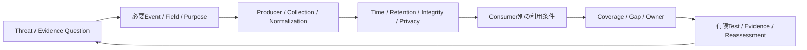

# 第16章 Telemetry ArchitectureとEvidence Readiness

## この章の位置付け

ログが保存されていても、判断に必要な証拠が使えるとは限らない。何の問いに、どの対象・期間・Fieldが必要かを先に決め、生成、収集、保持、検索、検証を別々の根拠で確認する。本章では、この設計をTelemetry Architecture（観測データの構成）と呼ぶ。Evidence Readinessは、その問いへ答えるためのデータと取扱条件が準備されている状態であり、侵害の不存在や証拠の法的適格性を認定する語ではない。

OWNは、必要Telemetry、利用目的、品質、不足条件、担当、再評価の接続である。第5章の行動、第6章のSignal Flow、第15章のFinding、第17章のDetectionをBRIDGEする。SIEM・EDR・NDRの製品設定、Cloud別の全Log Schema、保持基盤の実装は専門資料へDELEGATEし、本章の必修課題にしない。

## 学習目標

- 必要Telemetryを定義できる。
- 未観測と不存在を区別できる。
- Telemetry Coverage Mapを作成できる。

## 前提知識

[第5章](05-attack-behavior.md)、[第6章](06-observable-systems.md)、[第15章](15-findings-retest-risk.md)の成果物と、[第17章](17-detection-engineering.md)のData Requirementを参照する。製品の管理権限は不要である。実Log、実User、実IP、実Token、PIIは持ち込まない。

## 導入ケースまたは判断要求

完全合成の請求処理連携を題材に、「同意変更を判断期限までに比較できるか」と「後日、その変更の経緯を再構成できるか」を分ける。同じEventでも、DetectionとDFIRでは必要な保持期間、原記録、来歴、Fieldが異なる。短期の入力検査が成功しても、後日の調査準備が整うとは限らない。

新しい`TCM-2026-016`は`ART-24`の記入例であり、`CASE-DET-2026-001`とその親`CASE-2026-001`を詳細化する読解用Recordである。新対象`APP-TCM16-001` / `TCM16-REV-001`は合成の補助教材で、親の現在の実装や権限を表さない。

第15章の`HOF-FRT15-16`は`planned-not-delivered`のままである。本章が参照するのは対象・版・時刻・Gapを記録する方法であり、親のEvidenceや実行許可を受領したという意味ではない。第17章の`DVR-2026-017-001`、`DET-2026-017-001`、三つのTelemetry contractと既存fixtureも変更しない。[第II部横断対応表](../cases/part-ii-assessment-risk-map.md)の非継承境界を保つ。

## 全体像

`F-16-01`は、収集製品ではなく問いから設計する順序である。



文章代替: 問いを必要なEventとFieldへ分解し、生成から利用までの各境界で根拠を確認する。満たせない条件をGapと担当へ返し、限定したTestと再評価へ結ぶ。矢印はデータ到着や状態昇格を保証しない。

## 1. Event、Telemetry、Evidenceを区別する

Eventは起きた事象、Logは事象について作られた記録である。Telemetryは利用目的へ運ぶ観測データ、Evidenceは特定の主張を支持・反証するために評価した根拠として扱う。Alertは検知条件に対する出力であり、それだけでFindingやIncidentの成立を確定しない。

NIST SP 800-92は生成、転送、保存、分析などを分け、必要な記録と保持条件の設計を扱う。2006年の資料であり、現行Cloud製品の設定や暗号方式の推奨としては使わない。`SRC-NIST-LOG-001`

ATT&CKの対応付けは、必要な行動・観測を考える入口である。Strategyが掲載されていることと、この教材や自組織でデータを取得・検証できることは別である。確認時の版は 19.2 であり、Detection Strategiesは複数のAnalyticsをまとめる上位の検知方針として参照する。`SRC-ATTACK-001` `SRC-ATTACK-DET-001`

## 2. 問いから必要Fieldを導く

Evidence Questionには、対象、期間、利用者、判断期限、許される結論を付ける。「すべて保存する」だけでは、何が不足したときに判断を止めるかが決まらない。

`T-16-01`はFieldと目的の対応例である。実値ではなく、供給教材の欄を読む。

| Fieldの役割 | 必要な理由 | 不足時に止める判断 |
|---|---|---|
| Event識別子・対象ID・版 | 別対象の記録との混同を防ぐ | 同じ表示名だから同じ対象という結合 |
| Event時刻・観測時刻・取り込み時刻 | 発生順と到着遅延を分ける | 到着順を発生順とする判断 |
| 操作種別・変更内容 | 対象の問いへ答える | 件数だけによる意味の推測 |
| 承認参照・承認Window | 業務上の正常変更と比較する | 参照欠落だけから未承認と断定する判断 |
| 原記録参照・変換版 | 正規化の影響を追跡する | 加工済みFieldだけで元の意味を保証する判断 |

FieldごとにPurposeとConsumerを記す。Detectionに不要でも調査には必要な欄があり、逆に収集する必要のない情報もある。Privacyや取扱根拠が不明なら、実データを追加して確かめず、計画を止める。

## 3. 七つのCoverage状態と証拠条件

`T-16-02`は本書の有限語彙であり、製品やNISTが定めた共通状態機械ではない。対象・版・問い・Consumerを固定した一行に対して使う。

| 状態 | 表すこと | それだけでは言えないこと |
|---|---|---|
| Required | 必要性を定義した | 生成された |
| Produced | 対象の生成根拠がある | Collectorへ到達した |
| Collected | 対応する受取根拠がある | 判断期限まで保持できる |
| Retained | 問いに必要な期間の保持根拠がある | Consumerが検索できる |
| Queryable | 対象の検索根拠がある | 時刻・同一性・必要Fieldが妥当である |
| Validated | 限定したTestとEvidenceで利用条件を確認した | 当該入力以外の妥当性、法的な認定 |
| Unknown | 根拠がなく判断できない | Eventが存在しない |

先の状態を記すには、その主張に必要な根拠を個別に照合する。状態名の順序、成功した一つのTest、IDの存在から次へ自動昇格させない。相関可能性は時刻と同一性の品質欄で扱い、`Correlatable`という追加Statusにはしない。

## 4. CollectionからConsumerまでの品質境界

### 4.1 CollectionとNormalization

Producer、Collector、Transport、Normalizer、Schema版を分ける。生成元に記録があっても、転送遅延、損失、Backpressure、Parser drift、Samplingで必要なデータが届かないことがある。件数が同じでも、対象やFieldの意味が同じとは限らない。

正規化前の参照と変換規則の版を残す。NIST SP 800-92の正規化と時刻の説明は、異なる表現を比較可能にするために用いる。変換による意味の保存まで自動保証するものではない。`SRC-NIST-LOG-001`

### 4.2 TimeとIdentity

Event時刻は発生についての記録、Observed時刻は観測側の記録、Ingest時刻は収集経路への到着記録である。Timezone、Clock source、最大不確かさを付け、相関Windowに対して誤差が大きい場合は順序や同時性を断定しない。

同じUser文字列でも、Namespace、対象、Normalizer版が違えば結合根拠が不足する。Display nameを安定IDの代わりにせず、正規化前後の関係を確認する。不明点を実User調査で補うことは本章の課題ではない。

### 4.3 Retention、Integrity、Access、Privacy

保持期間は保存設定の数字だけでなく、必要な観測期間と判断期限を満たすかで評価する。現在読めることと、後日のDFIRで読めることも別である。

Hashの一致は、比較したByteが同じという根拠に限定する。原記録の真正性、作成者の権限、取得前の完全性、保管履歴全体を保証しない。原記録参照、取得・変換の記録、アクセスするRole、分類、保持・再評価条件を併記する。

NIST SP 800-61 Rev.3 は、ログの利用準備と、Incident記録の完全性・来歴・権限に応じたアクセス・保持を扱う。本章ではその利用者側の条件だけを参照し、Telemetry Schemaや法的適格性の認定として使わない。`SRC-IR-001`

## 5. Consumer別に結論の上限を決める

`T-16-03`の利用目的を混同しない。同じ行を転用する場合も、問いと条件を再確認する。

| Consumer | 中心となる問い | 残す制限 |
|---|---|---|
| Detection | 指定した条件を比較する入力がそろうか | 入力確認は検知Rule全体の成功ではない |
| Hunt | 仮説を調べる観測範囲があるか | 欠測をNegative Findingにしない |
| IR | 判断期限内にContextを渡せるか | 受取根拠なしにHandoff完了としない |
| DFIR | 後日、経緯を再構成できるか | 保持・原記録・来歴の不足を明示する |
| Audit | 設計と確認の記録を追跡できるか | 記録の存在を統制の実効性にしない |

第17章の既存Telemetry要求は、その章の記録を正とする。本章の短い合成入力検査で、第17章の180日・365日・90日の保持条件やDetection全体を充足したとは主張しない。

「Logなし」には未生成、未到着、期限切れ、検索条件不一致などの代替説明がある。「一致Eventなし」と記すには、検索対象と観測範囲の根拠も必要である。それでも許されるのは限定した合成Windowでの未観測であり、「侵害なし」という一般結論ではない。

## 6. Gap、Validation、再評価を記録する

Gapには不足条件、許されない結論、Owner、期限、次の確認条件を付ける。新しい情報がなければUnknownを保持してよい。データを追加することだけを解決策にせず、不要Fieldの削減、問いの限定、保持とアクセスの見直しも比較する。

Validation ID、Test ID、Evidence IDを同じ対象・版・問いへ結ぶ。NIST SP 800-92の検査・再評価の考え方を参考にするが、本章は供給JSONを読むオフライン比較に限定する。実環境でのEvent生成や能動的試験は行わない。`SRC-NIST-LOG-001`

確認事実は供給欄と比較結果、分析判断はその問いへの利用可否、仮定は教材の設計条件として分ける。確信度は合成記録内の整合性に限る。収集経路、Schema、対象版、時刻精度、保持、Consumer目的が変われば判断を再評価する。合成の比較結果を実環境への予測に読み替えない。

## 安全な演習または分析課題

目的は、`ART-24`の各行で主張と根拠を照合することである。前提はこの章、空Template、完全合成Case、配布JSONであり、実Logや製品接続は不要である。

Authority / Scopeは、自分の作業領域にある供給教材の読解だけに限定する。親RoEのDraftや期限を変更せず、実行許可として利用しない。期待するEvidenceは、参照ID、必要Field、期間、状態、不足理由を記した読解メモである。Impactはローカル読解と比較だけであり、設定変更、外部通信、通知は行わない。

Stop条件は、未知の入力、実データらしい内容、外部接続の要求、Scope不明、原記録との不一致である。停止したら追加取得をせず、Gapを記録する。Cleanupでは自分のメモだけを整理し、供給Evidenceや正本を削除・改変しない。Runtimeを起動しないため、環境の破棄は発生しない。

1. 一行を選び、問い、Consumer、対象版、必要FieldのPurposeを記す。
2. ProducedとCollectedの根拠を別々に探し、欠けた段階を状態名で補わない。
3. Retention、Clock uncertainty、Identity normalizationを確認し、Validatedへ進めない理由を挙げる。
4. 同じEventをDetectionとDFIRに使う二つの問いを比較する。
5. Gap、Owner、期限、許される結論、再評価条件を一行の提出メモにまとめる。

Repositoryの固定依存が導入済みの環境では、Linux / WSL2上のPython 3.12 と固定Jekyll/Kramdownによる次の読解契約検査も利用できる。初期導入はRepositoryの手順に従い、このコマンドは依存の取得や製品への接続を行わない。

```bash
python3 scripts/check_chapter16_contract.py
```

期待結果は、供給Caseの整合性と有限回帰検査の成功である。失敗した場合に状態を昇格させたり検査を省略したりせず、差分と不足条件へ戻る。検査成功は実収集、検知、調査、許可の成功を意味しない。

## 作成する成果物

[Telemetry Coverage Map](../templates/telemetry-coverage-map.md)に問いから再評価まで記入する。[完全合成Case](../cases/ch16-telemetry-coverage-example.md)には、判断例の要約と供給JSONの全欄を示す。各判断例は独立した対比であり、一つの実行が進んだ履歴ではない。

第17〜20章へ渡すのは、用途を限定した必要Field、Coverage、Gap、対象版、Owner、再評価条件である。Handoffは受領記録がない限り`planned-not-delivered`とし、親の記録を受領済みに書き換えない。

## 評価基準

`T-16-04`で、データ量ではなく判断の説明可能性を評価する。

| 観点 | 合格する説明 | 不適切な説明 |
|---|---|---|
| 問いとField | 各FieldのPurposeとConsumerを示す | 全量収集だけを勧める |
| 状態と根拠 | 段階ごとの対象版とEvidenceを示す | 順序だけで自動昇格する |
| 品質 | 時刻・同一性・保持・来歴の限界を示す | 欄やHashがあれば完全とする |
| 未観測 | 検索範囲と欠測を分離する | Alertなしを侵害なしにする |
| 安全 | 合成読解・停止・非継承を守る | 親IDから許可を借用する |
| 次の判断 | Gap、Owner、期限、再評価を結ぶ | 不足を隠して全行Validatedにする |

六観点をすべて満たせば読解課題を完了とする。UnknownやGapが残る成果物も、理由と次の判断が記録されていれば完成しうる。

## よくある誤解

- **全量収集なら完全である:** 必要な期間、意味、利用権限、到着経路の不足は件数では解消しない。
- **標準形式なら証拠として使える:** Formatと、来歴・取扱根拠・利用目的は別である。
- **Validatedなら第17章も検知成功である:** 本章の限定した入力検査と、既存Detectionの全体検証を分ける。
- **新しいDraftは旧Finalを置き換える:** NIST SP 800-92 Rev.1 は確認時点でInitial Public Draftであり、意見募集の終了はFinal化を意味しない。本章の採用範囲と版はSource Noteへ固定する。`SRC-NIST-LOG-DRAFT-001`

## 章のまとめ

Telemetryの設計は、問い、必要Field、取得から利用までの根拠、許される結論を結ぶ作業である。段階の飛躍、時刻と同一性の誤結合、保持と来歴の不足を見える形にし、Gapを担当と再評価へ返す。収集量やIDの接続だけで安全性、検知成功、Handoff受領を認定しない。

## 次に学ぶこと

[第17章 Detection Engineering](17-detection-engineering.md)で、必要な入力をDetection Hypothesis、Rule、fixture、Triageへ接続する。第18章以降では、Huntの観測範囲、IRの判断期限、DFIRの来歴と保持へ利用目的を広げる。詳細実装は[インフラセキュリティ設計・実装ガイド](https://itdojp.github.io/it-infra-security-guide-book/)へ委譲し、戻ったら`ART-24`のGapと再評価条件を更新する。

## 参考文献・Source Note ID

- `SRC-ATTACK-001`: ATT&CK 19.2。行動と観測を考える版付きの入口。
- `SRC-ATTACK-DET-001`: Detection Strategiesの役割。存在をCoverageの証明にしない。
- `SRC-NIST-LOG-001`: SP 800-92 Final。採用したライフサイクル・品質・保持・検査の限定節。
- `SRC-NIST-LOG-DRAFT-001`: SP 800-92 Rev.1 IPDの状態確認。現行Finalとしては採用しない。
- `SRC-IR-001`: SP 800-61 Rev.3 Final。ログ準備と記録の完全性・来歴・取扱条件。

[第16章Source Review](../references/ch16-source-review-2026-09-21.md)に、確認日、採用節、除外範囲、再確認条件を示す。
