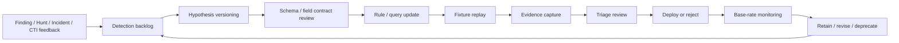

# 第17章　Detection Engineering

## この章の位置付け

第16章で定義したTelemetry Architectureは、Detection Engineeringによって初めて判断可能な運用成果へ変換される。ここでの目的は、Ruleを書くこと自体ではない。**Threat behaviorを、必要なデータ契約、判定条件、テスト、Triage、再評価まで接続し、意思決定に寄与する検知能力へ変換すること**である。

本章は、第1章で定義したCase ID中心の追跡性を、Detectionの文脈で具体化する代表章である。ATT&CKはBehaviorの共通語彙として有用だが、ATT&CK対応付けだけではCoverageの証明にならない。Coverageを主張するには、Telemetry ID、Detection ID、Fixture ID、Evidence ID、Triage / Incident Handoff ID、Control ID、Reassessment IDまで直接追跡できなければならない。`SRC-ATTACK-001`

ATT&CKのDetection Strategiesは、platform-specific analyticsを束ねる高水準の検知方針として有用である。一方で、それ自体は組織固有のData contract、Triage手順、fixture validationを代替しない。`SRC-ATTACK-DET-001`

## 学習目標

- Detection Hypothesisを作成できる
- Data Requirementを定義できる
- Detection Validation Recordを作成できる

## 前提知識

第1章のCase IDとHandoff Contract、第5章のATT&CK、第16章のTelemetry Coverage、第19章のIncident Responseの位置付けを理解していることを前提とする。個別SIEM製品やEDR製品の操作方法は前提としない。

本章では、実環境に対する検知Rule投入や第三者環境への試験は扱わない。合成データとオフラインfixtureのみを用いる。

## 本章が所有する範囲

### OWN

- Detection HypothesisをObservation Hypothesisへ分解すること
- Data semantics、time contract、identity contractを明示すること
- Detection logicをTest可能な形へ正規化すること
- Positive / Negative / Benign-near-miss fixtureを使ってValidationすること
- Outcome metricをdetectability、test success、triageability、decision latency contributionで定義すること
- Detection-as-Codeの保守、変更、廃止基準を定義すること

### BRIDGE

- Threat behaviorをATT&CKで共通表現すること
- AlertをTriageとIncident Responseへ引き渡すこと
- Detection GapをTelemetry改善、Control改善、Threat Huntingへ返すこと
- 分析判断や経営判断に必要なEvidenceを整形すること

### DELEGATE

- 特定製品のSIEMクエリ文法最適化
- EDRベンダー固有のクリック手順
- 実運用Tenantや本番アカウントに対する有効化作業
- 回避手法の実演、Malware、外部制御基盤、認証情報窃取、永続化の実行
- 24時間SOC運用体制の組織設計全般

## 導入ケースまたは判断要求

架空のExample Commerce社は、請求処理連携アプリに対する**未承認の管理者同意（admin consent）変更**を早期に検出したい。対象行動は、アプリへ業務要件外の権限が追加され、その変更が承認済みChangeと一致しない状態である。

このケースでは、次の二つを同時に満たす必要がある。

1. `DR-DET-2026-001`: 月末処理を止めずに、未承認権限付与を60分以内に「遮断 / 承認 / 監視継続」のいずれかへ判断できること
2. `RO-DET-2026-001`: SOCがAlert受信から15分以内に、`Escalate` / `Approved change` / `Needs telemetry gap review`を一次判定できること

この章では、上記要求を満たすDetection Validation Recordを、`CASE-DET-2026-001`として作成する。このRecordは、第1章Case Mapの`CASE-2026-001` / `DEC-2026-001`と、Detection backlogを開始した`FIND-2026-002` / `HUNT-2026-001`へ直接接続する。Detectionの版関係は、`DET-2026-017-001`が第1章の`DET-2026-001`を`refines`する詳細化である。第1章の`FIX-CONSENT-001` / `CTRL-2026-003`を置換または再配備するものではなく、Telemetry、Triage、Coverage gapの検証契約を追加する。

## 全体像

`F-17-01`は、BehaviorからDecision contributionまでの最短経路を示す。

```mermaid
flowchart LR
  Z[Finding / Hunt / Incident / CTI] --> Q[Detection backlog]
  Q --> A[Threat behavior
TH-DET-2026-001] --> B[Observation hypothesis
OBS-DET-2026-001]
  B --> C[Telemetry contract
TEL-DET-2026-001..003]
  C --> D[Detection logic
DET-2026-017-001]
  D --> E[Offline fixtures
FIX-2026-017-POS / NEG / BNM]
  E --> F[Validation evidence
EVD-DET-2026-001..005]
  F --> G[Triage / Incident handoff
TRI-DET-2026-001 / HO-DET-2026-001]
  G --> H[Control / Reassessment
CTRL-DET-2026-001..002 / REA-DET-2026-001]
```



文章代替: `F-17-01`は、Finding / Hunt / Incident / CTIからDetection backlogを作り、脅威仮説、観測仮説、Telemetry、Detection logic、fixture、Evidence、Triage / Incident handoff、Control / Reassessmentへ各IDで接続する図である。途中のどこかがIDなしになると、Alertは出ても説明責任と再評価が失われる。

今回の合成Caseでは`FIND-2026-002`と`HUNT-2026-001`を入力として採用し、IncidentとCTIは「入力なし」と明示する。入力がない区分へ架空の根拠を補わない。一方、将来のIncident lessonやCTI behavior changeが入った場合に、Rule、fixture、Triage、Hypothesisを同じbacklog contractで改訂できる入口を保持する。

## 1. Detection HypothesisをBehaviorから切り出す

Detection Hypothesisは、「何となく不審」を書く欄ではない。Behavior、必要な観測、正常系との差分、想定する判断を一文へ圧縮する。

本章の代表例では、次のように定義する。

- `TH-DET-2026-001`: 承認済みChangeと一致しない管理者同意変更により、請求処理連携アプリへ業務要件外の権限が追加される
- `OBS-DET-2026-001`: 管理者同意変更Eventに、actor、target workload、scope set、change ticket参照、event timeが含まれる
- `OBS-DET-2026-002`: 同じworkloadのsign-in Eventを30分以内に相関できる

ここで重要なのは、ATT&CK対応付けをDetection Hypothesisの代わりにしないことである。ATT&CKはBehaviorを共通語彙化するが、「どのログの、どのFieldで、どの時刻意味を使い、何を正常系と区別するか」は別途書かなければならない。旧来のData Sources一覧だけを現在の拡張分類として扱うのではなく、実際のData contractとDetection Strategyを切り分けて設計する必要がある。`SRC-ATTACK-001` `SRC-ATTACK-DS-001` `SRC-ATTACK-DET-001`

## 2. Data RequirementはField名ではなく契約で書く

Detectionが失敗する典型例は、Fieldが存在することだけを確認して、**意味**を確認しないことである。Detection Validation Recordでは、少なくとも次の三つの契約を分離する。

### 2.1 Time contract

- `event_time`は発生時刻か、収集時刻か、再送時刻か
- Time zoneはUTCか、ローカルか
- Correlation windowはどの時刻軸で測るか
- 遅延到着をどこまで許容するか

### 2.2 Identity contract

- `actor_id`は人か、service principalか、代理実行か
- `target_workload_id`はDisplay nameではなく安定IDか
- 正規化前後で同一性が壊れていないか

### 2.3 Data semantics contract

- `scope_set`の順序は意味を持つか、それとも集合比較するか
- `change_ticket_id = null`は「未承認」なのか、「連携欠落」なのか
- `result = success`は設定反映完了を意味するか、単なる受理を意味するか

`T-17-01`は、fixtureの意味を区別する最小契約である。

| ID | 意味 | Telemetryの状態 | Eventの状態 | 許される結論 |
|---|---|---|---|---|
| `FIX-2026-017-POS` | 検知すべき行動がある | 必要Telemetryが存在 | 対象Eventが存在 | AlertとTriageが成立するべき |
| `FIX-2026-017-NEG` | 検知すべき行動がない | 必要Telemetryが存在 | 対象Eventが存在しない | 「今回のfixtureでは未観測」とだけ言える |
| `FIX-2026-017-BNM` | 形は似るが許容される変更 | 必要Telemetryが存在 | Eventは存在するが承認済み | No alertまたは明示的な許容扱い |
| `GAP-DET-2026-001` | 評価に必要なcore dataが欠ける | `TEL-DET-2026-002`が欠落 | Event有無は不明 | 「判定不能」。不存在は結論しない |

**Telemetry absenceはEvent absenceではない。** Negative Findingを書く際は、Coverage、Gap、Permitted conclusionを必ず分ける。

## 3. Detection logicはRule本体だけで完結しない

Detection logicは、Rule、Query、Threshold、Correlation、Suppression、Triage contextを一体で定義する。代表ケースの`DET-2026-017-001`では、次を判定対象とする。

1. `TEL-DET-2026-001`の管理者同意変更Eventに、承認済みAllow list外のscope差分がある
2. `TEL-DET-2026-002`のChange情報に、対応する承認済みticketがない、または期限外である
3. Optional enrichmentである`TEL-DET-2026-003`で、成功したactive credentialによる同一workloadのsign-inが30分以内に観測された場合は緊急度を上げる

この三点は、ひとつでも欠けると運用品質が崩れる。

- 1だけなら、承認済み変更も大量に拾う
- 2だけなら、変更内容の危険度が分からない
- 3がない場合もcore detectionはHighとして成立するが、Criticalへ上げる判断材料が不足する

### Good example

- `DET-2026-017-001`は、Case ID、Threat Hypothesis ID、Telemetry ID、Fixture ID、Evidence ID、Handoff IDへ直接つながる
- `change_ticket_status = missing`と`change_ticket_status = not_approved`を区別する
- Positive / Negative / Benign-near-missの3種類でReplayし、期待結果を固定する
- Alert本文に、scope差分、ticket状態、target workload、coverage、correlation状態を含める

### Bad example

- 「不審なOAuth操作を検知する」
- ATT&CK Technique IDだけを書き、Field、時刻、Identity、正常系の定義がない
- Positive fixtureしかなく、Negative fixtureとBenign-near-miss fixtureがない
- Alert件数だけを成功指標にする

Bad exampleは、検知の存在を主張しても、再現、説明、改善、廃止判断ができない。

## 4. Outcome metricはRule件数ではなく判断寄与で測る

Rule数、Use case数、Alert件数はActivity metricであり、Outcome metricではない。本章で見るべき指標は次の四つである。

- **Detectability**: 必要Fieldがそろい、対象Behaviorを計測可能か
- **Test success**: Positive / Negative / Benign-near-miss fixtureで期待結果を再現できるか
- **Triageability**: 一次判定に必要なContextがAlertへ埋め込まれているか
- **Decision latency contribution**: Ruleが、遮断・承認・監視継続の判断時間をどれだけ短縮したか

precision、recall、base rateも、ここで扱う。

- Precisionを上げるために許容変更を除外する
- Recallを上げるために重要Behaviorを取り逃さない
- Base rateが低い環境では、少数のFalse positiveでも運用負荷が大きい

ただし、本書の代表例は合成fixtureによるValidationであり、Production全体の統計値を断定しない。合成fixtureで主張できるのは「この契約とこのReplay条件で、期待した判定が再現した」までである。

## 5. Detection-as-CodeはLifecycleまで書いて完了する

`F-17-02`は、Detection-as-Codeの最小Lifecycleを示す。



文章代替: `F-17-02`は、Finding / Hunt / Incident / CTIのfeedbackをDetection backlogへ戻し、仮説更新、Schema review、Rule更新、fixture replay、Evidence採取、Triage review、Deploy判断、運用監視、改訂または廃止を循環させる。Detectionは一度書いて終わりではなく、Schema変更、業務変更、Control変更、誤検知傾向に応じて更新または廃止する。

保守・廃止で最低限定義する項目は次のとおりである。

- ownerとreview interval
- 依存Telemetry IDとSchema version
- 変更トリガー: 新しいscope、Field名変更、保持期間変更、承認フロー変更
- 廃止条件: Controlで行動自体が成立しなくなった、より上位のControlで代替された、必要Telemetryが恒久的に取れない
- 廃止時の引継ぎ: 既存Alert参照先、Historical comparison、残存Risk

## 攻撃者・防御者・分析者・意思決定者の接続

Detection Engineeringは単独機能では完結しない。

- 攻撃者視点は「どのBehaviorを、どの順で実行すれば業務影響へ届くか」を与える
- 防御者視点は「どのControlとどのTelemetryで抑止・観測するか」を与える
- 分析者視点は「どこまでを確認事実とし、どこからを判断とするか」を与える
- 意思決定者視点は「15分、60分、四半期再評価のどの期限で何を決めるか」を与える

したがって、Detection Validation RecordはSOC内のメモではなく、Assessment、Hunting、IR、Control ownerへ渡す中間成果物である。NIST SP 800-61 Rev.3が示すように、Detectionは単独のAlert工程ではなく、incident detection / response / recovery lifecycleへ入力を渡す契約として設計する。`SRC-IR-001`

Detection-as-Codeの表現形式は組織依存でよいが、Sigma Rules Specification v2.1.0のような中立形式を採る場合は、status、logsource、detection、condition、related metadataを変更履歴と一緒に管理する。形式を採用しただけで運用品質が保証されるわけではなく、fixture replayとTriage契約が別途必要である。`SRC-SIGMA-001`

## 安全な演習または分析課題

### 演習目的

オフラインfixtureだけを使って、`DET-2026-017-001`の期待結果、Coverage制約、Negative Findingの書き分けを確認する。

### 前提

- このRepositoryをローカルにcheckoutしていること
- `python3`が利用できること
- 実環境、外部Tenant、外部APIへ接続しないこと

### 実行コマンド

```bash
python3 scripts/replay_chapter17_detection.py
python3 scripts/check_chapter17_contract.py
python3 -m json.tool cases/fixtures/ch17-detection-engineering-fixture.json | sed -n '1,160p'
```

### 期待する証拠

- 契約チェックスクリプトが成功する
- オフラインReplayが`POS=alert/critical`、`NEG=no_alert/none`、`BNM=no_alert/informational`を返す
- `FIX-2026-017-POS`、`FIX-2026-017-NEG`、`FIX-2026-017-BNM`の三種類が確認できる
- `GAP-DET-2026-001`が、Negative fixtureとは別概念として記録されている

### 影響

ローカルファイルを読み取るだけであり、環境変更は行わない。

### 停止条件

- コマンドが外部通信、実Credential、実Tenant参照を要求した場合
- 合成データではなく実Logが混入している疑いがある場合

### クリーンアップ

追加のクリーンアップは不要である。生成物が残った場合は削除し、`docs/`と`_site/`を編集対象に含めない。

## 作成する成果物

本章の成果物は`ART-05 Detection Validation Record`である。空テンプレートと合成記入例、オフラインfixtureは次を参照する。

- テンプレート: [`../templates/detection-validation.md`](../templates/detection-validation.md)
- 合成記入例: [`../cases/ch17-detection-validation-example.md`](../cases/ch17-detection-validation-example.md)
- fixture説明: [`../cases/fixtures/ch17-detection-engineering-fixture.md`](../cases/fixtures/ch17-detection-engineering-fixture.md)
- machine-readable fixture: [`../cases/fixtures/ch17-detection-engineering-fixture.json`](../cases/fixtures/ch17-detection-engineering-fixture.json)
- 合成rule: [`../detections/cloud_identity/det_2026_017_001.json`](../detections/cloud_identity/det_2026_017_001.json)
- オフラインrunner: [`../scripts/replay_chapter17_detection.py`](../scripts/replay_chapter17_detection.py)

## 評価基準

- `DR-DET-2026-001`または`RO-DET-2026-001`に対して、Detectionの役割が明示されている
- `TH-*`、`OBS-*`、`TEL-*`、`DET-*`、`FIX-*`、`EVD-*`、`TRI-*` / `HO-*`、`CTRL-*`、`REA-*`が直接追跡できる
- Positive / Negative / Benign-near-miss fixtureが区別されている
- 合成ruleを3種類のbehavior fixtureとcore telemetry gapへ決定的にReplayし、期待結果を再現できる
- Finding / Hunt / Incident / CTIからDetection backlogへ戻す入口と採否が明示されている
- Telemetry absenceとEvent absenceが混同されていない
- Outcome metricがdetectability、test success、triageability、decision latency contributionで書かれている
- ATT&CK mappingをCoverage proofと誤用していない
- 保守、変更、廃止条件が定義されている

## よくある誤解

1. **ATT&CKへ対応付けたのでCoverageがある**
   これは誤りである。対応付けは分類であり、Coverage proofではない。
2. **Alertが出なかったので事象はなかった**
   これは誤りである。Telemetry gap、保持不足、時刻解釈差異が残る。
3. **False positiveを減らすほど良い**
   Precisionだけを最適化するとRecallが落ち、重要Behaviorを取り逃す。
4. **一度通ったRuleは維持不要**
   Schema変更、承認フロー変更、Identity正規化変更で、過去のValidationは容易に失効する。

## 章のまとめ

- Detection Engineeringは、BehaviorをSignal、Rule、Test、Triageへ変換する業務である
- Detection Hypothesisには、Behavior、正常系との差分、判断期限、必要Telemetryを含める
- Data RequirementはFieldの有無ではなく、time contract、identity contract、data semantics contractとして定義する
- Positive / Negative / Benign-near-miss fixtureを使い、Telemetry absenceとEvent absenceを分けてValidationする
- Outcome metricはRule件数ではなく、detectability、test success、triageability、decision latency contributionで測る
- Detection-as-CodeはDeployで終わらず、変更、保守、廃止まで管理する

## 次に学ぶこと

次の第18章では、Detectionで定義したHypothesis、Coverage、Gapを使ってThreat Huntingを設計する。特に、Negative Findingをどこまで結論に使えるか、Detection backlogへどう還元するかを扱う。

## 参考文献・Source Note ID

- `SRC-ATTACK-001` MITRE ATT&CK Version History and April 2026 Updates
- `SRC-ATTACK-DS-001` ATT&CK Data Sources deprecation notice
- `SRC-ATTACK-DET-001` ATT&CK Detection Strategies
- `SRC-SIGMA-001` Sigma Rules Specification v2.1.0
- `SRC-IR-001` NIST SP 800-61 Rev.3
