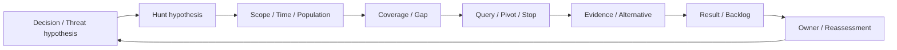

# 第18章 Threat Huntingを仮説・探索・Negative Findingへ構造化する

## この章の位置付け

Threat Huntingは、検索回数や異常件数を増やす作業ではない。意思決定に必要な問いを観測可能な仮説へ変換し、調べた範囲、証拠、代替説明、残る不確かさを記録する。本章では、検知されなかった事象についても「何を調べ、どこまで言えるか」を説明する。

OWNはHunt Plan and Findings、限定したQueryとPivot、Negative Finding、GapからBacklogと再評価への接続である。[第16章](16-telemetry-evidence-readiness.md)の観測条件、[第17章](17-detection-engineering.md)の検知仮説、第19〜20章のIR・DFIR、第25章の分析判断をBRIDGEする。本章では実環境の探索を行わない。SIEM固有言語と製品運用の詳細は専門資料へDELEGATEし、必修課題にしない。

## 学習目標

- Decision Questionを、反証条件を持つHunt Hypothesisへ変換できる。
- IOC検索、Behavior Hunt、Alert調査を区別できる。
- Scope、Time、Population、Coverageに限定してNegative Findingを説明できる。
- Evidence、Alternative explanation、Gap、Owner、再評価をART-06へ記録できる。

## 前提知識

第16章のCoverageと第17章のDetection Validation Recordを参照する。実組織のLog、実User、実IP、PII、実Tokenは使わない。配布した完全合成JSONの読解だけで課題を完了でき、製品権限や実SIEMは不要である。

## 導入ケースまたは判断要求

完全合成の請求処理連携について、「承認Snapshotで説明できない同意変更に続き、同じWorkloadの成功した利用が短時間に現れるか」を問う。判断要求は、検知候補の見直しか、観測不足の修正か、IR担当への評価依頼かを区別することである。悪意や侵害を自動認定する問いではない。

`CASE-HUNT-2026-001`は第17章の`CASE-DET-2026-001`を`refines`する別の教材Recordである。元の`DVR-2026-017-001`、`DET-2026-017-001`、三つのTelemetry契約、fixtureは不変とする。本章の`SYNTH-HUNT18-001` / `HUNT18-REV-001`は新しい教育用対象・版であり、元のEventを追加取得・改変したものではない。

第16章のHunt三行には時刻・同一性・生成根拠のGapが残り、`HOF-TCM16-18`も未配達である。本章の合成Coverage仮定を使って親の状態を昇格させない。親Caseの参照は実行権限、Evidence、Handoff受領の継承を意味しない。

## 全体像

`F-18-01`は問いから再評価までの順序である。



文章代替: 判断目的を仮説にし、対象範囲と観測条件を固定してから検索する。結果を代替説明と比較し、不足を隠さず次の担当と再評価へ渡す。矢印は実通知、収集、Incident宣言を表さない。

## 1. IOC検索とHuntを区別する

IOC検索は既知の値との一致を調べる。Alert調査は検知出力の文脈を確認する。Behavior Huntは「この振る舞いがあれば、どの観測が現れるか」という仮説と反証条件を先に置く。同じ検索を使う場合も、目的と許される結論は異なる。

IOC一致は調査の入口になりうるが、由来、更新時点、正当な利用、観測条件を省略できない。本章の`iocMatch`は供給された合成ラベルで、実Indicatorの照合ではない。IOCだけの検索から本章の行動仮説が支持されたとは判断せず、`Inconclusive`とする。

ATT&CKは仮説の共通語彙として参照する。確認した版は19.2である。Detection Strategiesは複数のAnalyticsをまとめる検知方針であり、掲載自体は手元のCoverageや検証済みQueryの証明ではない。Actor attributionにも変換しない。`SRC-ATTACK-001` `SRC-ATTACK-DET-001`

## 2. 反証可能な仮説とBaselineを置く

Threat Hypothesisは懸念する状況、Hunt Hypothesisは観測によって調べられる問いである。「怪しい動きがある」は、対象、時間、期待Event、比較条件が不足している。

本章の仮説は「指定Window内の成功した同意変更が供給承認Snapshotで説明できず、同じ対象の成功した利用が30分以内に現れる」である。承認済みの変更で説明できれば仮説は弱まる。十分な観測条件で該当する組がなければ、限定したNegative Findingとなる。観測不足なら反証ではなく判断保留とする。

Baselineは、何と比較して正常・例外を区別するかという基準である。この教材では、Ticket、対象、承認Window、許可Scopeの供給Snapshotを使う。組織全体の正常行動分布を学習したものではない。Snapshot外の正当な作業、未記録の変更、未モデル化の業務文脈は代替説明として残す。

## 3. Scope、Time、Populationを先に固定する

`T-18-01`はQuery契約`QUERY-HUNT18-1`の有限条件である。数値は架空時計の秒オフセットであり、実日付のParserではない。RecordのUTC日付とは別の軸で読む。

| 条件 | 本章の固定値 | 境界の意味 |
|---|---|---|
| 対象版 | SYNTH-HUNT18-001 / HUNT18-REV-001 | 別対象・別版へ結論を転用しない |
| Population | syn-workload-a | syn-workload-bは範囲外のNear-miss |
| 同意変更Window | 0以上1800未満 | 終端1800の変更は候補外 |
| Data Window | 0以上3600未満 | 終端3600のEventは対象外 |
| 判断時点 | asOf 4000 | それより遅い到着は不足として扱う |
| Pivot | 同意変更から0〜1800秒、同一Workload | 同時刻・1800秒ちょうどを含む |
| Identity | syn-tenant-a / syn-normalizer-1 | 表示名だけで異なるNamespaceを結ばない |

`scope-invoice-read`と`scope-ledger-export`は製品非依存の合成語であり、実APIの権限名ではない。承認のScope集合が変更のScopeをすべて含むかを比較する。Ticketだけが一致していても承認済みとはしない。

## 4. CoverageとKnown Gapを評価する

必要な三Streamはconsent、approval、useである。それぞれ対象版、Population、Data Windowと、生成・収集・保持・検索・時刻・同一性の条件を確認する。どれかが欠ければ、本章のQueryの結論は`Inconclusive`になる。

配布JSONの`receipts`は教育用の供給仮定であり、実ProducerやCollectorの受領証拠ではない。`SUP-HUNT18-*`は入力ID、対象版、Query ID、入力Digestを結ぶ教材内の比較根拠である。Digestは固定JSON表現の一致だけを示し、原記録の真正性や取得権限を証明しない。

遅延到着はEvent時刻と取り込み時刻を分けて扱う。Data Windowに重なる時刻誤差があれば、順序を断定せずGapとする。NamespaceやNormalizerが一致しなければ、同じ表示名でも結合しない。実データを追加して欠測を埋めることは課題外である。

## 5. Query、Pivot、Stopを計画する

Queryの前に、目的、入力、期待するEvidence、Impact、Stop、Cleanupを記す。`QRY-HUNT18-001`は供給入力の比較だけを行う。`PIV-HUNT18-001`は同じWorkloadの成功した利用への限定的な接続であり、新たな対象探索ではない。

優先順は入力契約検査、Stop、Coverage、行動比較である。未知のKey・型・ID・版などの契約違反はエラーとして拒否し、有効な`Stopped`判断とは区別する。有効な停止理由はScope拡大、Privacy懸念、担当者停止であり、検索結果があっても停止を優先する。

承認照合はTicket、対象、Window、Scope包含を合わせる。一件の承認を全変更へ一般化しない。説明できない変更と利用の組があれば`Supported`、全候補変更が承認で説明されれば`Weakened`、それ以外で必要条件を満たす場合は`Negative finding`とする。これは有限教材の算法であり、一般的なHuntの万能判定器ではない。

## 6. Evidenceと五つのResultを分ける

`T-18-02`の五語は本書の記録契約であり、MITREやNISTが定めた状態機械ではない。

| Result | この教材で必要な根拠 | 許されない飛躍 |
|---|---|---|
| Supported | 不足なく、承認で説明できない変更と利用の組を提示 | 悪意・Actor・侵害の確定 |
| Weakened | 不足なく、候補変更がすべて供給承認で説明できる | システム全体の安全認定 |
| Negative finding | 十分な供給条件の範囲で該当組を観測しない | 観測範囲外を含む侵害不存在 |
| Inconclusive | Coverage、到着、時刻、同一性、Query目的などの不足 | 0件を反証として扱う |
| Stopped | 有効な停止理由を記録し追加探索しない | 停止中の対象拡大 |

Negative Findingには、対象版、Population、Time Window、Query、Coverage、Gap、再評価条件を必ず添える。0件という数値だけでは成立しない。該当する組がないことと、すべてのEventが0件であることも区別する。

確認事実は供給入力と比較結果、分析判断は仮説への限定的な支持・弱化、仮定はCoverageとSnapshotの設計条件である。Confidenceは教材内の判断根拠に限り、現実の侵害確率ではない。反対のResultを主張するには何が変わる必要があるかも説明する。

## 7. BacklogとIncident評価を接続する

SupportedからはDetection見直し候補とIncident triage評価依頼を分ける。InconclusiveからはCollection条件の確認候補を作る。WeakenedとNegative Findingにも再評価条件を残す。StoppedはScope確認へ戻す。

NIST SP 800-61 Rev.3 Finalは、Incidentを宣言する基準、報告のTriageとValidation、調査記録の完全性・来歴を扱う。本章では引渡し先の判断条件として使い、合成のSupportedから自動的にIncidentを宣言しない。`SRC-IR-001`

各HandoffにはFinding ID、供給Evidence ID、目的、担当、期限、制限を付ける。全例は`planned-not-delivered`、受領IDはnull、実行権限はfalseである。記録の作成は通知や受領の完了ではない。Detection・Collection backlogを増やすだけでなく、どのDecisionへ戻すかを示す。

## 安全な演習または分析課題

目的は、同じ問いでもCoverageと代替説明によって結論が変わることを説明することである。前提は本章、空Template、完全合成CaseとJSONである。Authority / Scopeは、自分の作業領域にある供給教材の読解とオフライン比較に限定する。親RoEを実行許可として利用しない。

期待するEvidenceは、選んだ対比の入力ID、Query ID、Result、許容結論、Gap、Owner、再評価を含む読解メモである。Impactはローカルの読解・比較だけで、外部通信、設定変更、実収集、通知は行わない。未知の入力、実データらしい内容、外部接続要求、Scopeや取扱根拠の不明があれば停止し、追加取得せずGapを記す。Cleanupは自分のメモの整理だけとし、供給Evidenceや正本を削除・改変しない。

1. Case 001と002を比較し、どの承認条件が仮説を弱めるか説明する。
2. Case 003と005を比較し、同じ0件でも結論が違う理由を示す。
3. Case 004で、IOC一致と行動仮説の検証を区別する。
4. 遅延、時刻誤差、同一性不一致のいずれかを選び、許されない結論と次の確認条件を記す。
5. Case 010では結果より停止を優先し、実行権限を追加しない。
6. Findingから未配達Handoffと再評価へ辿り、実際の受領を示していない箇所を指摘する。

Repositoryの固定依存が導入済みなら、Linux / WSL2、Python 3.12と固定Jekyll/Kramdownで次の契約検査を利用できる。導入はRepository手順に従い、このコマンド自体はネットワーク接続や依存取得を行わない。

```bash
python3 scripts/check_chapter18_contract.py
```

期待結果は、固定入力、全公開面、有限回帰の整合性検査の成功である。失敗をResultの手修正や検査省略で隠さず、入力と判断根拠へ戻る。成功は実環境の探索・検知・許可・受領の成功を意味しない。

## 作成する成果物

[ART-06 Hunt Plan and Findings](../templates/hunt-report.md)へ記入する。[完全合成Case](../cases/ch18-hunt-plan-example.md)は12の独立した対比であり、一件のIncidentが進行した履歴ではない。CaseにはArtifact欄の全対応、入力JSONへの導線、結果ごとの許容結論を示す。

## 評価基準

`T-18-03`ではQuery数でなく、判断の説明可能性を評価する。

| 観点 | 合格する説明 | 不適切な説明 |
|---|---|---|
| 仮説 | Decision、期待観測、反証条件がつながる | IOC一致をHunt全体の成功とする |
| 範囲 | 対象版・時間・Population・Pivotを固定する | 結果を見て対象を無制限に広げる |
| Coverage | 必要条件とGapを独立に示す | 0件ならNegative Findingとする |
| 判断 | Evidenceと代替説明、Confidenceを分ける | Supportedなら侵害確定とする |
| 引渡し | 目的・担当・期限・未配達・再評価が追える | IDがあれば受領済みとする |
| 安全 | 合成・オフライン・停止・非継承を守る | 親Caseから権限を借用する |

六観点をすべて満たせば読解課題を完了とする。InconclusiveやStoppedでも、理由と次の判断を説明できれば成果物は完成しうる。

## よくある誤解

- **Negative Findingは価値がない:** 調べた範囲と制限が明確なら、次の判断や収集優先度に寄与する。
- **Snapshotにないなら不正である:** 未記録の正当な変更という代替説明を残す。
- **全Receiptがtrueなら実Coverageを検証した:** 本章では供給仮定の比較にすぎず、実収集の証拠ではない。
- **Queryを修正すれば同じ結論を保持できる:** 入力、Query、Scope、Coverageの変更は再評価の契機である。

## 章のまとめ

Huntの成果は、仮説、観測範囲、証拠、代替説明、許容結論を一つの記録へ結ぶことである。五つのResultを成功・失敗の順位にせず、不足や停止を正直に残す。BacklogとIncident評価を分け、担当と再評価条件へ接続する。

## 次に学ぶこと

第19章では、IRの判断要求、Triage、引渡し条件へ進む。第20章のDFIRでは原記録と来歴、第22章では改善候補、第25章では代替説明と確信度を扱う。[第25章 Structured Analysis](25-structured-analysis-attribution.md)へ戻り、Evidenceと判断の区別を確認してもよい。一般的な状況共有・復旧運用は[インシデント対応の基本](https://itdojp.github.io/incident-response-basics-book/)へ委譲し、本章へ戻ったらART-06のGapと再評価を更新する。

## 参考文献・Source Note ID

- `SRC-ATTACK-001`: ATT&CK 19.2。仮説の版付き語彙。Coverageや帰属の証明には使わない。
- `SRC-ATTACK-DET-001`: Detection Strategiesの役割。製品Queryや本書の算法の標準ではない。
- `SRC-IR-001`: SP 800-61 Rev.3 Final。Incident基準、Triage、記録の来歴への限定参照。

[第18章Source Review](../references/ch18-source-review-2026-09-22.md)に採用箇所、除外範囲、再確認条件を示す。
