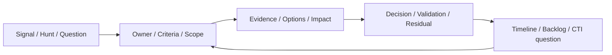

# 第19章 CSF 2.0 に接続したIncident Response

## この章の位置付け

インシデント対応（Incident Response、IR）は、Alertを処理して閉じるだけの作業ではない。誰が、どの範囲について、何を根拠に判断し、事業・証拠・復旧にどの不確かさを残したかを管理する。本章の成果物は`ART-25 Incident Action Plan`である。

OWNはIRの判断記録、役割、Scope、封じ込め選択肢、復旧検証、未配達Handoffである。[第2章](02-law-ethics-authorization.md)のAuthorityとData取扱い、[第16章](16-telemetry-evidence-readiness.md)の観測条件、[第17章](17-detection-engineering.md)のDetection、[第18章](18-threat-hunting.md)のHuntからBRIDGEする。一般的な連絡・復旧Runbookは[incident-response-basics-book](https://itdojp.github.io/incident-response-basics-book/)へDELEGATEする。製品固有の封じ込め操作と個別の法的通知判断は本章の対象外であり、委譲先を読まなくても本章の読解課題は完了できる。

## 学習目標

- IRをCSF 2.0の六つのFunctionへ接続し、固定の直列手順と区別できる。
- 初動から復旧までの役割と判断根拠を定義できる。
- Classification、Severity、Priority、Status、Scopeを分離できる。
- 宣言、Evidence、選択肢、復旧検証、残余リスクをIncident Action Planへ記録できる。

## 前提知識

第15章のFindingとResidual risk、第16〜18章のEvidence、Coverage、限定結論を参照する。完全合成の供給JSONを読むだけであり、実Incident、実組織、実User、実PII、実Credentialは使わない。製品操作、外部接続、実通知、追加収集は行わない。

## 導入ケースまたは判断要求

架空の請求連携Appについて、承認文脈の分からないOAuth同意変更とWorkload API利用がHuntの問いになった。IR担当が問うのは、「悪意が確定したか」だけではなく、「候補を誰が評価し、どの基準で宣言し、どのScopeと残余リスクを引き受けるか」である。Event不足、誤設定、正当な管理変更、侵害仮説を比較する。

`CASE-IR-2026-001`は、正式な親`CASE-DET-2026-001`を`refines`する教育用Recordである。`HUNT-2026-018-001` / `FND-HUNT18-001`を方法上の入力参照として別記する。十二対比は`SYNTH-IR19-001`〜`SYNTH-IR19-012`という独立した合成対象・版であり、一つの実Incidentを十二回処理した記録でも、親Eventの取得結果でもない。

親の`HOF-TCM16-19`と`HOF-HUNT18-001-2`は未配達のままである。第16章のIR行には保持・Privacy根拠のGapが残る。本章で供給する教育用仮定によって、親のEvidence、実権限、受領、検知契約を更新しない。

## 全体像

`F-19-01`は判断項目の接続を示す。矢印は実操作や必須の直列状態遷移を表さない。



文章代替: 入力の問いを判断主体と基準へ結び、Evidenceと選択肢の影響を比較する。判断後もValidationと残余リスクを分け、次の担当へ渡す問いと再評価条件を残す。Handoffは記録しただけでは配達されない。

## 1. CSFのOutcomeとIRの記録を接続する

CSF 2.0は組織のリスク管理に使うOutcomeの枠組みであり、六つのFunctionを順番に一度ずつ終える手順ではない。SP 800-61 Rev.3はIRをこの枠組みに接続する。旧Rev.2の図だけを現在の説明として用いない。`SRC-CSF-001` `SRC-IR-001`

`T-19-01`は本書による対応付けであり、標準への適合や有効性を認定する表ではない。

| Function | 本章で対応付ける判断 | ART-25に残すもの |
|---|---|---|
| Govern | 責任と取扱いの境界は何か | Decision owner、権限、通知照会 |
| Identify | 何が重要で、何が不明か | Asset、事業影響、Scope仮説 |
| Protect | 被害を抑える備えは何か | 保持条件、切戻し条件、Control候補 |
| Detect | 入力をどう評価するか | Signal、Hunt、宣言基準、Gap |
| Respond | 何を選び、どう調べるか | 封じ込め案、Evidence Question、判断Log |
| Recover | 何を確認して閉じるか | 正常性検証、閉鎖基準、残余リスク |

この表の順序で作業を待たせる必要はない。例えば調査を続けながら復旧の条件を検討し、Privacyの疑問は判明した時点で照会する。本章の有限検査も、CSF全体の実装を検証するものではない。

## 2. Eventから宣言までを同一視しない

Eventは観測した出来事であり、悪意の判定そのものではない。NISTの定義と宣言基準の考え方を参照しつつ、本書では次の記録上の区別を使う。`SRC-IR-001`

- Event: 供給された同意変更や利用の一件。
- Alert: 条件への一致を通知する出力。真のIncidentと同義ではない。
- Case: 問いと関連記録を束ねる容器。
- Incident Candidate: 判断主体が評価すべき候補。本章ではSuspectedとして扱う。
- Declared Incident: 定義した基準に対するOwner、Reason、Timestamp付きの宣言判断。

HuntのSupportedは候補を検討する理由になっても、宣言の代わりにはならない。`ICASE19-002`では別途供給した宣言基準判定を参照する。`ICASE19-008`はその記録が不足し、`ICASE19-009`は正当変更の代替が残るため、いずれもDeclaredへ進まない。悪い例は「Huntが支持したので自動宣言する」である。

## 3. 四つの軸と役割を分離する

Classificationは事象の種類に関する仮説、Severityは影響の重大さ、Priorityは対応の緊急性と資源配分、Statusは現在の対応状態である。重大度が高くても根拠不足は残り、優先度が高くても権限は生まれない。報告の確認、分類・優先付け、復旧開始基準を分けるNISTの記述を参照する。`SRC-IR-001`

Decision ownerは判断に責任を持つ。Incident commanderは活動の調整、Evidence leadは保持と来歴、Communication ownerは宛先と承認、Recovery ownerは復旧検証を担当する。実組織では兼務し得るが、記録の欄まで一つに潰さない。法務・Privacy担当への照会は、技術担当が法律上の結論を代行することではない。

`T-19-02`の七状態は本書の教育用契約であり、NISTの標準状態一覧ではない。

| Status | 本章で意味すること | それだけでは意味しないこと |
|---|---|---|
| Suspected | 候補の評価が必要 | 侵害確定、無害確定 |
| Declared | 主体・理由・時刻・基準付きの供給宣言 | 全Scope確定、実権限 |
| Contained | 指定対象の供給検証で拡大抑制を確認 | 根絶、全影響の解消 |
| Investigating | Evidence Questionを持つ調査中 | 原因・Actorの確定 |
| Recovering | 復旧開始条件を満たす供給判断 | 復旧完了 |
| Closed | 復旧検証と残余リスクの担当付きの閉鎖 | 再発防止の完了 |
| Reopened | 旧閉鎖を参照する新判断 | 旧記録の取消・削除 |

有限検査はDeclaredからInvestigatingへ進む例も許容し、封じ込めと調査を固定順にはしない。未知の遷移や入力は拒否する。実運用で全組織にこの遷移表を強制することは意図しない。

## 4. ScopeとEvidence Questionを先に分ける

Scope hypothesisは調べる候補、Confirmed scopeは供給Evidenceで限定して確認した対象、Excluded scopeは明示した除外根拠のある対象、Unknown scopeは分からない対象である。この教材では四対象を重複なく分類するが、現実のScope全体を列挙し切ったとは扱わない。

合成App A、App B、Identity C、Data Dのうち、Data DはUnknownとして残す。Excludedは「Logがなかったから」ではなく、指定対象・Windowの除外根拠を必要とする。`ICASE19-010`はApp BもUnknownへ残す対比である。これを「侵害なし」と書き換えることはできない。

問いには「どの対象・版・Windowについて、どの追加記録があれば正当変更と別の説明を区別できるか」を記す。`EQ-IR19-001-20`のようなEvidence Question IDを、予定Timeline IDと結ぶ。参照しただけでは第20章の調査が完了したことにならない。

## 5. 保存と封じ込め案を比較する

IRでは記録の来歴・完全性とData保持を意識する必要がある。保持条件は業務と組織手順に依存し、本教材のHashや供給Receiptは真正性・法的適格性を証明しない。`SRC-IR-001`

`T-19-03`は実行手順ではなく、合成選択肢の比較である。

| 選択肢 | 期待する効果 | 事業・Evidence上の負担 |
|---|---|---|
| App停止案 | 当該App利用の抑制 | 請求処理停止、変更前状態の保持 |
| Permission制限案 | 権限範囲の限定 | Export機能への影響、前後Snapshotの分離 |
| Monitoring強化案 | 観測の補強 | 保管・分析負荷、封じ込め効果とは別 |

各案には、対象版、教育上の承認主体・有効時間、Expected impact、Rollback、保持記録、効果のValidationを結び付ける。案の存在、承認、実施、効果確認は別々である。`ICASE19-003`は事前保持と限定した供給検証を持つ。`ICASE19-011`はMonitoring案だけではContainedへ進めないことを示す。

本章の実行回数は0である。破壊的なActionは供給モデルでも対象外とし、保持前のActionや承認の不足を正常な封じ込めにしない。調査のために実影響を増やす選択、実ログ削除、製品コマンドは掲載しない。

## 6. 調査とCommunicationを並行して管理する

調査では確認事実と判断を分ける。記録したEventの組、供給された基準判定、未観測範囲を別欄に置き、侵害仮説だけでなく正当変更と誤設定も比較する。Actorの特定を、封じ込めや復旧の前提にしない。

通知については、Dataの性質、影響、関係者、法域、契約、組織手順を誰が確認するかをQuestionとして残す。NISTは関係者との調整と該当する法・規則等に沿う通知を扱うが、これだけで個別案件の要否・期限は決まらない。第2章の責任境界へ戻り、適切な法務・Privacy担当へ照会する。`SRC-IR-001`

`NQ-IR19-001`のAudienceは検討先の候補であり、配信一覧ではない。機微情報をそのまま転送する前提を置かず、必要最小限の内容と承認を別途確認する。本課題の通知は0件で、通知不要という法律上の結論も出さない。

## 7. Recovery、Closure、Reopenを分ける

根絶に向けた計画、復旧開始条件、復旧後の正常性・完全性検証、閉鎖の判断は別々である。NISTの復旧基準と検証、復旧終結の考え方を参照する。製品固有の復元方法は扱わない。`SRC-IR-001`

`ICASE19-005`はRecoveringへ進む入口であり、Closedではない。`ICASE19-006`は供給Scopeの復旧検証、Owner、判断時刻、残余リスク、Risk owner、再確認期限を持つ。反証例の`ICASE19-012`は検証がUnknownのためRecoveringを維持する。復旧Actionの記録だけを成功の証明にしない。

`ICASE19-007`は閉鎖時点より後に利用可能となった新Evidenceで再開する。新しい事象とは限らず、遅れて分かった情報の場合もある。以前の閉鎖ID・時刻・残余リスクは保持し、新しいOwner、Reason、Timestampを追記する。閉鎖した事実を消して履歴を整えない。

## 8. Lessonsを次の判断要求へ渡す

改善候補はControl ID、Owner、期限、検証条件、再評価IDを持たせる。Recoveryの完了と、改善Backlogの解消を別の軸で管理する。予定Timeline、Backlog、CTI RecordのIDを置いても、受け手が受領・評価したとはしない。

第20章にはEvidence QuestionとScope、第22章には残余リスクと改善候補、第26章には限定結論・代替説明・判断要求を渡す計画を作る。全36件のHandoffは`planned-not-delivered`、Receiptはnull、実権限はfalseである。未執筆の章の成果を先行認定しない。

## 安全な演習または分析課題

目的は、[合成Case](../cases/ch19-incident-action-plan-example.md)と[供給JSON](../cases/fixtures/ch19-incident-response.json)を比較し、各判断で足りない根拠を説明することである。事前に[ART-25](../templates/incident-action-plan.md)の欄と[JSON Schema](../schemas/ch19-incident-response.schema.json)を確認する。追加収集や外部アクセスは不要である。

Authorityは自分の教材コピーの読解だけ、Scopeは十二の供給Snapshotだけである。期待Evidenceは、要求状態、以前の状態、基準・Scope・時刻を照合した読解メモであり、実対応の成功記録ではない。影響は自分のメモに限る。実Data、未知の入力、外部接続、権限不明が出たら止める。Cleanupはメモの整理だけで、供給Evidenceを変更しない。

1. `ICASE19-001`と002、008と009を比べ、Hunt入力と宣言判断の差を書く。
2. 003と011で、選択肢・教育上の承認・保持・効果検証を別欄へ写す。
3. 006と012で、復旧開始・検証・残余リスク・Closedを区別する。
4. 007で、旧閉鎖を保持したまま再開する理由と新Evidenceの利用可能時刻を示す。
5. 010のUnknownを残したまま、次章へ渡すQuestionを作る。宛先へ送信しない。

任意のローカル契約確認は、Repositoryの依存導入済み環境でのみ行う。Python 3.12と固定Ruby/Jekyll依存を前提とする。依存導入やネットワーク接続をこのコマンドは行わない。期待結果は契約成功、影響はプロセスとローカルキャッシュだけである。ERRORなら入力・版・依存を確認して停止し、検査を外さない。終了後は自分の読解メモと所有キャッシュだけを整理する。

```bash
python3 scripts/check_chapter19_contract.py
```

検査のacceptedは供給記録の条件充足、deferredは不足による以前の状態の維持を意味する。型・ID・Scope・時刻の不正は入力エラーとして停止する。実組織の宣言や承認を自動化するツールではない。

## 作成する成果物

`IAP-2026-019-001`として、Roles、四つの判断軸、Scope、Evidence、封じ込め案、通知照会、復旧検証、閉鎖・再開、Timeline / Finding / Control / Reassessmentを記録する。確認事実・判断・仮定・推奨を区別し、確信度と代替説明を併記する。供給Receiptと前状態のRecordは教育上の仮定であり、電子署名検証や来歴認証ではない。

Caseの「全欄の読み方」は全Artifact欄とJSONの値を対応付ける。詳細Evidence列はリンク先JSONを正本として読む。有限の日本語判断文もレビュー対象に固定するため、意味のある変更は入力・期待値・判断文を一緒に再レビューする。任意の文章の真偽を機械判定するとは主張しない。

## 評価基準

`T-19-04`では速度やAlert件数ではなく、判断記録の質を評価する。

| 観点 | 合格する記録 | 不合格となる例 |
|---|---|---|
| 基準・役割 | 主体・理由・時刻と宣言基準がある | Supportedを宣言に代用 |
| Scope | 確認・仮説・除外・未知を分ける | Log不足から全体安全 |
| 選択肢 | 影響・承認・保持・切戻しと効果検証を分ける | 案だけでContained |
| 復旧 | 入口基準と正常性検証、残余リスクを分ける | ActionだけでClosed |
| 通知 | 照会先・Question・判断責任を残す | 教材だけで要否・期限を断定 |
| 再評価 | 旧判断を保持して新Evidenceと次のOwnerへ結ぶ | 未配達を受領済みに変更 |

## よくある誤解

- 「重大だからDeclared」: 重大度と宣言根拠は別である。
- 「Monitoringを増やす案を選んだのでContained」: 効果の供給検証が必要である。
- 「Closedだから改善も完了」: 残余リスクとBacklogは別に追跡する。
- 「Hashが同じなら正しいEvidence」: 固定表現の比較と真正性は別である。
- 「通知していないので通知不要」: 未送信という事実と法的判断は別である。

## 章のまとめ

IRを判断主体、基準、Scope、Evidence、選択肢、復旧検証、残余リスクへ分解すると、速さだけでは見えないGapを扱える。七状態は記録上の境界であり、実権限や組織全体の安全を付与しない。不足を残した完全な教材と、根拠を省いた成功宣言を区別する。

## 次に学ぶこと

第20章ではEvidence QuestionからTimelineと因果を再構成する。第22章では改善候補を測定と優先順位へ、第26章では限定したIR知見をOperational CTIへ接続する。これらは後続章の計画であり、本章のHandoffは未配達である。分析判断の書き分けは既存の[第25章](25-structured-analysis-attribution.md)も参照できる。

## 参考文献・Source Note ID

- `SRC-CSF-001`: NIST CSF 2.0、2024-02-26 Final。六Functionを上位Outcomeとして使用する。
- `SRC-IR-001`: NIST SP 800-61 Rev.3、2025-04-03 Final。宣言、判断、記録、通知、復旧の用途に限定する。

確認日2026-09-23、採用箇所と非採用範囲は[Source Review](../references/ch19-source-review-2026-09-23.md)を参照する。七状態と有限判断契約は本書独自であり、標準の規範算法ではない。
