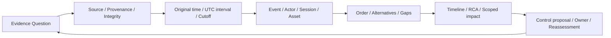

# 第20章 DFIRとタイムライン・因果再構成

## この章の位置付け

DFIR（Digital Forensics and Incident Response）の分析では、時刻の付いたRecordを並べるだけでは足りない。どの問いに答えるための記録か、どのClockを使ったか、判断時点で利用できたか、別の説明を否定できるかを残す。本章の成果物は`ART-07 Incident Timeline`と`ART-26 Root Cause Analysis`である。

OWNはEvidence Question、時刻の正規化と不確かさ、Eventの対応付け、代替順序、原因・寄与要因・影響範囲の区別である。[第8章](08-safe-lab-evidence.md)の来歴、[第16章](16-telemetry-evidence-readiness.md)の観測条件、[第19章](19-incident-response.md)の対応判断、[第25章](25-structured-analysis-attribution.md)の代替仮説へBRIDGEする。ディスク・メモリ・モバイルの取得手順、個別ツール操作、マルウェア解析、法的適格性の個別判断はDELEGATEし、本章では実施しない。

## 学習目標

- 原時刻、正規化時刻、Clockの不確かさ、収集・取込・分析時点を分離できる。
- Event、Source、Actor、Session、Assetの対応と、その限界を説明できる。
- TimelineからRoot Causeへ飛躍せず、代替説明とEvidence gapを記録できる。
- 原因仮説、Trigger、寄与要因、影響範囲、改善案と再評価を追跡可能にできる。

## 前提知識

第16〜19章のEvidence、Coverage、Hunt、Incident Action Planを参照する。演習は完全合成JSONの読解だけで完結する。実Incident、実イメージ、実メモリ、実PII、実Credential、第三者環境は使用しない。外部接続、実収集、実操作、実通知は0件である。

## 導入ケースまたは判断要求

架空App Aの同意変更とWorkload API利用が、別々のSourceに記録されている。CollectorはAPIのRecordを先に届けた。一方で保守予定もある。「同意変更がAPI利用の原因であり、正当な保守ではない」と結論してよいだろうか。

`CASE-DFIR-2026-001`は親`CASE-IR-2026-001`を`refines`する。本章の供給対象は独立した`SYNTH-DFIR20-001` / `REV-DFIR20-001`である。親19の`ICASE19-004`、`HOF-IR19-004-20`、`EQ-IR19-004-20`は方法上の参照にすぎない。親の予定`TL-IR19-004`を受領したことにはせず、親Handoffは未配達、Receiptはnull、実行権限はfalseのまま保持する。

## 全体像

`F-20-01`は分析の接続である。矢印は実収集や原因成立を意味しない。

文章代替: 問いに対応するSourceと来歴を確認し、時刻と利用可能時点を分ける。対象・版・Eventを対応付け、順序と代替説明を比較する。限定した結論とGapを二つの成果物へ残し、改善案の担当・確認条件・再評価へ結ぶ。

## 1. 問いと原記録の範囲を決める

「何が起きたか」を、対象・版・Windowを持つ問いへ分ける。本章では同意変更がAPI利用より前か、保守予定とどう関係するか、特定Changeの対象範囲に入るか、利用可能化の機構を示せるかを別のQuestionにする。Actorの特定を、調査開始や改善案の前提にしない。

NIST SP 800-86は収集、検査、分析、報告を区別し、複数Sourceの対応付けや結論できない場合の扱いを説明する。2006年の文書であり、ここでは継続的に使える分析・報告の原則だけを参照する。古い製品や取得手順を現在の標準演習として採用しない。`SRC-NIST-DFIR-001`

原記録の識別子、Source、供給主体、保持参照、表現のHash、作業Copy、変換履歴を分ける。Berkeley ProtocolはDigital Open Source調査の文脈で原形式の保持、来歴と作業Copyの区別を扱う。本章はその限定した原則を参考にするのであり、すべてのDFIRや法域に通用する適格性・証拠能力を認定するものではない。`SRC-BERKELEY-001`

本章のHashは、ソート済みKey・空白なしの供給JSON payload表現を比較する。実収集ByteのHashでも、署名検証でも、正しさや許可の証明でもない。時刻変換は作業上の見方を増やすだけで、元payloadを書き換えない。

## 2. 四つの時点とCutoffを分ける

`T-20-01`は本書の記録上の区別である。製品固有のField名と同一ではない。

| 時点 | 意味 | 混同しないもの |
|---|---|---|
| Event time | SourceがEventへ付した原時刻 | Collector到着順 |
| Collection time | 供給モデルで取り出された時点 | Eventの発生順 |
| Ingest time | 供給モデルで取り込まれた時点 | 内容の真正性 |
| Analysis time | 対象Snapshotを評価した時点 | その後に得たEvidence |
| Available time | 当該Recordが分析入力として利用可能になった時点 | 原時刻が古いこと |
| Evidence cut-off | その判断へ使用できる入力の締切 | 後着Dataを無言で加えた最新版 |

Available timeはCollectionやIngestとは別に供給する。分析基盤では受付済みでも、必要な検査や変換が済んでいない場合があるためである。実運用でどの時点を使うかは組織の手順に依存する。本教材ではCollection ≤ Ingest ≤ Availableを条件とする。

Snapshot Aは08:10 UTCをCutoffとし、08:12に分析する。08:30に利用可能になる`EV20-005`は、原時刻が07:55でもAの判断には使えない。Snapshot Bは08:35をCutoffとし、08:36に分析する。Aの不確かさを消さず、新しい版の判断として残す。

## 3. 原時刻を幅のあるUTCへ変換する

UTCへ変換してもClockのずれは消えない。本教材ではClock offsetの正値を「基準より進んでいる」と定義し、UTCへ直した原時刻からoffsetを引く。さらに、精度・量子化・driftを含めて供給した総不確かさを両側へ加える。これは本書の有限モデルであり、標準化されたDFIR算法や実測精度の保証ではない。

`T-20-02`では日付をすべて2026-09-01とする。区間は両端を含み、不確かさは確信度の百分率ではない。

| Evidence | 原時刻 | offset / 不確かさ | 正規化区間 UTC |
|---|---|---|---|
| EV20-001 | 17:00:40+09:00 | +30秒 / ±30秒 | 07:59:40〜08:00:40 |
| EV20-002 | 08:00:10Z | -10秒 / ±30秒 | 07:59:50〜08:00:50 |
| EV20-003 | 07:58:00Z | 0秒 / ±1秒 | 07:57:59〜07:58:01 |
| EV20-005 | 07:55:00Z | 0秒 / ±1秒 | 07:54:59〜07:55:01 |

同意変更とAPI利用の区間は重なる。中心時刻だけを並べた「同意変更→API利用」と、実際に証明できる順序は異なる。Clockの条件が変われば再評価が必要になる。

有限検査は2000〜2099年の秒単位でTimezoneを明示した表現を扱う。Timezoneなし、未知offsetの`-00:00`、曖昧な地域略称、うるう秒、未対応の小数秒を推測変換しない。時刻不明を現在時刻や0秒で埋めるのも誤りである。未知・未対応は停止して、必要なTime basisを問い直す。

## 4. 到着順、重複、Eventの同一性を分離する

`EV20-002`は08:04に利用可能になり、同意変更`EV20-001`は08:07に利用可能になる。到着順がAPI→同意変更でも、Event順まで確定しない。Collector遅延は分析に寄与した条件として残すが、それ自体を事案のRoot Causeにしない。

`EV20-004`は`EV20-002`と同じSource・Event ID・payloadを持つ再送Recordである。二つのReceiptは残し、Timelineでは一つのEventにまとめる。別Sourceで同じEvent IDを使っているだけなら重複と断定できない。同じSource・Event IDなのにpayloadが違えば、都合のよい方を採用せず衝突として停止する。

Snapshotごとに利用可能なReceiptの中から対応付ける。後着Receiptを代表に選んで、前の判断の存在しなかった入力にしてはならない。表示の安定性のためのSource ID順は、発生順や因果順を意味しない。

## 5. Relationと根拠の強さを記録する

`T-20-03`の五つのRelation名は本書の記録語彙である。自然言語を万能に解釈する分類器ではない。

| Relation | 記録する意味 | この教材での制約 |
|---|---|---|
| Before | 指定した左Eventが右より前 | 左区間の終端が右区間の始端より厳密に前 |
| After | 指定した左Eventが右より後 | 左区間の始端が右区間の終端より厳密に後 |
| Concurrent | 同時性を独立根拠で支持 | 本供給Bundleには同時性の独立根拠がなく、受理しない |
| Possibly related | 順序・関係の評価が未確定 | 区間の接触・重なりだけで因果や同時性を昇格しない |
| Contradicted | 特定の主張が供給根拠と矛盾 | Eventを削除する意味でも、別の原因を証明する意味でもない |

保守予定Recordが同意変更より前という`CLM20-002`は、供給Clockモデル内で支持される。API利用が保守予定より前という`CLM20-005`は反証され、実際の区間関係はAfterである。JSONでは`status=contradicted`と`relation=After`を分ける。

Actor、Session、Assetの一致は、相関の問いを作る手掛かりである。本例の同意変更のActorとAPIのWorkloadは異なる。Appの一致だけで、同一人物、同一Session、悪意、同意変更による利用可能化まで推定しない。

## 6. 代替説明を追加Evidenceで更新する

Snapshot Aでは、保守予定が存在することと、API利用がその承認範囲に入ることを分ける。範囲を示す`EV20-005`が未到着なので、`CLM20-003`は未確定である。

Bで利用可能になったRecordは、特定`CHG20-001`の承認対象がApp Bだけであることを示す。App AのAPI利用はこのChangeの対象ではないため、「このChangeがその利用を覆う」という説明は反証される。この有限比較は対象資産と時間窓の二条件だけであり、仮に一致しても手法・操作の実行許可を認定しない。ただし、別の許可・保守の存否、Actorの意図、認可機構は分からない。「正当な説明がすべて消えた」「侵害が確定した」とは書けない。

NIST SP 800-86の分析・報告は、入手できたDataから結論できない場合と、複数の説明を検討する必要性を扱う。追加Evidenceを都合のよい仮説だけに適用せず、何が変わり何が残ったかを示す。`SRC-NIST-DFIR-001`

## 7. Trigger、原因仮説、寄与要因、影響を分ける

NIST SP 800-61 Rev.3のRS.AN-03は、事象の順序や関係資産を検討し、根底にある原因を調べることを扱う。RS.AN-06/07は調査の記録とDataの来歴・保持を扱う。これを「前に起きたEventが原因」と短絡する根拠にはしない。`SRC-IR-001`

本例のART-26は次を別欄に置く。

- Trigger: 調査のきっかけとなる同意変更Record。真の原因を宣言する欄ではない。
- Root condition hypothesis: 認可条件の欠落という仮説。機構を示す入力がなく`unresolved`。
- Contributing factor: Collectorの後着により分析時の見え方が変わる条件。事案自体への因果的寄与は未確定。
- Observed impact: 供給されたApp AのAPI利用一件の範囲。全Data流出や全事業影響ではない。
- Unknown scope: Data D。記録不足を「影響なし」に置き換えない。

A/Bのいずれも原因の確信度はlowである。Bで一つの代替説明が弱まっても、原因を支持する機構Evidenceが増えたわけではない。有限検査も二つのEventから原因をsupportedへ昇格する経路を持たない。これは教材の範囲を限定した設計であり、全DFIRの原因分析を自動化したものではない。

## 8. 改善案と再評価へ渡す

Root Causeが未確定でも、認可判定根拠と変更対象の対応を検証する計画は作れる。ただしControl failureはhypothesis-only、復旧はnot-assessedである。改善案の存在と実変更、変更と効果の確認を同一視しない。

`CTL-DFIR20-001`へ、対象・版・Window、検証する問い、Owner、期限、反例、受入基準、再評価IDを結ぶ。実変更は0件である。第21章へのControl検証の問い、第22章への改善管理、第25章への代替分析は、いずれも`planned-not-delivered` / Receipt null / `executionAuthorized=false`として記録する。親19の復旧・閉鎖状態を更新しない。

## 成果物

[ART-07 Template](../templates/incident-timeline.md)にTimelineと時刻・根拠・Gapを、[ART-26 Template](../templates/root-cause-analysis.md)に原因仮説・代替・影響・改善と再評価を記入する。[完全合成記入例](../cases/ch20-dfir-timeline-causality-example.md)には全欄を示し、[JSON](../cases/fixtures/ch20-dfir-timeline-causality.json)と[Schema](../schemas/ch20-dfir-timeline-causality.schema.json)へ対応付ける。

## 安全な演習または分析課題

目的は、供給された五Receiptから二つのCutoff判断を比較することだけである。前提は本章と配布資料の読解であり、実環境や新しいDataは不要である。期待する証跡は記入した二つのArtifact、採否理由、Gapである。実システムへの影響はない。

1. 原時刻を保持して四つのUTC区間を計算し、符号と不確かさの意味を説明する。
2. Aで利用できる四Receiptと除外する一Receiptを分け、再送を残した三Eventを作る。
3. 六つのClaimについて、支持・反証・未確定を根拠ID付きで記入する。
4. Bで増えた入力だけを示し、保守仮説の更新と変わらないGapを分ける。
5. Trigger、Root condition hypothesis、寄与要因、限定影響とUnknown scopeをART-26へ記入する。
6. Owner、期限、検証条件と未配達Handoffを確認し、どの新Evidenceで再評価するかを書く。

実Data・個人情報・実Credentialの追加収集は行わない。実外部対象や許可不明の入力が必要と分かった時点で停止する。欠けたLogを創作して課題を成功させない。Cleanupは自分の解答Copyを保持条件に従って整理することであり、配布原本や実ログを変更する作業ではない。

## 評価ルーブリック

`T-20-04`の各観点を0〜2点で評価する。0点は欠落・誤同一視、1点は区別できるがIDや理由が不足、2点は根拠・限界・再評価まで追跡できる状態である。合計12点中10点以上を目安とし、重大な安全・推論上の誤りは点数で相殺しない。

| 観点 | 2点の証跡 |
|---|---|
| 原時刻とClock | 原表現、offsetの符号、区間、条件を保持 |
| 来歴とCutoff | Source、Receipt、再送、後着Evidenceの採否を追跡 |
| Relation | 重なりと同時性、到着順とEvent順を区別 |
| 原因と代替 | 機構不足と特定Changeの反証を別記 |
| 影響範囲 | 供給事実、判断、Unknown、Gapを分離 |
| 改善と再評価 | Owner、期限、確認条件、未配達と権限falseを保持 |

実対象への追加操作、Hashによる真正性の断定、後着EvidenceによるAの無言の修復、相関だけの原因確定、Unknownの不存在化は再提出とする。

## 章のまとめ

Timelineは時刻順の物語ではなく、問い、入力の来歴、時刻幅、採否と関係を持つ記録である。因果の分析には機構と代替説明が必要であり、前後関係や一つの反証だけでは足りない。結論できない点も、担当と再評価条件を持つ成果物として残せる。

## 次に学ぶこと

[目次](../TOC.md)の第21章ではControlの検証へ、第22章では改善管理へ進む。第25章では残る代替説明の分析を深める。この導線は後続章の受領や実作業の完了を意味しない。

## 参考文献・Source Note ID

- `SRC-NIST-DFIR-001`: NIST SP 800-86 Final、August 2006。§3.1〜3.5の分析・報告・完全性の原則に限定。
- `SRC-IR-001`: NIST SP 800-61 Rev.3 Final、2025-04-03。RS.AN-03/06/07の調査・来歴・保持に限定。
- `SRC-BERKELEY-001`: Berkeley Protocol、2022 edition。VI.C154/155(g,h)、VI.D167〜169の原形式・来歴・作業Copyに限定。

[確認記録](../references/ch20-source-review-2026-09-25.md)と[Source Baseline](../references/reference-baseline.md)を参照する。有限時刻モデル、五Relation、二Snapshotと評価基準は本書独自である。
