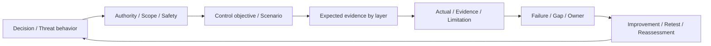

# 第21章 Purple TeamとControl Validation

## この章の位置付け

Purple Teamを、攻撃側が操作し防御側が画面を見せる催しだけにしない。何を防ぎ、何を観測し、どの判断へつなげたいかを先に定め、期待と実際の差を改善担当へ返す。本章のControl Validation（統制の検証）は、その問い・条件・根拠・限界を結ぶ作業である。成果物は`ART-27 Control Validation Plan`とする。

OWNは検証計画、層別評価、失敗の分類、改善と再試験の接続である。[第5章](05-attack-behavior.md)の行動、[第14章](14-minimal-impact-validation.md)の最小十分な根拠と停止、[第16章](16-telemetry-evidence-readiness.md)の観測条件、[第17章](17-detection-engineering.md)の検知、[第19章](19-incident-response.md)の対応判断、[第20章](20-dfir-timeline-causality.md)の原因仮説へBRIDGEする。攻撃Emulation製品の操作、実マルウェア、C2、永続化、回避、本番への攻撃演習はDELEGATEし、本章では実施しない。

## 学習目標

- シナリオを、目的・条件・期待Evidence・層別結果へ分解できる。
- コントロール失敗と、観測不足・検知論理・手順・権限・試験設計の問題を分類できる。
- Control Validation Planを作成し、改善担当・期限・Retestへ接続できる。

## 前提知識

第14・16・17・19・20章の成果物を方法上の参照にする。演習は配布された完全合成JSONの読解と有限比較だけで完結する。実Target、実Account、実Credential、実Log、実Incident、外部接続は不要である。実操作・収集・通知・Deploy・Incident宣言はすべて0件である。

## 導入ケースまたは判断要求

架空の請求連携で、業務上未承認のscope追加を防ぎたい。防止の供給記録には「blocked」とあるが、必要な監査の配送失敗も記録されている。別の検知試験では必要な入力がそろっているのにPositiveのAlertが出ない。両方を「検知できなかった」の一言で処理すると、改善する場所を誤る。

`CVP-2026-021-001` / `CASE-CV-2026-001`は`CASE-DET-2026-001`を`refines`する。本章の対象は新しい`SYNTH-CV21-001` / `REV-CV21-001`である。親17の`DR-DET-2026-001`、`TH-DET-2026-001`、`DVR-2026-017-001`、`DET-2026-017-001`は問いと正常・異常の比較方法を参照するだけで、親Evidenceの受領や実検知契約の充足を認定しない。

親20の`RCA-DFIR20-B`にある`CTL-DFIR20-001`は原因未確定の改善仮説である。`HOF-DFIR20-21`は未配達、Receiptはnull、実行権限はfalseのまま保持する。本章の教材ができても、親の原因仮説を確定したり、予定Handoffを受領済みにしたりしない。

## 全体像

`F-21-01`は検証計画の読み順である。矢印は実攻撃の手順や実行許可ではない。

文章代替: 判断の問いと行動を、許可・範囲・停止条件へ結ぶ。Controlの目的とシナリオを決め、層別に期待した根拠と供給された記録を比較する。失敗・不足・限定結果を担当と再試験へ返す。図の往復は未承認の追加操作を許さない。

## 1. ToolではなくControl objectiveから始める

Controlの存在、設定の記載、期待した機能、事業上の有効性は別の主張である。「Ruleがある」「ATT&CKに対応する」という事実だけでは、その条件で適切に働いたとはいえない。まず対象・版・行動・Window・正常系を決め、何が出れば期待を満たし、何が出れば反証になるかを書く。

NIST SP 800-53A Rev.5は、評価対象、方法、目的と判定条件を結び、期待と実際を比較する考え方を示す。対象には仕様・仕組み・活動・人があり、方法にはexamine、interview、testがある。本章はこの区別を参考にするが、人への聞取りや実Controlの試験は行わない。供給記録を比較した結果を、NISTへの適合や全統制の評価完了と呼ばない。`SRC-NIST-ASSESS-001`

`OBJ-CV21-003`の問いは「Positiveを検知し、NegativeとBenign-near-missを誤検知しないか」である。Positive一件を成功させるために正常系を消すことは、同じ目的に対する改善ではない。試験数を増やす前に、どの反例を残す必要があるかを考える。

## 2. Behaviorの対応付けと有効性を分ける

ATT&CKは行動を共通語彙へ対応付ける入口として使う。現行Sourceで確認した版は19.2であり、親17の`T1098`対応は方法参照として保持する。掲載されたTechnique数を、本章で検証したControl数や実組織のCoverageへ読み替えない。`SRC-ATTACK-001`

Detection Strategiesは、Platformに応じたAnalyticsをまとめる上位の検知方針として参照する。Strategy名を挙げただけでは、必要Field、正常系、相関条件、Triageの入力は埋まらない。本章では導入の定義だけを使い、全Strategyや全製品の実装を監査したとはしない。`SRC-ATTACK-DET-001`

よい例は「未承認scope追加という仮説に対し、指定対象版の防止結果と監査到達を別々のEvidenceで比較する」である。悪い例は「対応TechniqueがあるのでControlは有効」である。後者には、反証条件も観測範囲もない。

## 3. Authorityと停止は成果の強さから独立させる

親`AUTH-CASE-2026-001`は2026-08-19T09:00:00Zに失効している。`ROE-2026-009`はversion 1のDraft、`LABPLAN-2026-001`は実Runtime未実行である。第14章の停止境界を引き継ぎ、本章のために期限やScopeを延長しない。

JSONの`suppliedAuthority`は、供給された仮想判断で条件がそろうかという教材上の仮定である。trueでも実操作の許可にはならず、rootの`executionAuthorized=false`は変わらない。`SCN-CV21-005`は仮想判断側でも権限根拠がなく、ResponseをStoppedとする。対応案や担当名の存在で不足を補わない。

NIST SP 800-61 Rev.3は、IRに関わる役割・責任と必要な権限を組織内で明確にすることを扱う。この背景を、教材の作成者が実権限を付与できるという意味には使わない。個別の法的判断や実運用の承認は組織の手順へ戻す。`SRC-IR-001`

実Data、実Credential、外部対象、許可不明の追加入力が必要と分かったら停止する。`stepsAfterStop=0`は供給記録の制約であり、実プロセスを止める装置ではない。Cleanupは自分の解答Copyの整理計画、Residual checkは実Runtimeを作らず実残存影響を測定していないという区別を残す。配布原本や実ログを変更しない。

## 4. AtomicとEnd-to-Endを使い分ける

本書のScenario typeは二つだけである。Offline replayは実施方法の軸であり、第三のScenario typeにしない。

- **Atomic**: 一つの層の問いを切り出す。防止の期待とActual、または検知の正常・異常対比のように、失敗箇所を説明しやすくする。未選択の層は暗黙のPassedではない。
- **End-to-End**: 同じ対象・版・Traceの供給記録が層間でつながるかを見る。本例では五層のIDと供給時刻の順序を照合する。各層の局所成功だけを、別Traceの記録でつないではならない。

本章のEnd-to-Endは、実攻撃を再現したという意味ではない。防止された要求に対応する監査、Alert、判定文脈、保留判断という供給された流れを読む。防止で遮断した後に、侵害が成功したことを前提とする記録を無言で追加しない。

## 5. 五層のExpectedとActualを別欄へ置く

`T-21-01`は本章の五つの問いである。Expectedは実施後にActualへ合わせて書き換えない。

| 層 | 期待する供給根拠 | それだけでは主張できないこと |
|---|---|---|
| Prevention | 未承認scopeをblockedとする判定 | 必要監査の到達、全経路の遮断 |
| Telemetry | 必要channelがConsumerへ届く記録 | Eventの不存在、検知Ruleの成功 |
| Detection | Positiveはalert、正常とNear-missはno-alert | Incident宣言、全体の検知率 |
| Triage | Evidence、Owner、理由のそろった文脈 | 対応の実権限、実配達 |
| Response | 条件とOwnerを持つhold判断 | 実封じ込め、復旧、リスク受容 |

Telemetryの`missing-confirmed`は、単に検索結果が空だったという意味ではない。本供給例では、生成記録と配送失敗の根拠が併記される。その根拠がなく、入力が欠けているだけならIndeterminateであり、Eventや侵害の不存在とは結論しない。

EvidenceにはScenario、対象・版、Control版、Trace、利用可能時点とCutoffを結ぶ。Hashは供給JSON payloadの表現比較だけであり、真正性や実収集を証明しない。別対象、別版、別Trace、後着のRecordは、過去の判断を成功へ変える材料として使わない。

## 6. 五つのResultと六つのFailure class

`T-21-02`のResultは本書の教育用語彙であり、NISTの判定名ではない。NIST SP 800-53Aのsatisfied / other than satisfiedでは、後者に情報不足も含まれ得る。本章は不足と観測された差を読者が分けられるよう、五種類を使う。標準の結果一覧を転載したものではない。`SRC-NIST-ASSESS-001`

| Result | 本供給モデルでの意味 | 必ず残すもの |
|---|---|---|
| Passed | 選択した層の全条件が期待と一致 | Evidenceと対象・版・範囲の上限 |
| Failed | 有効な入力が期待と明確に矛盾 | 反証された条件、残るGap、担当 |
| Partial | 事前に定義した部分充足が観測されている | 充足範囲と不足範囲、改善条件 |
| Indeterminate | 入力不足などで結果を確定できない | Gap、結論できない理由、Next action |
| Stopped | 停止条件または供給権限の不足 | Stop reason、継続0、整理と残存確認 |

PartialはUnknownを好意的に言い換える状態ではない。Triageの`evidence-only`、Telemetryの`primary-only`という、部分の到達と不足が供給されている二種類だけを扱う。nullや未供給の値はPartialにもfalseにも置換しない。未実行を第六のResultに追加せず、方法・実施有無・未選択範囲を別欄へ残す。

有限比較は各条件を判定した後、層内でStopped、Failed、Indeterminate、Partial、Passedの順に集約する。一つの条件が明確に反証され、別条件が不明なら、層はFailedだが不明条件のGapも残す。全条件が失敗したという意味ではない。五層をさらに一つの総合Passedへ潰す出力は持たない。

`T-21-03`のFailure classは、改善先を考えるための分類である。人の責任や真のRoot Causeを自動認定しない。

| Failure class | 本章で区別する問題 |
|---|---|
| Control | 防止条件と供給された結果の不一致 |
| Telemetry | 生成・到達・必要channelの観測された不足 |
| Detection logic | 比較入力はそろうが検知出力が期待と異なる |
| Workflow | Triage文脈、引継ぎ、権限がある場合の対応判断の不足 |
| Authority | 判断・実行に必要な権限条件がない |
| Test design | fixtureや評価条件が不足し比較できない |

例えばAlertがないという記述だけではDetection logicを選べない。必要なfixtureとTelemetryがそろっていたのか、それを示す根拠を先に確認する。分類が未確定なら追加の問いを残し、もっともらしいControl failureへ寄せない。

## 7. 十の供給対比を読む

`T-21-04`ではScenario IDの末尾を短く表示する。正式IDはすべて`SCN-CV21-`で始まる。Resultは選択した層だけのものであり、表にない層を評価したことにはならない。

| Scenario末尾 | Type / 選択層 | 供給結果 | 読み取る差 |
|---|---|---|---|
| 001 | Atomic / Prevention | Passed | blockedでも監査到達は別の問い |
| 002 | Atomic / Telemetry | Failed | 同一Batchで配送失敗根拠がある |
| 003 | Atomic / Detection | Failed | Positiveの出力不一致、正常対比は保持 |
| 004 | Atomic / Triage | Partial | EvidenceだけではOwnerと理由が足りない |
| 005 | Atomic / Response | Stopped | 案はあっても権限根拠がない |
| 006 | Atomic / Detection | Indeterminate | Positive fixture不足を検知失敗にしない |
| 007 | Atomic / Prevention | Failed | 未承認scopeのallowedは期待と矛盾 |
| 008 | End-to-End / 五層 | 各層Passed | 同一Traceの供給比較だけを支持 |
| 009 | Atomic / Telemetry | Partial | Primary到達とSecondary不足を分ける |
| 010 | Atomic / Detection | Passed | 003を保持し、版を変えた供給Retest |

確認事実は供給Recordの値、仮定はその入力条件と教材内の時間基準、分析判断は有限条件に対する層別評価である。モデル内の直接照合に対する確信度は高だが、実有効性は未評価である。配送・入力不足などの代替説明とGapを残し、対象・版・Trace・入力条件が変われば旧判断を再利用しない。改善案は推奨であって実施結果ではない。

これは著者が供給した条件と期待値であり、実製品の測定表ではない。検証コードの成功は、この有限な読解契約との一致を意味する。実組織の検知率・有効性・許可・真正性を保証しない。

## 8. 改善ActionとRetestをつなぐ

ActionにはFailureまたはGap、Owner、期限、受入基準、Retest ID、再評価条件を結ぶ。Passedにも対象外の範囲と再評価条件は残る。記録が完成することと、業務上の課題がすべて解消することは別である。

`RT-CV21-003`は003のFailedを残し、010の供給版と比較する。対象・問い・Batch・比較Fieldと正常系を維持し、Control版の変更を明示する。新しいRecordは010のScenario・Traceへ結び、003のEvidence IDへ上書きしない。これは版名と供給出力の比較であり、Rule実装の修正やDeployを実測したRetestではない。

NIST SP 800-53Aは、評価結果を組織のリスク判断へ渡すこと、変更されたControlを再評価することを扱う。結果からリスク受容を自動決定しない。SP 800-61 Rev.3は評価や演習、運用からの改善を区別して扱う。今回の供給対比を、実Incidentで得た教訓と偽って報告しない。`SRC-NIST-ASSESS-001` `SRC-IR-001`

`HOF-CV21-22`は十Actionを第22章の改善管理へ接続する予定である。Statusは`planned-not-delivered`、Receiptはnull、`executionAuthorized=false`を保持する。第22章の成果物、受領、実改善を本章だけで完成扱いにしない。

## 攻撃者・防御者・分析者・意思決定者の接続

攻撃評価者は行動と成立条件、防御者はControlと観測条件、分析者は根拠と代替説明、意思決定者は担当・期限・判断上限を読む。全員が同じ成功画面を共有することより、違う問いを同じIDで追跡できることが重要である。

「供給入力の不足」「Controlの不一致」「実権限の不足」を分ければ、必要な修正も変わる。追加の攻撃操作をすべてのGapの解決策にしない。

## 成果物

[ART-27 Template](../templates/control-validation-plan.md)へ、問い、Control objective、Scenario、Expected/Actual、Evidence、層別Result、Failure、Gap、改善、Retestを記入する。[全欄Case](../cases/ch21-control-validation-example.md)、[供給JSON](../cases/fixtures/ch21-control-validation.json)、[Schema](../schemas/ch21-control-validation.schema.json)を対応付けて読む。

## 安全な演習または分析課題

Purposeは十対比の層別判断と改善先を説明することである。Prerequisite / Authority / Scopeは配布資料の読解だけとし、実環境へ接続しない。Expected evidenceは記入したART-27、根拠ID、Gapと再試験条件である。実システムへの影響はない。

1. 001と002の対象・版・Batchを確認し、防止成功から言えないことを書く。
2. 003と006を比較し、検知出力の反証と試験入力不足を分ける。
3. 004と009の部分充足を、nullや未観測と区別する。
4. 005がStoppedになる理由と、真偽にかかわらず実権限がないことを書く。
5. 008の五層のScenario・Trace・対象・Control版・時刻を照合する。
6. 003と010の正常・Near-miss対比を保持し、改善案と実改修を分ける。
7. 十Action、Owner、期限、Retestと未配達HandoffをART-27へ残す。

実Dataや実Credentialが必要になったら停止する。欠けたfixtureを創作して結果を成功にしない。Cleanupは自分の解答Copyを保持条件に従って整理することであり、配布原本・親Evidence・実ログを削除する作業ではない。実Runtimeの残存影響を検証したとは記録しない。

## 評価基準

`T-21-05`の各観点を0〜2点で評価する。0点は欠落・混同、1点は区別できるが根拠や条件が不足、2点はID・限界・次の判断まで追跡できる状態である。合計12点中10点以上を目安とし、重大な安全・推論上の誤りは点数で相殺しない。

| 観点 | 2点の証跡 |
|---|---|
| 問いとScenario | Control目的、正常系、AtomicとEnd-to-Endの境界 |
| Authorityと停止 | 失効/Draft、実権限false、停止後継続0、残存未測定 |
| 層別Evidence | Expected/Actual、対象版、Trace、Cutoffの一致 |
| 結果と分類 | 五Result・六Failure、UnknownとPartialの分離 |
| 改善とRetest | Owner、期限、比較可能性、旧失敗と正常対比の保持 |
| Handoffと上限 | 未配達/null、親不変、実有効性を主張しない |

実対象への操作、対応付けだけのPassed、Unknownの成功化、別Traceの継ぎ足し、未配達の受領化、供給版比較を実改修済みとする記述は再提出とする。

## よくある誤解

- 「防止したから監査も不要」: 防止と到達は別の目的である。
- 「Alertなしだから検知失敗」: 入力不足なら判定できない。
- 「部分が分からないのでPartial」: Partialには観測された部分充足が必要である。
- 「全層Passedなら安全」: この対象・版・供給条件だけの結果である。
- 「Retest記録があるので改善完了」: 比較結果、実変更、受領、受入判断を分ける。

## 章のまとめ

Purple Teamの成果は操作数ではなく、どの目的がどのEvidenceで支持・反証され、どこに不足が残るかを説明できることである。Atomicで局所の問いを切り出し、End-to-Endで供給Traceの接続を確かめる。層別の結果、停止、改善担当、比較可能なRetestを、一つの計画で追跡する。

## 次に学ぶこと

[目次](../TOC.md)の第22章では、未配達の改善項目を優先度・担当・受入基準・再評価へ接続する。第25章では残る代替説明と分析判断の扱いを深める。導線の存在を後続成果物の受領や実施の完了としない。

## 参考文献・Source Note ID

- `SRC-ATTACK-001`: MITRE ATT&CK 19.2。版とBehaviorの共通語彙に限定し、mappingを有効性にしない。
- `SRC-ATTACK-DET-001`: Detection Strategiesの導入定義。全Strategy・全Analyticsの監査ではない。
- `SRC-NIST-ASSESS-001`: NIST SP 800-53A Rev.5、January 2022。§2.4、§3.2.3.1、§3.3〜3.4の対象・方法・結果・再評価に限定。
- `SRC-IR-001`: NIST SP 800-61 Rev.3 Final、2025-04-03。GV.RR-02とID.IM-01/02/03の役割・権限・改善に限定。

[確認記録](../references/ch21-source-review-2026-09-25.md)と[Source Baseline](../references/reference-baseline.md)を参照する。五Result、六Failure、部分充足、集約順序、十対比、Rubricは本書独自の有限教材である。
