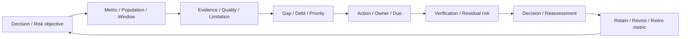

# 第22章 測定、優先順位、継続改善

## この章の位置付け

「Ruleが増えた」「平均時間が短くなった」という報告だけでは、次にどの問題へ資源を配分するかは決まらない。改善の対象は数値そのものではなく、判断を妨げる不足、期待を満たさないControl、許容できない残存Riskである。本章では、測定の目的から改善担当、検証、次の判断までを`ART-28 Security Improvement Backlog`で接続する。

OWNは指標の選択、Telemetry・Detection・Evidence debt、改善の優先順位、検証、再評価と指標の廃止である。[第7章](07-vulnerability-prioritization.md)の文脈に基づく優先順位、[第15章](15-findings-retest-risk.md)のFinding・Retest・受容、[第16章](16-telemetry-evidence-readiness.md)から[第21章](21-purple-team-validation.md)までの成果物へBRIDGEする。第26章への判断材料を用意するが、BI製品の実装、財務Riskモデル、人事評価・個人KPIの設計はDELEGATEし、本章では扱わない。

## 学習目標

- 判断目的に対して有効な測定項目を選べる。
- 対応付けや件数だけの、見せかけのCoverageを避けられる。
- 不足からAction、Verification、Risk decisionを辿れるSecurity Improvement Backlogを作成できる。

## 前提知識

第7・15・16〜21章の成果物を方法上の参照にする。演習は本章で供給する完全合成記録の読解と計算だけで完結する。実Target、実Credential、実Log、個人情報、外部接続は不要である。実操作・実収集・実通知・実Deploy・実Incident宣言はすべて0件である。

## 導入ケースまたは判断要求

架空の請求連携を担当するチームに、三つの報告が届いた。Rule数は4から8へ増え、対応表は10仮説中9仮説を覆い、判断までの平均時間は10分から5分へ短くなった。しかし、重要な行動の検証範囲は5件中2件のままで、必要なEvidenceがそろう記録は5件中5件から2件へ減っている。

このときの問いは「数値が改善したか」ではなく、「どの判断の信頼性が高まったか、何が未確認で、何を先に直すべきか」である。`SIB-2026-022-001` / `CASE-IMP-2026-001`は、この問いに対する完全合成のBacklogである。各項目が`CASE-2026-001`と`CASE-DET-2026-001`を`refines`するが、親Caseの実測値やEvidenceを受領したという意味ではない。

親21の`HOF-CV21-22`は`planned-not-delivered`、Receiptはnull、実行権限はfalseのままである。本章の教材を作ったことを、親の改善提案が実行されたことや、実組織のRiskが下がったことへ読み替えない。

## 全体像

`F-22-01`は判断と改善記録の読み順を示す。矢印は実環境の操作手順ではない。

文章代替: 判断目的から測定対象と範囲を決め、根拠の品質と限界を確認する。不足を優先順位と担当へ結び、改善案を検証して残存Riskを判断する。再評価では指標自体を残すか、改めるか、廃止するかも見直す。数値の見栄えを整えるために根拠を削らない。

## 1. Metricより先にDecisionを置く

Measureは何をどの方法で数値化したか、Metricはその値をどの目標や判断へ使うかという問いを含む。NIST SP 800-55v1の§1.4と§3.1.1は、目的、範囲、式、根拠、時間基準、責任者を結んで測定を記録する。数値だけを再利用せず、定義も一緒に渡す。`SRC-NIST-MEASURE-001`

例えば「重要な仮説の検証不足を先に埋める」というDecisionなら、Rule数より、重要仮説の母集団、必要な観測条件、正常・異常の対比、未検証の理由が必要になる。「Rule数を増やす」が先に目標になると、同じ行動を検知するRuleを増やすだけでも達成したように見える。

CSF 2.0のOrganizational Profileは、現在と目標のOutcomeの差から優先的な行動計画を作る上位文脈として用いる。本章のMetricや七状態をCSFの規定と呼ばず、Profileへのmappingも有効性の証明にしない。`SRC-CSF-001`

## 2. Outcome・Leading・Process・Qualityを分ける

`T-22-01`は本書の教育用分類である。一つの値が文脈により複数の役割を持つ場合も、今回何の判断へ使うかを一つずつ説明する。NISTのImplementation・Effectiveness・Efficiency・Impactという分類と、同じ分類名や一対一対応だとはしない。`SRC-NIST-MEASURE-001`

| 種類 | 問い | 例と限界 |
|---|---|---|
| Outcome | 目的に沿う結果を支持するか | 限定した供給Control比較。実組織の損害減少とは別 |
| Leading | 後の結果に関係すると考える条件が整うか | 重要仮説の観測準備。予測力は別途確認する |
| Process | 作業の量・時間・流れはどうか | Rule数や判断時間。安全性・正しさを単独で示さない |
| Quality | 結論を支える根拠は十分か | 必須Evidenceの充足、欠測、再現可能性 |

件数や活動量も、作業負荷や運用能力の見積りには使える。問題はそれを目的達成へ無条件に昇格させることにある。Outcomeにも観測範囲と代替説明が必要であり、分類名だけで因果関係は確定しない。

## 3. 分母・母集団・Windowを固定する

率を記すときは、分子、分母、母集団の選び方、Window、Cutoff、除外条件を同時に記す。分母が0なら率は未定義であり、0%や100%へ置換しない。分母が不明な場合も「不明」を残す。対象を除外して率だけを上げる変更は、改善とは別に扱う。

本章の集合型の率では、分子のMember IDが重複せず、分母のMember IDの部分集合であることを確認する。Ruleの件数を仮説の分母で割る、別Windowの分子を足す、同じ根拠を重複して数える、といった比較を拒否する。母集団の版や定義が変わった場合は、旧値を残して別系列として説明する。

KEVのような継続更新Dataを補助情報に使う場合も、取得時点、Snapshot、対象Assetへの適用範囲を記録する。本章は更新されるDataの例としてのみ参照し、現在の掲載件数や個別の期限を教材の定数にしない。今回のcanonical URLは403で、公式mirrorの更新説明を確認した範囲に限る。第7章の過去Snapshotを最新と呼ばない。`SRC-KEV-001`

## 4. 平均・中央値・Percentileを混同しない

五つの供給時間`[4, 5, 6, 10, 25]`分の平均は10分、中央値は6分である。本教材のp90はnearest-rank方式で、昇順の第`ceil(0.90 × n)`番を選ぶため25分になる。比較側`[1, 2, 3, 4, 15]`分では平均5分、中央値3分、p90は15分である。小標本なのでp90が最大値に一致しており、実業務の裾の分布を推定できたとはいえない。

平均が短くなっても、長い判断の原因や未完了の判断が消えたとは限らない。開始・終了イベントの定義、時刻単位、対象件数、未完了・欠測の扱いを添える。Percentileには複数の計算法があるため、方式も記録する。方式や対象を変えた系列を、同じMetricの改善として並べない。

この例ではEvidence充足が5/5から2/5へ下がる。時間短縮を理由に調査品質・安全性の不足を許容しない。担当者別の順位付けではなく、必要な根拠を失うWorkflowを見直すための比較である。

## 5. 欠測・Bias・Goodhart riskを残す

Data qualityの確認は、数値の計算より前に行う。報告された一部だけを母集団とする選択Bias、失敗例だけが未収集になる欠測、定義の異なる記録の混在を、桁数の多い平均値で補わない。NIST SP 800-55v1の§3.1.3〜3.1.5は、Data管理・品質・不確実性を測定の設計事項として扱う。本教材では欠測を推測値で補完せず、数値と結論の限界を別欄に残す。`SRC-NIST-MEASURE-001`

Goodhart riskは、指標が目標になることで、本来知りたかった性質との関係が弱まる危険として扱う。「処理時間だけを短くする」「簡単な仮説だけを分母へ入れる」「不足Evidenceを除外する」という誘因を点検する。個人監視、公開Ranking、懲罰KPIへの転用はしない。

対策は指標を増やすことだけではない。目的と集計条件を固定し、Qualityの対比を置き、反証例と除外理由を保持し、指標を廃止する条件を決める。指標が不要になった理由を残すことも改善である。

## 6. CoverageとEffectivenessを分離する

本章の供給例では、対応表が10仮説中9仮説を覆う一方、必要な条件で検証された検知は2仮説だけである。対応があること、必要Dataがあること、検知が成立したこと、判断や対応につながったことを一つのCoverage率に潰さない。

重要な仮説のCoverageは、重要とした理由と未選択範囲も伴う。選んだ5行動の2行動を検証した結果を、全攻撃行動の40%に対応すると一般化しない。Rule数を4から8へ増やしても、この2/5が変わらないなら、検証不足への対処は別に残る。

## 7. Debtを優先順位とDependencyへ変える

Telemetry debtは必要な観測条件の不足、Detection debtは検知仮説・比較条件・運用接続の不足、Evidence debtは判断の根拠・来歴・保持の不足として区別する。同じGapでも、どの判断を止めるかによって次のActionは異なる。

`T-22-02`の比較では、重大さのラベルを自動的な実施順にしない。第7章の方法へBRIDGEし、対象業務への関係、根拠の強さ、依存関係、費用、変更可能時期、安全性を別々に記す。

| Gap / Debt | 優先する理由 | 依存と次の判断 |
|---|---|---|
| 重要行動の検証不足 | Rule追加だけでは問いが埋まらない | 母集団と検証条件を先に固定する |
| 対応付けと検証の差 | 高いmapping率が未検証を隠す | Evidenceと正常系を伴う比較を計画する |
| 判断時間と品質の逆行 | 速くても必要根拠が欠ける | 必須FieldとWorkflowの関係を見直す |
| Telemetry不足 | Huntの結論が保留される | 同じ母集団・入力条件の供給比較を残す |
| 権限根拠の不足 | 他の良い数値で補えない | Blockedを保持し、実操作へ進まない |

DependencyはOwner不在を隠す欄ではない。先行項目、受入条件、期限を明記し、循環していたら計画を分解する。費用対効果の仮説と、実際に効果を確認した記録を分ける。

## 8. Actionと七状態を結ぶ

`T-22-03`は本章の有限Statusである。これはNISTの状態機械ではなく、教材の記録契約である。実装したという説明をVerificationの代わりにしない。

| Status | 意味 | 必要な根拠 |
|---|---|---|
| Proposed | 改善案を提示した | 問い、Gap、候補Action、担当案 |
| Approved | 供給記録上で計画を承認した | 判断主体、条件、依存、期限。実操作許可とは別 |
| In progress | 供給記録上の作業が進行している | 対象Action、進捗、未完了の受入条件 |
| Blocked | 必要条件が不足している | Blocker、Owner、解除のために必要な根拠 |
| Verified | 同じ対象・範囲で受入条件を照合した | Validation ID、Evidence ID、条件とActualの一致 |
| Accepted | 残存Riskを条件付きで受容する供給判断 | Risk owner、理由、範囲、期限、再評価条件 |
| Retired | 指標または改善項目の役割を終えた | 廃止理由、旧記録、代替先、再開条件 |

Verifiedでも実組織のRiskが0になったとはいえない。Acceptedを修正完了として数えず、Retiredを失敗記録の削除に使わない。八つの合成Backlog項目は状態の違いを読むための独立した記録であり、一つの実案件の時系列ではない。

## 9. VerificationとRisk reductionを別々に判断する

検証には、何を変え、何を変えず、どの根拠で前後を比較したかが必要である。Validation IDとEvidence IDが存在するだけでは足りない。対象、版、Metric、Window、Cutoff、期待条件に結び付き、必要な品質を満たすかを照合する。

親21の`SCN-CV21-003`はPositiveの出力が期待と異なり、`SCN-CV21-010`は供給新版で三条件が一致する。同一対象・Batch・時間条件と正常・Near-miss対比を保持した限定比較であり、旧Failedを新Passedで上書きしない。実Rule変更やDeployを行った証明にはしない。

もう一つの例では、同じ10件の供給Hunt記録でInconclusiveが4件から1件へ減る。これは教材内の不足の差を示すが、実際の侵害が減ったことや、親18のGapが解消されたことを示さない。Risk reduction judgmentには、支持する限定結論、代替説明、未確認範囲、確信度、無効化条件を記す。

NIST SP 800-61 Rev.3のID.IM-01〜03は、評価、演習、運用から改善を得る文脈を示す。本教材は供給比較だけなので、実Incidentから得た教訓を記録したとはしない。`SRC-IR-001`

## 10. 再評価とMetric retirementを計画する

再評価日は予定日だけでなく、母集団・入力Schema・Rule版・Data source・権限条件・受容期限の変化とも結ぶ。期限切れの受容記録は現行の受容根拠にせず、新しい判断まで保留する。

Metricの廃止候補は、判断目的を失った、別の指標と重複した、継続してDataを得られない、Gamingが目的を損なう、より適切な代替がある、といった条件から選ぶ。旧値、定義、廃止理由、代替先を残し、根拠の不足を消去しない。

NIST SP 800-55v2の§3は、目的と現状の評価から指標選択、分析、是正、再評価へつなぐ反復的な流れを示す。§3.1.4では指標の見直しや廃止も扱う。すべての組織に同じ数値目標や固定順序を要求するものとして使わない。`SRC-NIST-MEASURE-002`

## 11. 五つの対比から判断を練習する

`T-22-04`を[全欄の完全合成例](../cases/ch22-improvement-backlog-example.md)と照合する。数値の計算が合うことと、その数値で結論してよいことは別の評価項目である。

| 対比 | 供給された差 | 許される結論 |
|---|---|---|
| Rule数と重要範囲 | 4→8、2/5→2/5 | 件数増加。重要範囲の検証拡大は未確認 |
| Mappingと検証 | 9/10と2/10 | 対応表の広さを有効性へ変換しない |
| 時間と根拠品質 | 平均10→5分、充足5/5→2/5 | 時間短縮と品質低下を併記する |
| TelemetryとHunt | Inconclusive4/10→1/10 | 同じ供給母集団の限定比較だけ |
| Control再検証 | 三条件一致2/3→3/3 | 旧Failedを保持した供給版の比較だけ |

## 安全な演習または分析課題

Purposeは、配布された合成記録からMetricの用途と限界を読み、改善判断へ接続することである。Prerequisiteは本章の表と親章の方法理解に限る。Authority / Scopeは教材の読解とローカルCopyの計算だけであり、実環境への許可は含まない。

Expected evidenceは、分母とWindowの確認、五つの対比の説明、状態の根拠、ActionからVerification・Decision・ReassessmentへのID追跡である。Impactは解答用Copyだけに限定し、正本、親Case、実設定を変更しない。Stop条件は、実Dataの混入、定義の不明、範囲や権限の不明である。追加の外部確認や実操作を続けない。

1. `MET-IMP22-002`の分子と母集団を示し、Rule数の増加と分けて説明する。
2. 時間の平均・中央値・p90を計算し、Evidenceの充足を落とした結論を退ける。
3. Verifiedの二項目でValidationとEvidenceの対応を辿り、実効果について未知のままの事項を挙げる。
4. Blocked、Accepted、Retiredを改善成功へ数えない理由を説明する。
5. 第26章へ渡すOption comparisonを記す。予定Handoffを配達済みへ変更しない。

Cleanupでは解答用Copyを整理する計画と残存確認を記す。本演習はRuntimeや外部接続を作っていないため、実環境の復旧完了という主張はしない。

## 成果物と評価基準

成果物は[ART-28 Template](../templates/security-improvement-backlog.md)、[合成JSON](../cases/fixtures/ch22-measurement-improvement.json)、[閉Schema](../schemas/ch22-measurement-improvement.schema.json)を用いたSecurity Improvement Backlogである。

| 評価軸 | 合格の根拠 | 不合格の例 |
|---|---|---|
| 判断目的 | Metricの定義と利用先を説明する | 件数を増やすことだけを目的にする |
| 測定条件 | 分母・母集団・時間・Data sourceが追跡できる | 分母不明や欠測を0へ置換する |
| 分析品質 | 代替説明・Gap・確信度・無効化条件を残す | 小数の桁数で不確実性を隠す |
| 検証と状態 | 対象・版・根拠を照合し残存Riskを分ける | IDがあるだけでVerifiedにする |
| 安全と再評価 | 実権限を推定せず廃止・再開条件を残す | 個人Rankingや未配達Handoffの完了扱い |

必須欄を埋めることは、全項目をVerifiedにすることではない。不足と停止を説明できる記録も完成した成果物に含む。

## 章のまとめ

測定は判断のために行い、率の母集団、時間の定義、根拠の品質を一緒に扱う。Coverage、件数、速さだけを効果へ昇格させない。Backlogは不足を担当と検証へ結び、残存Riskの判断、再評価、指標の廃止までを残す。

## 次に学ぶこと

第23章では判断主体・期限・情報ギャップからIntelligence Requirementを整理する。第26章へは、改善案の費用・依存・根拠・限界と選択肢を渡す。本章の`HOF-IMP22-26`は計画にとどまり、受領や実判断を認定しない。

## 参考文献・Source Note ID

- `SRC-NIST-MEASURE-001`: NIST SP 800-55v1 Final、§1.4・§3・§4。測定の定義、条件、品質、選択に限定。
- `SRC-NIST-MEASURE-002`: NIST SP 800-55v2 Final、§3。改善の反復と指標の見直しに限定。
- `SRC-CSF-001`: NIST CSF 2.0、§3.1。現在と目標のOutcome、Gap、行動計画の上位文脈。
- `SRC-IR-001`: NIST SP 800-61 Rev.3、ID.IM-01〜03。評価・演習・運用からの改善の文脈。
- `SRC-KEV-001`: CISA KEV / 公式mirrorの更新説明。継続更新Dataの例だけ。最新値や法的期限は採用しない。

確認範囲、取得制約、一次URL、PDF識別子は[用途限定Source Review](../references/ch22-source-review-2026-09-26.md)に記録する。
