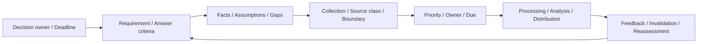

# 第23章 Intelligence Requirementsと収集計画

## この章の位置付け

情報を集めてから用途を考えると、量は増えても判断に必要な問いが残る。本章は「誰が、何を、いつまでに、どの不確実性を残して判断するか」を起点に、情報要求（Intelligence Requirement）と収集計画（Collection Plan）を設計する。成果物は`ART-29 Intelligence Requirement and Collection Plan`である。

OWNはDecision RequirementとIntelligence Requirementの分離、回答基準、収集要求、Gap、優先順位、期限、Feedbackである。[第1章](01-integrated-discipline.md)のDecision Loop、[第10章](10-recon-osint-boundary.md)の境界、第16〜20章のTelemetry・Incident・Evidence、第24〜26章の来歴・分析・配布へBRIDGEする。認証実装は[認証の専門書](https://itdojp.github.io/practical-auth-book/)、評価Toolの詳細は[ペネトレーションテストの専門書](https://itdojp.github.io/pentest-learning-book/)へDELEGATEする。両書の操作を本演習の前提にせず、秘密情報要求や国家情報機関の収集運用は扱わない。

## 学習目標

- Intelligence Requirementを定義できる。
- 収集計画を作成できる。
- Collection Planを作成できる。

第二目標では問いをSource classと担当・期限へ分解し、第三目標ではその結果をART-29として追跡可能に記録する。

## 前提知識

[第4章](04-assets-boundaries-threat-model.md)、[第16章](16-telemetry-evidence-readiness.md)、[第19章](19-incident-response.md)の成果物の読み方を前提にする。本演習は供給された完全合成記録の読解だけで完結する。実Target、実Credential、実Log、実在人物の情報、外部接続は不要である。実操作・実収集・実通知は0件で、`executionAuthorized=false`を維持する。

## 導入ケースまたは判断要求

架空の請求連携に関して、「48時間以内に外部連携を停止すべきか」と判断主体から問われた。「関連する情報を全部集める」では、締切までに何を答えるべきかが分からない。停止を提案する案と、制限付き継続を提案する案を比較するには、次の五つの問いが必要になる。

| Requirement | 問い | 供給例で残る問題 |
|---|---|---|
| IR23-R1 | 影響対象と権限範囲 | 二つの回答条件を供給範囲内で照合できる |
| IR23-R2 | 実行された操作のEvidence | 操作の記載はあるが結果の確認が不足する |
| IR23-R3 | 代替説明 | 正常変更・誤設定の説明をまだ排除できない |
| IR23-R4 | Controlの有効性 | 期待条件と正常対比が未供給である |
| IR23-R5 | 停止の事業影響 | 架空Owner回答の利用条件が未確認である |

`CASE-IRP-2026-001` / `IRCP-2026-023-001`は`CASE-2026-001`を方法上`refines`する新しい完全合成教材である。親の対象、Evidence、実行許可、Incident宣言を引き継がない。`TCM-2026-016`と`IAP-2026-019-001`も成果物の方法参照であり、同じ実案件の受領記録ではない。

## 全体像

`F-23-01`は記録の読み順を示す。実環境への操作順序ではない。

文章代替: 判断主体と期限から問いと回答基準を定める。分かっている事実、仮定、不足を分け、不足ごとに収集方法の種類と利用境界を検討する。担当と期限を決め、処理・分析・配布の時間も確保する。回答が判断に役立ったかを確認し、条件が変われば問いを見直す。

## 1. DecisionとIntelligence Requirementを分ける

Decision Requirementは「何を選ぶ必要があるか」、Intelligence Requirementは「その選択に必要な不確実性をどう減らすか」である。「連携を停止する」は選択肢であり、「停止による業務影響は何か」が情報要求になる。分析担当が情報要求を書いたことを、業務停止の権限を得たことへ変換しない。

ICD 203のD.6.cは利用者の要求と優先順位に応じた適時性、D.6.dは重要な情報ギャップと収集への接続を扱う。本章は分析品質の参考として用い、米国ICの指令を民間の収集権限やART-29の規格として扱わない。`SRC-ICD203-001`

まずDecision ID、判断主体、期限、選択肢、可逆性を記す。停止の可逆性も「再開できそう」という推測では足りず、復旧条件が未確認ならその不足を残す。判断主体や期限が空欄なら、Feedの選定より先に要求を差し戻す。

## 2. 答えられる問いと回答基準を作る

「何か危険な情報はないか」という問いは対象も終点もない。「供給例の対象APP-IR23-001、版IR23-REV-001について、どの操作が記録され、何が未確認か」と限定すれば、必要なEvidenceと不足が分かる。

Supporting questionは大きな問いを分解する補助質問である。Answer criteriaは回答と認める条件で、検索語の一覧ではない。IR23-R2では「操作を特定する」と「操作結果を別の根拠で確認する」を分ける。前者だけを満たす記録を、後者の回答として二重利用しない。

最小確信度は回答の受入条件であり、Sourceの種類だけで自動計算しない。確信度は`高・中・低`を用い、根拠品質、代替説明、Gapと合わせて記す。ICD 203のD.6.e.1〜4はSource品質、不確実性、事実と仮定・判断の区別、代替説明を扱う。書類の完成と分析上の確実性は別である。`SRC-ICD203-001`

## 3. Fact・Assumption・Gap・Indicator・Signpostを区別する

確認事実は供給記録へ参照できる観測、仮定はまだ確かめていない条件、分析判断はそれらから導いた評価である。Gapは「何も分からない」という一文ではなく、どの回答条件が未充足かを示す。

Indicatorは仮説や条件に関係する観測項目、Signpostは将来の変化を捉えて再評価を始める目印として使う。いずれも、それだけで原因や帰属を確定するものではない。本例では「供給対象の版が変わる」をSignpostにできるが、版の変更だけで悪意を示すことはできない。この区別は本書の教育用の整理である。

IR23-R2-BにはGapが残る。架空Owner回答案IR23-E4は存在するが、Sourceの品質確認がpendingである。「Evidence IDがある」から「回答条件を満たす」へ飛ばさない。

## 4. 時間軸と優先順位を判断へ結ぶ

Tacticalは目前の限定判断、Operationalは複数の活動や業務の調整、Strategicは中長期の方針・資源配分を支える時間軸として整理する。固定の日数で分類する国際規格としては扱わない。同じ題材でも、48時間の停止判断と来年度の連携方式の見直しは別のRequirementになる。

本章のPriorityは`P0 Decision blocking / P1 Required / P2 Useful / P3 Deferred / P4 Not collect`とする教育用分類である。P0は判断の選択肢を比較するうえで重大な不足、P1は必要な問い、P2は補助、P3は理由付き保留、P4は収集対象にしない判断を表す。P0であっても無権限の収集は認めない。

早く答えることと、不確実性を小さくすることは両立しない場合がある。期限が来たらGapを消すのではなく、何が回答可能で、何が保留かを判断主体へ渡す。判断主体は条件付き案、延期、対象の限定などを比較するが、教材内で実停止を行うことはない。

## 5. RequirementとCollectionを多対多で結ぶ

Collection Requirementは、不足を埋めるためにどの種類の情報が必要かを記す。Source classは供給Telemetry、供給公開文書例、供給架空Owner回答のような種類で、個別Sourceの正確さや独立性とは別である。

IC OSINT Strategy 2024–2026は、公開情報を優先順位・要求・Gapに結び付け、収集管理を調整する考え方を示す。本章が参照するのは公開された当該版の説明だけであり、現行の後継方針や民間の法的権限を確定したものではない。公開されている情報でも、利用条件や分類、プライバシーの確認は省略しない。`SRC-ODNI-OSINT-001`

本例のCOL-IR23-001はR1とR2、C3はR2とR3に関係する。逆にR2はC1とC3を参照する。この多対多関係を両側から照合する。一つの資料を複数の問いへ使うことはできても、同じ資料の複製を独立した裏付けとして数えない。

## 6. 収集境界と六状態を記録する

`T-23-01`の六状態は本教材の有限集合である。他章のLab状態や改善Backlog状態を混在させない。

| Status | 意味 | 完了への誤変換を避ける条件 |
|---|---|---|
| Planned | 計画したが開始していない | 計画の存在をEvidenceにしない |
| Collecting | 供給記録上で進行中 | 未完の回答条件を残す |
| Satisfied | 定めた条件を満たす | Evidenceと評価済みSourceに結び付ける |
| Partially satisfied | 一部だけ満たす | 残るGapと確信度の制約を明示する |
| Blocked | 必要条件が不足して進められない | Blocker、Owner、再評価を残す |
| Cancelled | 理由を記して取り消した | 未実施を充足と数えず旧記録を保持する |

CollectionのSatisfiedは定めたDeliverableを供給した状態である。RequirementのSatisfiedは回答基準を満たした状態なので、Collectionの状態をそのまま転記しない。C2の文書はR1の一条件を満たす一方、R3の代替説明を回答したことにはならない。

Authority、Terms、Classificationが不明なら停止する。本例のC6はAuthorityとTermsがunknownなのでBlockedである。C7の別案やP0という優先度で上書きしない。実在人物の追跡、秘密取得、身分偽装、無権限Accessを必要とする計画は作らない。

## 7. 処理・分析・配布まで期限を逆算する

収集期限をDecision deadlineと同じにすると、形式を整え、品質を確認し、分析して伝える時間がなくなる。本例は教材上の開始を2026-10-01 00:00 UTC、判断期限を10-03 00:00 UTCとする。供給Cutoffは10-02 12:00 UTCで、収集16時、処理18時、Requirement回答20時、分析21時、配布22時という計画を置く。未来の教材時刻であり、実観測や実行許可ではない。

処理では対象・版・時刻・来歴・重複を整える。分析では回答基準、代替説明、Gap、確信度を評価する。配布ではAudienceと用途、期限、未解決点を伝える。処理済みというだけで分析済みにせず、配布予定を配達済みにしない。

同じ対象IDでも版やWindowが違えば、そのまま回答へ使えない。Cutoff後に利用可能になったEvidenceを、Cutoff時点の回答根拠へ遡及追加しない。再評価として旧判断と分けて扱う。

## 8. Feedback・無効化・再評価を計画する

Feedbackは「資料を受け取ったか」だけでなく、「選択肢を比較できたか、期限に間に合ったか、不足と限界が伝わったか」を問う。受領確認と判断への有用性を別に記す。

対象や版、Source品質、利用条件、期限、選択肢が変化したら旧回答の有効性を見直す。新しい情報が旧結論を支持しない場合も、旧Recordを削除せず、無効化理由と新しいReassessment IDを結ぶ。収集量が増えなくなったという理由だけで「十分」とせず、回答基準と残るGapで終了を判断する。

## 攻撃者・防御者・分析者・意思決定者の接続

攻撃者に関する仮説は必要な問いを考える補助であり、実行手順ではない。防御者は必要なTelemetryと観測限界を示す。分析者は根拠の品質と代替説明を評価し、意思決定者は不確実性を含めて選択肢を比較する。分析担当がOwner確認を代行した、Incidentを宣言した、実停止を承認したという記録に変換しない。

## 安全な演習または分析課題

Purposeは、供給記録だけから回答可能な問いと不足を区別することである。Prerequisiteは本章と[完全合成例](../cases/ch23-intelligence-requirements-example.md)であり、Authority / Scopeは教材Dataの読解だけ。Expected evidenceは記入したART-29と不足の説明で、Impactは教材上の記録に限る。実Data、未知の権限、外部接続が必要になればStopし、Cleanupでは作業用の記入内容だけを整理する。実システムを変更しない。

1. Decision owner、二つの選択肢、48時間の期限を確認する。
2. R1〜R5の回答条件をEvidence / Sourceへ辿り、未充足の七条件をGapと照合する。
3. C1/C3とR2を両方向に辿り、多対多関係を説明する。
4. pendingのE4、Cutoff後のEvidence、対象外のEvidenceを回答に使えない理由を書く。
5. C6のBlockedとC8のCancelledを保持し、残る問いを含む配布案を作る。
6. 第24〜26章へのHandoffは予定のまま、Receipt nullと実行権限falseを確認する。

## 作成する成果物

[ART-29 Template](../templates/intelligence-requirement-collection-plan.md)へDecision、Requirement、Collection、Source、Evidence、Gap、処理・分析・配布、Feedbackを記入する。最小例は「DEC-IR23-001→R2→C1/C3→E2と未確認E4→GAP-IR23-R2-B→REASS-IR23-001」である。R2はPartially satisfied、判断の確信度は低のままで、件数の多さで昇格させない。

完全例は五つのRequirement、八つのCollection、三つのSource、四つのEvidence、七つのGapを持つ。成果物の完成は全RequirementがSatisfiedになることではない。不足のOwner、期限、許容結論、再評価が記録されていることを評価する。

## 評価基準

| 観点 | 合格する記録 | 差戻しになる例 |
|---|---|---|
| 判断要求 | 主体・期限・選択肢・可逆性を明示 | Feed名だけがある |
| 回答基準 | 対象と条件をEvidenceへ結ぶ | IDの存在だけでSatisfied |
| 収集境界 | Authority・Terms・分類・Stopを明示 | 不明条件を優先度で上書き |
| 追跡性 | 多対多関係とGapを両側で照合 | 未充足条件を削除する |
| 分析品質 | 確信度・代替説明・無効化を残す | 件数やSource classだけで確信度を上げる |
| 配布・再評価 | Audience・期限・未配達・再評価を記す | 予定を受領済みとする |

## よくある誤解

悪い例は「公開情報なので自由に集め、量が十分ならSatisfied」とする計画である。良い例は用途、境界、回答条件を先に定め、満たさない条件をGapとして残す。失敗例はSource品質がpendingのE4を回答へ結ぶこと、反証例は同じ対象IDでも別版のEvidenceが旧回答を支持しないことである。

機械検査はこの有限教材の参照・状態・時刻・安全境界を照合する。自然言語の真偽、現実の合法性、将来の分析品質を自動認定するものではない。

## 章のまとめ

情報要求は収集量ではなく判断から設計する。問いと回答基準を分け、Source classと個別品質を区別し、Collectionの完了をRequirementの充足へ直結させない。期限までに残るGapを隠さず、担当、確信度、配布、無効化、再評価へ接続する。

## 次に学ぶこと

第24章へSourceと来歴の確認条件、第25章へ代替説明・仮説・Gap、第26章へ判断主体・選択肢・期限を渡す。本例の三つのHandoffは`planned-not-delivered`、Receiptはnull、実行権限はfalseであり、未執筆章の受入済み成果物を装わない。[第25章](25-structured-analysis-attribution.md)の独立Caseへ同じEvidenceやCase IDを移植せず、分析の方法を参照する。

## 参考文献・Source Note ID

- `SRC-ICD203-001`: [ICD 203](https://www.dni.gov/files/documents/ICD/ICD-203.pdf)。D.6.c/d/eの分析品質を限定参照。2015本文と旧2022記録、公式2023-06改訂情報を区別し、正確な改訂署名日は未確認のまま保持する。
- `SRC-ODNI-OSINT-001`: [IC OSINT Strategy 2024–2026](https://www.odni.gov/files/ODNI/documents/IC_OSINT_Strategy.pdf)。当該公開版の要求・優先順位・Gapの考え方だけを参照する。後継の不存在や現行民間規範を主張しない。

[限定Source再監査](../references/ch23-source-review-2026-09-27.md)に確認方法と限界を記録する。
