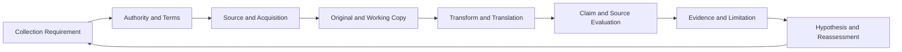

# 第24章 OSINT、Provenance、情報源評価

## この章の位置付け

三つの記事が同じ注意喚起を引用しています。記事数が三つなら、独立した裏付けも三つでしょうか。引用元の訂正が一つだけなら、古い記事を足しても新しい結論の根拠は増えません。公開情報を読めたことと、その内容を特定の判断へ使えることは別です。

本章は[第23章](23-intelligence-requirements.md)の問いを、原典、取得記録、変換、個別主張、利用上の限界へ分解します。[ART-30 Evidence and Source Evaluation Table](../templates/evidence-source-evaluation-table.md)を作り、[第25章](25-structured-analysis-attribution.md)へ仮説と情報ギャップを渡せる記録にします。後続の判断を先に確定する章ではありません。

### OWN / BRIDGE / DELEGATE

- **OWN:** 来歴と版、取得・保存・Hash、変換・翻訳、Source reliability、information credibility、independence、循環参照、Evidence用途の記録。
- **BRIDGE:** 第10章の収集境界、第23章のCollection Requirement、第25章の分析判断、第26章の配布制約。判断手法の詳細は第25章が所有します。
- **DELEGATE:** 実在人物の特定・追跡、地理特定、画像鑑定、秘密情報の取得、捜査・法的証拠能力の判断、製品別の保存操作。これらの手順を本章で実施しません。

## 学習目標

1. 原典、取得物、派生物、個別主張を区別し、Provenanceを追跡できる。
2. Source reliabilityとinformation credibility、independenceを別々の根拠で評価できる。
3. Evidence and Source Evaluation Tableへ利用制約、仮説、Gap、再評価条件を記入できる。

## 前提知識

[第10章](10-recon-osint-boundary.md)の「公開と許可は別」、第23章の問い・期限・回答基準を前提にします。検索サービスの操作や実対象への収集は不要です。教材はすべて著者が記述した完全合成資料であり、URL、日時、発行者、観測、利用条件も教育用の供給値です。

[合成Case](../cases/ch24-source-evaluation-example.md)は独立Caseです。第10・23・25章を方法参照しますが、対象、Evidence、Authorization、Incidentの状態を継承しません。親章の未配達Handoffを受領済みにする操作も行いません。

## 24.1 問いと利用目的を先に固定する

「関連しそうな記事を集める」では、取得範囲も終了条件も決まりません。どの対象、版、時間範囲のどの主張を比較するのか、何を判断するためなのかを先に書きます。記事の人気や数を回答基準の代わりにしません。

本章の問いは、合成の通知機能について、供給資料が示す遅延の範囲と、旧版から訂正版で変わった説明を区別することです。資料にない実稼働、利用者の被害、攻撃者の身元は判断しません。確認が足りないときはGapとして終えられます。

図F-24-01: 資料から利用可能な限定Evidenceまで（本書の教育用整理）。



矢印は自動承認ではありません。Bが不明なら追加処理を止めます。DでHashが一致しても、Fの内容評価を省略できません。GからHへは、使える主張だけでなく、使えない範囲と再確認の条件も渡します。

## 24.2 公開情報と利用できる情報を分ける

第三者のページが表示されることは、保存、再配布、別目的利用、個人情報の集約への包括的な許可ではありません。Authority、Terms、Data分類、保持、配布先を別欄で確認します。不明点を追加収集で埋めず、担当者への確認要求に戻します。

Berkeley Protocolは人権・国際刑事・人道法違反の調査を背景とする方法論です。本章では関連性、取得文脈、保存と検証の参考に限定し、企業CTIへの普遍的な法的義務や収集許可へ転用しません。`SRC-BERKELEY-001`

演習は供給済みJSONの読解だけです。架空URLへアクセスせず、実人物や実Dataで置換しません。必要なものはSourceの内容をたどる記録であり、実在投稿者の身元調査ではありません。

## 24.3 Source、Item、Claimを分離する

表T-24-01: 三つの単位と、単独では証明しないこと。

| 単位 | 記録するもの | それだけでは証明しないこと |
|---|---|---|
| Source | 供給資料で宣言された発行・観測主体と、その評価根拠 | 発行主体が有名なら全主張が正しいということ |
| Item | 特定の版、取得時点、表現、保存参照、内容Hash | URLが同じなら内容も時点も同じということ |
| Claim | 対象・版・条件を伴う個別の主張 | 記事全体の要約がすべての問いへの回答になること |

合成資料の`OSRC-*`は教材の情報源ID、章末の`SRC-*`は本書の説明を支える参考文献IDです。AIが作った要約は変換後のItemであり、新しいSourceや独立観測にしません。

現実のWebで最初に発見できたコピーが、世界で最初に公開された原典とは限りません。検索範囲外や失われた版があり得ます。本Caseの原典関係は著者が供給した設定に限ります。原典が不明な入力を、推測で既存Sourceへ割り当てません。

## 24.4 取得・保存とHashの意味を限定する

Canonical URLと実際のAcquired URLを分け、公開時刻、取得時刻、Timezone、保存参照、媒体型、取得方法を記録します。同じURLでも訂正版は別Itemです。旧版を訂正版で上書きすると、当時何に依存したかを説明できなくなります。

供給JSONのHash対象は、対応する`content`文字列をUTF-8へ変換したbyte列です。JSONファイル全体でも、閲覧画面でもありません。空白、改行、Unicodeを正規化せず、前後の表現をそのまま比べます。**Hash一致は内容一致の確認であって、発行者の真正性、情報の真実性、取得権限の証明ではありません。**

保存参照は教材内のIDで、実Archiveサービスへの保存済みURLではありません。日時と保存の値も著者の供給条件で、実測値ではありません。取得記録がそろったことと、訴訟で利用できることも分けます。

## 24.5 変換と翻訳を原典に戻せる形で残す

変換には入力Item、入力Hash、出力Item、出力Hash、方法、担当またはTool、版、日時、Reviewer、限界を記録します。原本は保持し、作業Copyだけを処理します。Berkeley Protocolの作業Copyと処理履歴の考え方を、供給資料の対応付けに限定して参考にします。`SRC-BERKELEY-001`

翻訳では、原語、訳語、確認担当、曖昧な語、残る解釈を併記します。「起きる可能性がある」を「起きた」と訳せば、読みやすくても主張が変わっています。単語が似ていることやHashが正しいことでは、その変化を正当化できません。

本教材の語義・modalityの対応は著者が与えた有限の比較条件です。Checkerは任意の自然言語を正しく翻訳する仕組みではありません。AI要約も派生物として入力へ戻し、独立根拠として足しません。原典にない確定表現を含む供給負例は、利用対象から除外して誤りとGapを残します。

## 24.6 三つの評価軸を混ぜない

表T-24-02: 評価軸ごとの問い。

| 軸 | 問い | 必要な根拠 |
|---|---|---|
| Source reliability | この供給経路・発行主体を、どの範囲で信頼するか | 出所、取扱い、過去情報の範囲と不足 |
| Information credibility | この対象・版について、この個別主張はどこまで支えられるか | 支持・矛盾・欠測、時点、意味、対象範囲 |
| Independence | 同じ報告の言い換えか、別の観測か | 直接の引用関係と、根底にある観測の関係 |

ICD203は、Source等の品質、不確実性、情報と仮定・判断の区別を求めます。本章では分析品質の参考にとどめ、米国ICの規則を民間の権限へ移しません。三軸や本章の有限区分は著者の教材設計で、ICDの採点規則ではありません。`SRC-ICD203-001`

Reliabilityが高いと記録された資料にも、狭い対象範囲や訂正があり得ます。逆に、発行者に関する情報が乏しくても、特定の主張だけは別のEvidenceと照合できる場合があります。いずれも三軸を一つの数値へ平均しません。

## 24.7 同じ原典、循環参照、矛盾を読む

転載記事がVendor記事を引用し、Vendor記事が同じ転載記事を参照していても、新しい独立観測は生まれません。引用リンクの循環と、内容を実際に変換した親子関係を区別します。前者は「相互参照だが追加根拠なし」、後者の循環は履歴が説明不能な入力として扱います。 本Caseの相互引用は、両方の初回取得後にResource間へ追加された別の供給イベントです。発生時刻と記録時刻、文脈となる取得Itemを分け、初回Itemの内容やHashへ将来のリンクを逆算して書き込みません。

独立性はDomainの異なりや別のSource IDだけでは決まりません。本教材では、供給された観測グループをたどって重複を除きます。このグループも実世界の独立性を機械認定したものではありません。

矛盾を評価する前に、対象、版、時間範囲、条件を合わせます。旧版の広い説明と、訂正版の狭い説明を混ぜて「二つの独立Sourceが最新説明を支持する」とは書きません。同じ条件で両立しないなら矛盾として残し、都合の悪い資料を記録から除去しません。

## 24.8 Evidenceの用途とHandoffを限定する

表T-24-03: 本書の有限な利用区分。法的な証拠区分ではありません。

| 区分 | 本教材での扱い |
|---|---|
| Direct evidence | 記載したClaimの対象・版・条件に限って用いる |
| Context | 背景や旧版の説明で、現在Claimの直接裏付けへ足さない |
| Lead | 次の確認問いを作る材料で、回答済みにしない |
| Unverified | 検証不足を明示し、判断根拠として昇格させない |
| Excluded | 指定用途には使わず、理由と履歴は保持する |

Evidence IDへClaim、Source/Item、関係、制限、Hypothesis、Gap、Owner、再評価期限を結びます。支持と矛盾を両方渡し、受け手が対象範囲を読み直せるようにします。第25章での最終判断や第26章での実配布を本章の記入完了と同一視しません。

Handoffはplanned-not-delivered、receiptはnull、実行権限はfalseです。資料の評価と実操作の許可は別であり、後続章の独立Caseへ本章のEvidenceを自動投入しません。

## 24.9 完全合成演習と評価基準

**Purpose:** 供給資料をART-30へ整理し、原典・版・変換と個別Claimの利用範囲を説明します。記事数や検索量は評価しません。

**Prerequisite / Authority / Scope:** [Case](../cases/ch24-source-evaluation-example.md)、[供給JSON](../cases/fixtures/ch24-source-evaluation.json)、[閉Schema](../schemas/ch24-source-evaluation.schema.json)だけを用います。任意検査は本書Repositoryで固定依存導入済みの場合に限ります。新しい外部収集や依存取得は演習に含めません。

**Expected evidence:** Itemから原典、変換、Claim、Evidence用途、Gap、Owner、再評価まで追跡できる表です。検査成功は供給条件の整合性であり、現実の情報の真偽や法律判断ではありません。

**Impact / Stop / Cleanup:** 読解と記入だけで、実収集・実操作・実通知・外部通信は0です。未知の入力、個人情報、Credential、Terms不明、Hash不一致、原典や対象範囲不明なら追加処理を止めます。自分の演習Copyを確認して作業後24時間以内に除去し、正本や他者のDataを消去しません。これは教材の保持条件で、削除実行や隔離機構の実装保証ではありません。

```bash
python3 scripts/check_chapter24_contract.py --no-regressions
```

1. Caseの結論を読む前に、Itemごとの対象・版・取得と原典を図にします。
2. 同一原典の三報告をまとめ、独立観測がいくつあるかを説明します。
3. 訳のmodalityとAI要約の追加主張を原入力へ照合し、用途と制限を記入します。
4. 旧版、訂正版、矛盾する供給観測を同じ母集団へ混ぜていないか点検します。
5. 完全記入Caseと比較し、未確認や除外が残っても成果物を完成できる理由を説明します。

表T-24-04: ART-30 Rubric（各項目0〜2点、教育用）。

| 項目 | 0点 | 1点 | 2点 |
|---|---|---|---|
| 境界 | 公開を許可と同一視 | 条件はあるが停止不明 | 問い・Terms・用途・停止を説明 |
| 来歴 | URLだけ | Hashか時点がある | 原典/版/取得/変換/Hash対象を追跡 |
| 評価 | 単一Scoreや記事数 | 三軸の名前だけ | 個別Claimと原典関係で三軸を説明 |
| Handoff | 根拠を無条件に転送 | 制限だけでOwner不明 | 用途・Gap・期限・未配達を保持 |

実人物情報の使用、無権限取得、原典の偽装、根拠を超える確定、親許可の継承は合計点にかかわらず差戻しです。満点も分析正確性や実務資格の認定ではありません。

### 四つの実務視点

収集担当は取得と版、管理担当は保存と変換履歴、分析担当はClaimごとの根拠、意思決定者は利用範囲とGapを確認します。同じ表を見ても、Source評価担当が実収集の承認者になるわけではありません。

## 章のまとめ

公開資料はURLの数で評価しません。原典・取得物・変換物・個別主張を区別し、品質、独立性、利用条件を別軸で記録します。ART-30の完成は、すべてを高評価にすることではなく、使える範囲と使えない理由を次の判断へ説明できる状態です。

## 次に学ぶこと

[第25章](25-structured-analysis-attribution.md)では、Evidence、仮定、競合仮説、不確実性をAnalytic Judgment Recordへ結びます。独立Caseの区別を保ち、原典関係だけで判断や帰属を確定しません。第26章へは配布できる範囲とSource lineageを渡す計画を残します。

## 参考文献・Source Note ID

- `SRC-BERKELEY-001`: OHCHR / UC Berkeley、Berkeley Protocol 2022 edition。来歴、保存、検証、処理記録に用途限定。正確な刊行日は未確認。
- `SRC-ICD203-001`: ODNI、ICD203 D6.e(1)〜(3)。Source品質、不確実性、情報と判断の区別に限定。版と確認精度は[章用Source Note](../references/ch24-source-review-2026-09-27.md)と[Source baseline](../references/reference-baseline.md)を参照します。
