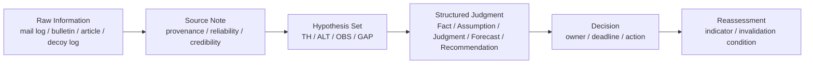
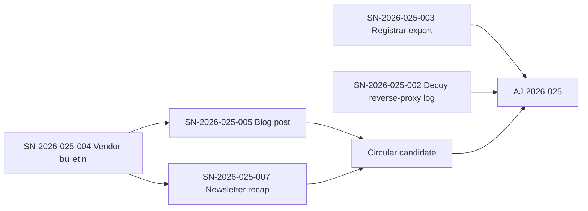
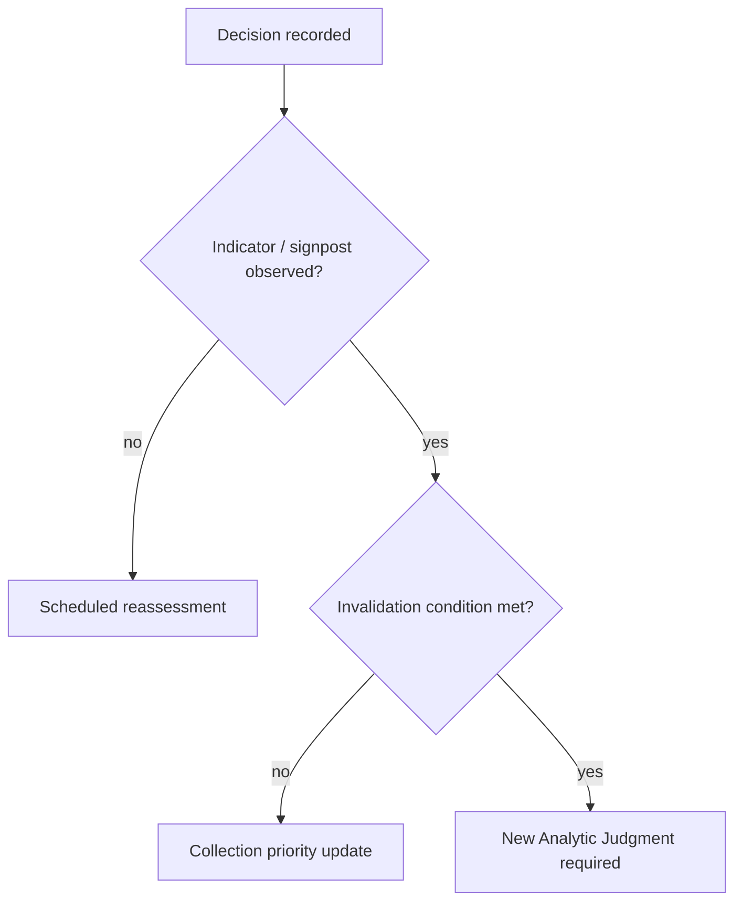

# 第25章　構造化分析、不確実性、アトリビューション

## この章の位置付け

第23章で判断要求（Decision Requirement）とIntelligence Requirementを定義し、第24章で公開情報のProvenanceと情報源評価を扱った。第25章では、その入力を**期限内の判断に使える分析文書**へ変換する。

本章の主題は、報告を増やすことではない。次を同時に満たすことである。

- 確認事実、仮定、分析判断、予測、推奨を混同しない
- 競合仮説を比較し、否定材料と情報ギャップを明示する
- Source reliability、情報のcredibility、独立性、翻訳・時刻・Entityの不確実性を分けて扱う
- 欺瞞、false flag、shared tooling、infrastructure reuse、circular reportingを前提に、証拠を超える帰属を止める
- Decision ownerが、判断期限までに何を決められ、何が未確定かを理解できる

本章が完成すると、読者は`ART-12 Analytic Judgment Record`を用いて、Technical clusterからCampaign、Operator、Sponsorshipへ安易に飛躍せず、**どこで止まるべきか**を説明できる。

## 学習目標

- 事実と判断を分離できる
- 競合仮説を比較できる
- Analytic Judgment Recordを作成できる

## 前提知識

本章は、第23章のIntelligence Requirementと収集計画、第24章のEvidence and Source Tableを読了していることを前提とする。Detection、Hunt、IR、DFIRの個別手順そのものは前提としないが、Evidence ID、Source Note ID、Negative Finding、Collection Gapの意味は理解している必要がある。

本章では、実在のActor、組織、個人、国家の帰属を扱わない。合成Caseだけを用い、判断の型を学ぶ。合成組織、媒体、役割名は実在との衝突を避けるため、`SYNTH-`接頭辞を付ける。

## 本章が所有する範囲

### OWN

- 情報（information）とインテリジェンス（intelligence）の区別
- Confirmed Fact、Assumption、Judgment、Forecast、Recommendationの分離
- Source reliability、credibility、independenceの分離
- ACHの使いどころと限界
- Base rateとBayesian更新を使う前提条件の整理
- Translation、timestamp、entity uncertaintyの記録
- Attribution Ladderの証拠閾値と許容表現
- Circular reportingとsame-origin republicationの検知
- Deception / false flag / shared tooling / infrastructure reuseの評価
- Decision impactとCollection Priorityの接続
- `Analytic Judgment Record`の作成

### BRIDGE

- Intelligence Requirementの定義と期限管理（第23章）
- Source Noteの作成とProvenance管理（第24章）
- Detection / Hunt / Incidentから受け取るEvidenceの読み方（第17章〜第20章）
- CTI ReportとExecutive Briefへの配布（第26章）

### DELEGATE

- HUMINT、法執行機関協力、外交・法的調整を伴う実在主体の帰属調査
- 高度な統計推定、ベイズネットワーク、定量モデルの実装詳細
- 特定国・特定組織を名指しする公開アトリビューション手順
- 実在ターゲットへの追加収集や侵入確認

## 導入ケースまたは判断要求

架空のSYNTH-ORG-ALPHA社は、財務担当者向けの外部認証ポータルを運用している。社内の分析Teamは、次の三つの入力を同時に受け取った。

1. 合成Mail gatewayで隔離された認証誘導メール
2. 合成Decoy reverse proxy logに残ったredirect chain
3. 外部の合成Vendor bulletinと、同内容を引用したBlog記事

SYNTH-CISOの判断要求は明確である。

- 今回の事象を「Technical cluster」までの表現にとどめるか
- Partner向け注意喚起を出すか
- 追加収集をどこへ優先配分するか
- Control強化を即時に行うか

ここで重要なのは、情報量ではない。**どの表現が証拠閾値を超えているか**である。

## 1. 情報とインテリジェンスを分ける

情報（information）は、Event、報告、ログ、記事、設定Snapshotのような未加工入力である。インテリジェンス（intelligence）は、特定のDecision ownerが期限内に判断できるよう、目的、仮説、根拠、代替仮説、不確実性、含意を付与した分析成果物である。

### F-25-01　情報から判断へ変換するAnalytic Reduction

この図の読み方は次の通りである。

- 入力は複数あってよいが、そのまま判断へ渡さない
- Source Noteで来歴と品質を記録する
- 仮説集合を置いて比較する
- JudgmentはDecisionへ接続し、必ずReassessment条件を残す

「記事を三本読んだ」ことはインテリジェンスではない。「同じ原典を引用した記事が三本ある」ことも独立裏付けではない。ICD 203は、出典の品質、仮定、不確実性、代替分析を明示することを求める。`SRC-ICD203-001`

## 2. Source reliability、credibility、independenceを分ける

分析では、情報源そのものの安定性と、個別主張の確からしさを分離する。さらに、複数報告が同じ原典に依存していないかを独立性として別管理する。

### T-25-01　Source reliability、credibility、independenceの分離

| 観点 | 問い | 典型的な誤り | 記録方法 |
|---|---|---|---|
| Source reliability | この収集経路・発行主体は、継続して同品質の情報を出せるか | 有名媒体だから常に正しいとみなす | Source Noteへ、収集経路、改変可能性、取得時刻、公開主体を記録する |
| Information credibility | この主張は、今回のCaseにおいて事実らしいか | 信頼できる情報源なら全主張が正しいとみなす | 具体的主張ごとにEvidence IDへ紐付ける |
| Independence | それぞれ別の観測なのか、同じ原典の再掲なのか | 記事数を裏付け数として数える | Lineage graphとsame-origin republication候補を残す |
| Timeliness | 時刻は比較可能か | タイムゾーン未正規化で前後関係を誤る | 原時刻と正規化時刻を併記する |
| Entity resolution | 同一人物・同一組織・同一資産と言えるか | 同名・別名・翻字差を同一視する | Entity ambiguityをUncertainty Registerへ残す |

Berkeley Protocolは、出典、取得経路、完全性、時間、改変可能性を保持することを重視する。第24章のSource Noteを第25章で分析判断へ接続する理由はここにある。`SRC-BERKELEY-001`

### 2.1 reliabilityが高くてもcredibilityは別である

たとえば、自組織のDecoy logは収集経路として高いreliabilityを持ちやすい。しかし、そのlogだけで「誰が運用したか」を説明できるとは限らない。逆に、匿名掲示板の投稿はsource reliabilityが限定的でも、添付Artifactが別Evidenceで検証されれば、個別主張のcredibilityは上がり得る。

### 2.2 independenceがない裏付けは足し算しない

Vendor bulletin、Blog、再配信Newsletterがすべて同じscreen shotを参照しているなら、三つの独立証拠ではない。**countではなくlineage**をみる。

## 3. 競合仮説、ACH、Base rate、Bayesian前提

Analysis of Competing Hypotheses（ACH）は、もっともらしい仮説を一つ選ぶ方法ではない。複数仮説を並べ、どの証拠がどの仮説を弱めるかを可視化するための補助具である。

### T-25-02　ACHの用途・限界とBayesian前提

| 項目 | 有効な使い方 | 限界 | 追加で必要な前提 |
|---|---|---|---|
| ACH | 競合仮説を列挙し、反証材料を見落とさない | 仮説の質が低いと比較が成立しない。重み付けや事前確率を自動では扱わない | 仮説生成、Evidence依存関係、除外条件 |
| Base rate | その事象が対象母集団でどれくらい起こるかを把握する | 母集団定義を誤ると逆に誤誘導する | 対象集合、期間、観測可能性 |
| Bayesian更新 | 新証拠が仮説間の比をどう変えるかを説明する | likelihoodを定義できない証拠には向かない。独立性を誤ると過大更新になる | 事前確率、条件付き尤度、証拠独立性 |
| Key assumptions check | 暗黙の前提を露出し、壊れた時の影響を示す | 前提が多すぎると追跡できない | Assumption ID、failure trigger、再評価期限 |

### 3.1 ACHの使いどころ

ACHは、次のような場面で有効である。CIAのStructured Analytic Techniques primerは、仮定の露出、代替仮説の比較、重要な情報ギャップやdeceptionの影響評価、Indicators / Signpostsの設定を支援する方法として位置付けている。ただし、手法を使っただけで結論が自動的に正しくなるわけではない。`SRC-CIA-SAT-001`

- もっとも目立つ説明が、同時にもっとも検証不足である場合
- Detection、Hunt、外部報告、翻訳情報が混在し、証拠の質が揃っていない場合
- 「何が分かっていないか」をDecision ownerへ渡したい場合

### 3.2 ACHの限界

ACHだけで、確率や優先順位は決まらない。たとえば「この業界ではshared phishing kitの再利用が多い」というbase rateを無視すると、同じLogoやDomain登録時刻だけで同一Operatorだと誤認しやすい。Bayesianに更新するなら、少なくとも次を明示する必要がある。

- 比較する母集団
- 観測された特徴が、各仮説の下でどれくらい出やすいか
- 証拠同士が独立か、同じ原典から派生したものか

本章の公開Templateでは数式評価を必須にしない。ただし、**base rateと独立性を無視した印象論**は避ける。

## 4. 不確実性は一枚岩ではない

不確実性は「情報が足りない」の一言で済ませない。何が不確実なのかを型に分ける。

### 4.1 missing evidenceとevidence of absenceを分ける

Negative Findingは「見つからなかった」という観測結果であり、「存在しない」という証明ではない。したがって、必ずCoverageとGapを付ける。

- Missing evidence: そもそも収集していない、保持していない、取得に失敗した
- Evidence of absenceに近づく条件: 期待Signal、Coverage、時間範囲、品質基準が明示され、その条件下で観測されない

それでも、公開実務では「不存在を証明した」とは書かず、**許容される結論**を限定する。

### 4.2 translation、timestamp、entity uncertainty

翻訳、時刻、Entityの曖昧さは、後から修正しづらい。

- Translation uncertainty: 原文の語義が複数あり、訳語が解釈を誘導する
- Timestamp uncertainty: Sourceごとにタイムゾーン、遅延、log export時刻が異なる
- Entity uncertainty: 同名部署、略称、転記揺れ、Domain aliasにより、同一対象か不明

第25章では、これらを`Uncertainty Register`へ個別に記録する。

## 5. Attribution Ladderで止まる位置を決める

Technical artifactの類似は、最上位の帰属根拠ではない。Domain、TLS、hosting、toolingは再利用できる。したがって、Analytic Judgment Recordでは、**どの段に立っているか**を明示する。

### T-25-03　Attribution Ladderの証拠閾値と許容表現

| Ladder level | 最低限必要な証拠 | 許容される表現 | 禁止する飛躍 |
|---|---|---|---|
| L1 Observed event | 自組織または許可環境で直接観測したEvent | 「当組織で観測した」 | 観測だけでActorや目的を断定する |
| L2 Technical cluster | 複数Artifactの関連性、同一lineage、近接時系列 | 「同一Technical clusterの可能性がある」 | 直ちに同一Operatorとみなす |
| L3 Coordinated campaign | 目的、対象群、時系列、複数独立Sourceの整合 | 「同一Campaignとして扱うのが妥当」 | Sponsorや国家を断定する |
| L4 Operator / intrusion set | 共有tooling以外の運用癖、infrastructure管理、反復行動、代替仮説の弱化 | 「同一Operatorの可能性がある」 | 組織・国家支援を自動的に推定する |
| L5 Organizational sponsorship | Tasking、資金、人的結節点、法執行または高品質独立Source | 「特定組織の支援を受けた可能性」 | 国家スポンサーへ飛躍する |
| L6 State sponsorship | 複数独立Sourceによる直接的支援・指示の裏付け | 「国家支援の可能性」または条件付き表現 | Technical clusterから一足飛びに国家名を出す |

本書の公開演習では、通常L1〜L3で止める。L4以上は、実務でも高い証拠閾値を要する。

### 5.1 false flag、shared tooling、infrastructure reuse

Attributionを難しくする要因は三つある。

1. false flag: 既知Actorの痕跡を意図的に混ぜる
2. shared tooling: 同じkitやbuilderを複数Operatorが使う
3. infrastructure reuse: CDN、VPS、redirector、privacy registrationが短期再利用される

したがって、Tool、Domain、JA3、Logo、登録時刻の一致は、Technical clusterの根拠にはなっても、Sponsorの根拠にはならない。ATT&CKはBehaviorを記述して比較するための共通語彙として有用だが、v19.1のTechnique mapping自体は帰属証拠ではない。`SRC-ATTACK-001`

## 6. Circular reportingを検知する

一次報告から二次報告、三次報告へ展開する過程で、見かけ上の裏付け数は増える。しかし、そのすべてが同じ原典に依存している可能性がある。

### F-25-02　Lineageとcircular reportingの検知

この図では、Vendor bulletinを引用したBlogとNewsletterは、独立裏付けとして数えない。さらに、BlogがVendor bulletinを引用し、後からVendor bulletinがそのBlogを「外部確認」として再掲した場合、循環参照が生じる。

Analytic Judgment Recordでは、Lineage edgeとcircular-reporting candidateを機械可読で残し、裏付け数の水増しを防ぐ。

## 7. Decision impactとCollection Priorityを先に置く

分析文書は、完成度ではなく意思決定への寄与で評価する。したがって、Gapは重要度順に並べる。

- Decisionを変えるGapなのか
- 影響範囲を広げるGapなのか
- Attributionの表現を一段上げるためのGapなのか
- いまの判断には不要なGapなのか

### F-25-03　Reassessmentと無効化条件

無効化条件（invalidation condition）を持たない判断は、時間とともに古くなるだけで、見直しの契機を失う。

## 8. 合成Caseで全体を確認する

本章では、次の合成資材を用いる。

- [Analytic Judgment Recordテンプレート](../templates/analytic-judgment-record.md)
- [第25章の合成記入例](../cases/ch25-structured-analysis-attribution-example.md)
- [Case索引](../cases/index.md)
- [Fixture catalog](../cases/fixtures/index.md)
- [機械可読dataset](../cases/fixtures/ch25-structured-analysis-attribution-dataset.json)

このCaseでは、Technical clusterの一致はあるが、same-origin republicationとshared toolingの可能性が残るため、L2からL3への引き上げを保留する。

## 9. 安全な演習または分析課題

### 課題

架空組織のCaseについて、[Analytic Judgment Recordテンプレート](../templates/analytic-judgment-record.md)を使用し、次を記入する。

1. Case ID、Decision Requirement ID、Intelligence Requirement ID
2. 少なくとも三つのThreat Hypothesisと二つ以上のAlternative Hypothesis
3. Source Note IDとEvidence IDの対応
4. Negative FindingのCoverageとGap
5. Translation、timestamp、entity uncertainty
6. Attribution Ladderの適用段
7. Confirmed Fact、Assumption、Judgment、Forecast、Recommendation
8. Collection PriorityとDecision impact
9. Indicators / SignpostsとReassessment ID
10. Judgmentを無効化する条件

### 使用するData

- 合成Mail log
- 合成reverse-proxy log
- 合成Domain registration export
- 合成Vendor bulletin
- 合成Blog repost
- 予約済みDomain（`.example`、`.test`、`.invalid`）
- 必要に応じて文書用IP Address

予約済みDomainとRoot Zoneの現行状態は、合成Datasetの公開前安全GateでIANAのRoot Zone snapshotと照合する。これは実在Domainの調査ではなく、合成値が実TLDへ逸脱していないことをfail-closedで確認するために用いる。`SRC-IANA-TLD-001`

### 禁止

- 実在Actor、組織、国家、個人への帰属
- 実在Domainや実在Mail addressへの追加調査
- 第三者Systemへの認証試行、Scan、Access
- 実Credential、Token、Cookie、個人情報の使用
- 収集Gapを埋めるための能動的侵入行為

### Stop condition

次のいずれかが発生した場合は分析演習を停止する。

- 実在組織や実在人物を参照しないと結論できない
- 実在Sourceの真偽確認のため外部Target調査が必要になった
- 翻訳原文や時刻正規化が欠落し、比較不能になった
- 合成Dataへ実Dataが混入した
- Attribution Ladderの段を上げるために、証拠ではなく印象で補完し始めた

## 10. 作成する成果物

本章の中心成果物は`ART-12 Analytic Judgment Record`である。

- [空Template](../templates/analytic-judgment-record.md)
- [第25章の合成記入例](../cases/ch25-structured-analysis-attribution-example.md)
- [Fixture catalog](../cases/fixtures/index.md)
- [成果物索引](../artifact-index.md)

### 最小完成条件

- Case ID、Decision Requirement ID、Intelligence Requirement IDがある
- Threat Hypothesis IDが三つ以上ある
- Source Note ID、Evidence ID、Alternative Hypothesis ID、Collection Gap IDが追跡できる
- Negative FindingにCoverage、Gap、Permitted conclusionがある
- Attribution Ladderに証拠閾値、適用段、許容表現がある
- Confirmed Fact、Assumption、Judgment、Forecast、Recommendationが分離されている
- Indicators / SignpostsとReassessment IDがある
- Judgmentを変える条件と無効化条件がある

## 11. 評価基準

### 技術

- Threat Hypothesis、Alternative Hypothesis、Observation Hypothesisが矛盾なく定義されている
- Evidence IDがSource Note IDとLineageへ遡れる
- Technical clusterとOperator / Sponsorの表現が区別されている

### 安全性

- 実在Target、実在Actor、実在個人、実Credentialを含まない
- 追加調査を必要とする場合も、外部Target操作を前提にしていない
- false flagやshared toolingの可能性を無視していない

### Source quality

- reliability、credibility、independenceが別項目になっている
- circular reporting候補が明示されている
- Translation、timestamp、entity uncertaintyが記録されている

### 分析

- Fact、Assumption、Judgment、Forecast、Recommendationが混ざっていない
- ACHで候補仮説を比較し、反証材料と情報ギャップを示している
- Base rateまたは尤度差を考えずに断定していない

### 意思決定支援

- Decision owner、deadline、decision impactがある
- Collection Priorityが判断変更可能性に基づいている
- Indicators / SignpostsとReassessment Triggerが設定されている

## よくある誤解

### 情報源が有名なら、その主張はすべて正しい

違う。reliabilityとcredibilityは別である。有名媒体でも、同じ原典の再掲しかしていない場合がある。

### 競合仮説を置くと、結論が弱くなる

違う。代替仮説を比較することで、どこまでなら安全に言えるかが明確になる。

### Technical clusterが一致したので、同じActorである

違う。shared tooling、infrastructure reuse、false flagがある。L2からL4へ飛ばない。

### Negative Findingは不存在証明である

違う。CoverageとGapが伴わなければ、単なるmissing evidenceである。

### 確信度「高」でなければ判断を出してはいけない

違う。期限内判断では、確信度`中`や`低`でも、Option、Gap、Reassessment条件を添えて判断する。

## 章のまとめ

- 情報を、そのままインテリジェンスとして扱わない
- Source reliability、credibility、independenceを分離する
- ACHは競合仮説の比較に有効だが、base rateや独立性を自動では扱わない
- Missing evidenceとevidence of absenceを分け、Negative FindingへCoverageとGapを残す
- Translation、timestamp、entity uncertaintyを個別に記録する
- Technical clusterからOperator / Sponsorshipへ飛躍しないため、Attribution Ladderで止まる位置を明示する
- circular reportingとsame-origin republicationを独立裏付けとして数えない
- 欺瞞やshared toolingを前提に、Fact、Assumption、Judgment、Forecast、Recommendationを分ける
- 分析文書の最終目的は、Decision ownerが期限内に適切な表現と優先順位を選べるようにすることである

## 次に学ぶこと

第26章では、第25章で作成したAnalytic Judgmentを、技術向けCTI Report、意思決定者向けExecutive Brief、配布用構造化データへ変換する。

第25章のAnalytic Judgment Recordは、次の入力になる。

- 第26章: Key Judgment、Confidence、Distribution別の再構成
- 第29章: 統合CaseでのDecision、Residual Risk、Reassessment

## 参考文献・Source Note ID

- `SRC-ICD203-001`: 分析基準。不確実性、仮定、代替仮説、論理的説明、情報と判断の分離基準として参照する
- `SRC-CIA-SAT-001`: ACH、Key Assumptions Check、Indicators / Signpostsなどの構造化分析技法の補助的な実務ガイドとして参照する
- `SRC-ATTACK-001`: Behaviorの記述とMappingの共通語彙として参照する。ただし帰属証拠としては使わない
- `SRC-BERKELEY-001`: 出典、取得経路、完全性、時刻、改変可能性を追跡する補助的基準として参照する
- `SRC-IANA-TLD-001`: 合成DatasetのDomainが予約済み用途から実TLDへ逸脱していないことを確認する公開前安全Gateに利用する

Version、Status、確認日、次回Review日は[Source Baseline](../references/reference-baseline.md)を参照する。
