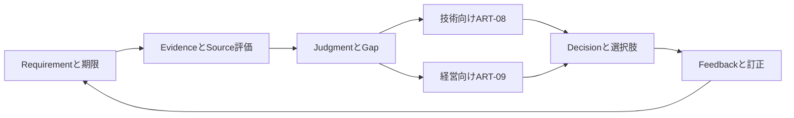

# 第26章 CTIを構造化し、技術・経営へ配布する

## この章の位置付け

同じ三件の報告を技術者へ渡したときは「どの観測で確かめるか」が問われ、経営層へ渡したときは「何を選び、何を引き受けるか」が問われます。報告数やIOCの量を増やしても、この問いに答えなければ判断を支える成果物にはなりません。

本章では[第25章](25-structured-analysis-attribution.md)の限定的な判断を、[CTI Report（ART-08）](../templates/cti-report.md)と[Executive Brief（ART-09）](../templates/executive-brief.md)へ変換します。根拠は共通にし、用途と説明の粒度を変えます。短いBriefにする際も、確信度、代替説明、Gap、許容表現、期限は削りません。

### OWN / BRIDGE / DELEGATE

- **OWN:** Productの判断目的、Key Judgment、読者、推奨、業務上の含意、配布、訂正、Feedbackと再評価を記録する。
- **BRIDGE:** 第23章の要求、第24章の来歴、第25章の分析判断と、第16〜22章の検知・Hunt・IR・改善成果物を、受領条件と非継承を明示して接続する。
- **DELEGATE:** Threat feed製品操作、Platform管理、仕様の逐条実装、実在Actor・国家への帰属調査は行わない。一般IRの運用手順は[既存のインシデント対応書](https://itdojp.github.io/incident-response-basics-book/)へ委譲し、Productへ戻る際は判断要求と必要Evidenceを記録する。

## 学習目標

- CTIオブジェクトを関係付けられる。
- 対象読者別に配布物を作れる。
- CTI Reportを作成できる。

## 前提知識

[第23章](23-intelligence-requirements.md)のRequirementと回答条件、[第24章](24-osint-provenance-sources.md)のSource・Item・Claimの分離、第25章の確信度・代替仮説・帰属の上限を前提とします。STIX/TAXIIサーバーや外部アカウントは不要です。

## 導入ケース：短くしても判断の境界を失わない

親`CASE-2026-025`は、合成資料が技術クラスタと整合する一方、CampaignやOperatorの断定を支持しないと判断しました。三つの外部報告には同じ原典があり、IdPの保持範囲外と詳細Telemetry欠落も残っています。親の限定Block・注意喚起の案を、実施済みの通知や実行許可へ読み替えてはいけません。

子Record `CDP-2026-026-001`は同じCaseを`refines`します。新しい実観測は追加せず、親の`IR-2026-025`、`DR-2026-025`、`AJ-2026-025`、`DEC-2026-025`を配布面から詳細化します。親のDecisionを別案で上書きしません。第23・24章の独立Caseは方法参照だけで、そこで未配達だった資料を受領済みにはしません。

もう一つの`CASE-STIX26-DEMO`は、型と関係を学ぶ**独立した完全合成の構造例**です。この例のActorやCampaignを、親CaseのEvidence・帰属判断に採用しません。型を用意できることと、その型へ主張を置く根拠があることは別です。

## 全体像

図`F-26-01`の入力はRequirement、期限と供給Evidenceです。出力は読者別Productと、未配達を含むDecision / Feedback / Reassessmentの記録です。矢印は自動承認や実操作を意味しません。



文章で追う場合は、要求から根拠と判断へ進み、二つのProductへ同じ判断を渡し、選択・Feedback・訂正を次の要求へ戻します。受領の証跡がない矢印は、成果物上も未配達のままです。

## 26.1 Productは形式ではなく判断目的から決める

本書ではTactical / Operational / Strategicを固定の組織階層や優劣ではなく、支援する判断の粒度として使います。一つのCTI Reportが複数用途を支えても構いませんが、用途別の読者と必要な判断を明記します。

| 用途 | 主な問い | 必要な説明 | 避ける取り違え |
|---|---|---|---|
| Tactical | 何を観測し、何と比較するか | 対象、観測条件、Coverage、誤検知、検証の停止条件 | IOC一致を検知有効性の証明にする |
| Operational | 何を先に確認し、誰へ引き継ぐか | 期間、仮説、Gap、担当、依存関係 | 関連した挙動を同一Campaignへ即断する |
| Strategic | どの選択肢と残余リスクを引き受けるか | 業務影響、費用、中断、可逆性、期限 | 長いIOC一覧を経営判断の代用にする |

`PRD-CTI26-TECH`は技術・運用、`PRD-CTI26-EXEC`は経営判断を支えます。いずれも同じ三つのKJを参照します。資料の短縮は、根拠や不確実性の削除ではなく、読者が辿る順序の設計です。

## 26.2 Fact・Judgment・Recommendation・Implicationを分ける

Sourceの品質、分析の不確実性、仮定、代替説明を示すという `SRC-ICD203-001` の考え方を、民間CTIの記録設計へ限定して参照します。米国ICの規範を、民間の収集権限や普遍的な法的義務へ転用しません。

| 欄 | 本Caseでの役割 | 誤った書き方 |
|---|---|---|
| Fact / Evidence | 供給資料の範囲で何が記録されているか | 新しい実観測を行ったように書く |
| Key Judgment | 何をどの確信度で言えるか | 推奨操作を事実の欄へ入れる |
| Recommendation | 目的・制約に対する案 | 案が承認済み、実行済みだとみなす |
| Implication | 判断が業務へ意味すること | 最大影響を観測済み被害額とする |

三KJの中心は、L2技術クラスタの表現上限、成功可否の未確定、三報告が一原典群であることです。例えばKJ2の`低`は、成功の確率や業務影響の小ささではありません。詳細Telemetryと期間前半が欠け、成功に関する判断の根拠が限定されていることを示します。

Confidenceだけを転記せず、Evidence / Source / Gap / Alternative / Invalidationを一組にします。同じ原典の再掲は新しい独立観測ではありません。本文の`independentOrigins`は著者が供給した原典群の数で、実世界の独立性や確信度を自動採点するものではありません。

## 26.3 EntityとRelationshipにも主張の強さがある

Actorは行為主体、Campaignは一定の活動のまとまり、Malwareは悪意あるコードの概念、Infrastructureは活動に関係する資源、Attack Patternは挙動を表すための型です。型の定義を知っても、個別事象をその型へ割り当てる根拠は別に必要です。`SRC-STIX-001`

`SRC-ATTACK-001` の挙動語彙は、検知・Huntとの対応付けを話し合う共通語として使います。現在のRegistryは19.2で、親25の歴史的な19.1記述はそのまま保持します。対応付けだけではCoverage、Controlの有効性、同一Actor、国家の関与を証明しません。本章の独立STIX例は実在ATT&CK objectの新規監査や写しではありません。

**悪い例:** 型があるので、親の技術クラスタをCampaignにし、`attributed-to`でActorへ結ぶ。

**良い例:** 親Caseの帰属はL2で止める。別の構造教材にある合成Campaign / Actorの関係は、その教材の設定であって親Evidenceにはしない。後から混入させた場合は、配布を止めて出自を確認する。

## 26.4 STIXは構造化の言語で、分析の正しさではない

本章は `SRC-STIX-001` のSTIX 2.1 OASIS Standard（2021-06-10）を基準にします。最新版リンクはErrataのDraft段階も指すため、固定OSと同じ版だと推定しません。確認範囲は[Source再監査](../references/ch26-source-review-2026-09-28.md)に残します。

- SDOは分析上の概念、SCOは観測対象の性質、SROは関係やSightingを表すための構成要素です。
- Observableの表現、観測されたという記録、検出用のIndicatorは同じものではありません。Patternがあることは検出が成功した証拠ではありません。
- BundleはObjectを束ねる入れ物で、分析報告の承認、意味上の一貫性、信頼、機密区分を自動的に保証しません。

[独立Bundle](../cases/fixtures/ch26-stix-bundle.json)には八つのObjectと五つのRelationshipがあります。`domain-name`の予約済み値からObserved Dataと単一等価Patternを作り、架空のCampaign・Actor・Malware等の関係を示します。コードや稼働するサービスは含みません。型の例を親Caseの根拠へ結合しないことが本教材の重要な検査対象です。

本章のprofileは固定13Objectの型、必須欄、参照、UUID、時刻、単一Patternだけを検査します。一般STIXのすべての拡張やPatternを受け入れるvalidatorではありません。未対応のPropertyや型は拒否し、必要なら契約を別途レビューします。任意のSTIXをこの検査へ投入して準拠認証に使わないでください。

### 版と確信度の境界

ObjectのIDと`modified`を使うSTIX側の版管理と、読者へ出すProductの訂正・差替えは別に記録します。旧Productを訂正したからといって、関係するObjectが自動的に`revoked`になるわけではありません。Productの期限切れとIndicatorの有効期間も別の欄です。

STIXの数値Confidenceと、本書のEvidence条件で説明する`高・中・低`を暗黙に相互変換しません。この例はSTIX数値Confidenceを付けず、Product側に確信度と根拠を保持します。共通の変換規則を用いる場合でも、その尺度の適用条件を別途確認する必要があります。`SRC-STIX-001`

## 26.5 TAXIIは交換手段で、Trustや権限の代替ではない

`SRC-TAXII-001` のTAXII 2.1では、DiscoveryからAPI Rootを知り、CollectionのObjectを扱います。ManifestはObjectの版などの一覧、Statusは追加要求の処理状況を扱う資源です。Content negotiationで交換する版を明示します。Channelsのキーワードは予約されていますが、2.1はChannelサービスを定義していません。

本演習では[静的なrequest / response例](../cases/fixtures/ch26-taxii-exchange.json)だけを読みます。予約済みの`taxii.example` は接続先として使用せず、通信プログラムも用意しません。例のHTTP 200や`can_read=true`は著者の供給値であり、実サーバーの応答や読者の利用許可ではありません。

Objectsのenvelopeに入るのは例のObject群で、Bundleそのものを一つのObjectとして包み直しません。envelopeと独立Bundleの内容が一致しても、それはデータの対応だけです。真正性、出典の独立性、分析品質、受領確認、操作許可の証明にはなりません。

## 26.6 技術者向けReportと経営向けBrief

ART-08では、KJからEvidence / Source / Gapへ降り、Recommendationを検知・Hunt・IRの**紙上検討**へ接続します。第16〜22章のArtifactは方法参照であり、過去のPassedや受領証跡をこのCaseへ自動転記しません。必要Telemetry、観測範囲、誤検知、停止条件が未確認なら、その不足もHandoffへ記録します。

ART-09では三KJを先に示し、Decision、選択肢、費用、中断、残余リスク、可逆性へ進みます。本Templateは重要判断を最大五件とする著者設計です。五件を超えるなら、優先順位と別紙の必要性を再検討します。短縮してもEvidenceへの参照を切りません。

本Caseは親の限定案を表現するA、根拠なく範囲を広げるB、説明自体を保留するCを比較し、Aだけを親Decisionの表現として選びます。Aも実行承認ではありません。最大の懸念は、成功可否が未確定のまま不要な断定や誤通知へ進むことです。実被害額・実費用の見積りを捏造せず、数値がない箇所は理由を記録します。

## 26.7 配布境界、期限、受領を分ける

`SRC-TLP-001` のTLP 2.0は共有相手の境界を示します。RED / AMBER / GREEN / CLEARと、組織内に限定するAMBER+STRICTを区別し、受領元の指定より広げる場合は明示の許可を得ます。これは機密分類、ライセンス、暗号化、保持、技術的な操作許可の代替ではありません。

本CaseのTLP:CLEARは公開合成教材についての指定です。商用利用を含むライセンス条件や、Action permission=falseは別に保持します。実資料へ同じラベルを無断で付け直すことはできません。STIXの古いTLP定義へ新しいラベルをそのまま挿入する実装も、このprofileでは扱いません。

| 時点・状態 | 確認すること |
|---|---|
| Cutoff | どこまでの資料に基づく判断か |
| Prepared / As-of | いつの教材状態を示すか |
| Decision deadline | 読者がいつまでに選ぶ必要があるか |
| Expiry / Reassessment | いつ配布対象から外し、どの条件で見直すか |
| Delivered / Receipt | 実際に届いたかを示す別の証跡があるか |

二Productは`prepared-not-delivered`、Feedbackは`planned-not-received`です。第29章へのHandoffも`planned-not-delivered`でReceiptはnullです。良い成果物とは、すべてを配達済みにした表ではなく、未実施を隠さず担当・期限・次の確認へ結んだ表です。

## 26.8 Feedback、訂正、差替え

受信者への質問をProduct IDへ結び、回答がないうちは理解されたと仮定しません。回答が届いた場合も、使い勝手の評価と、新しいEvidenceによる判断変更を分けます。

誤ったSource参照が判明したら、旧版を配布対象から外し、影響するKJ、訂正理由、対象読者、再通知の状態を記録します。差替え先IDが未発行ならnullのままです。訂正によってGapが閉じたと自動的に扱わず、再評価の入力を明記します。状態の変更が必要なときは、旧記録を無言で消さず新しい版をレビューします。

## 安全な演習：二つの読者へ同じ根拠を渡す

**目的:** ART-08 / ART-09の追跡性と、独立した構造例の非混入を確認する。

**前提・Authority / Scope:** Linux / WSL2のPython 3環境で、自己所有の作業領域にある供給JSONと文書だけを読みます。Caseは完全合成、readOnly=true、executionAuthorized=falseです。外部Feed、TAXII、実AI API、実在人物や第三者Systemは使用しない。

1. [完全記入例](../cases/ch26-cti-distribution-example.md)から、三KJのEvidence / Gap / Alternativeを辿る。
2. 同じ三KJを技術向けと経営向けの順序で読み、RecommendationとImplicationが混ざっていないか確認する。
3. 独立BundleのCampaign / Actorを親のEvidenceへ結ぼうとした場合、出自と帰属上限に反する理由を説明する。
4. 本文の期限・未配達・Feedback未受領を確認し、下の有限検査を実行する。

**期待するEvidence:** 固定三JSON、閉Schema、五公開文書の対応と、直接の危険変更・型/参照/期限の矛盾を拒否した検査結果です。実収集や実サーバーの応答証跡ではありません。

**影響:** 供給資料を読み、結果を標準出力へ表示します。データの更新・外部通信・Block・通知は行いません。

**停止条件:** 実Data混入、対象外の型やProperty、親Caseへの不当なEvidence混入、未知のSource版、外部接続が必要になった場合は停止します。

**Cleanup:** 自分で作成した演習Copyと出力だけを整理します。供給正本や親Caseを削除・上書きしません。TAXIIや稼働サービスは開始しないので停止すべき外部サービスもありません。

```bash
npm run check:chapter26
```

## 作成する成果物

- ART-08 CTI Report: Requirement、読者、Cutoff、KJ、Evidence / Source / Gap / Alternative、Recommendation、Implication、配布・訂正欄。
- ART-09 Executive Brief: 同じ三KJ、Decision、Owner、期限、三Option、残余リスク・可逆性、Feedback / Reassessment。
- 独立構造例: STIX Bundleと静的TAXII envelope。ProductのEvidenceではないことを維持する。

## 評価基準

| 観点 | 合格条件 | 不合格例 |
|---|---|---|
| 追跡性 | RequirementからKJ、Evidence、Product、Decisionへ辿れる | 同じIDなのに読者ごとに確信度が違う |
| 分析 | Gapと代替説明、L2上限を両Productに残す | IOC一致からActorを断定する |
| 読者適合 | 技術向けの検討と経営の選択肢を分ける | IOC一覧だけをExecutive Briefにする |
| 交換 | 独立例の型・参照・時刻を確認し、限界を説明する | JSONが通れば分析も正しいとする |
| 配布 | 期限、共有境界、未配達と未受領を記録する | TLPやcan_readを実操作許可とする |
| 再評価 | 訂正理由、影響KJ、次の確認を残す | 旧版を消して差替え済みとだけ書く |

## よくある誤解

**「STIXにしたのでCTIである」:** 交換形式だけではRequirementへの回答、根拠、意思決定への有用性を示せません。

**「経営向けには不確実性を削る」:** 不確実性は選択肢と残余リスクの入力です。短く説明し、根拠へ戻れるようにします。

**「安全な合成Domainなら接続してよい」:** 本演習は読取りだけです。予約済み表記は接続許可ではありません。

**「訂正すれば配布先も更新される」:** 訂正版の作成、配送、受領、理解は別の事実です。Receiptがなければ未配達を維持します。

## 章のまとめ

CTI Productは、根拠と不確実性を保ったまま、判断に必要な順序へ情報を組み替える成果物です。STIX/TAXIIは構造と交換を支えますが、分析の正しさ、実権限、配達の証明を代行しません。二Audienceへ同じKJを渡し、選択肢、期限、Feedback、訂正までを追跡できる形にします。

## 次に学ぶこと

第27章ではAI・LLM・Agentの安全境界を学びます。第28章のAI支援分析へ進んでも、モデル出力を新しいSourceへ昇格させず、本章のEvidenceと判断の分離を維持します。第29章へのProduct Handoffは、受領確認が得られるまで未配達です。

## 参考文献・Source Note ID

- `SRC-STIX-001`: STIX 2.1固定OS。型、参照、版と有限交換profile。
- `SRC-TAXII-001`: TAXII 2.1固定OS。Collection、envelopeと交換の限界。
- `SRC-ATTACK-001`: 版付きの挙動語彙。Coverage・帰属の証明ではない。
- `SRC-ICD203-001`: Source品質、不確実性、仮定・判断・代替説明の分離。
- `SRC-TLP-001`: TLP 2.0の共有境界。ライセンスや操作許可とは別。
