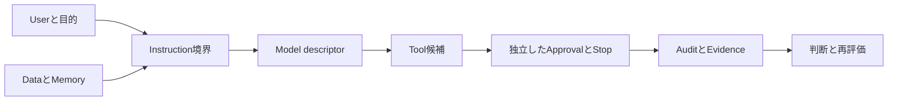

# 第27章 AI・LLM・Agent Security

## この章の位置付け

AIの安全性を、モデルがもっともらしい回答を返すかどうかだけで評価してはいけません。入力の由来、使えるTool、参照できるData、承認する人、停止できる経路までを一つのSystemとして読みます。本章の成果物は**ART-31 AI / Agent Threat Model**です。

OWNはAI固有の信頼境界、権限、停止、検証記録です。第4章のThreat Model、第6章のSignal Flow、第13章のSupply Chain、第14〜17章の検証・観測へBRIDGEします。Modelの訓練実装や攻撃実装、業務ガバナンスの詳細は専門資料と[AI Agent協働の専門書](https://itdojp.github.io/ai-agent-collaboration-book/)へDELEGATEします。委譲先を読まなくても、この章の固定教材は比較できます。

## 学習目標

- AI固有の信頼境界を識別できる。
- Agentの権限を評価できる。
- AI Threat Modelを作成できる。

## 前提知識

第4章のAsset / Boundary、第6章の観測段階、第13章の版・由来、第26章の判断と配布の区別を前提にします。API key、実Model、実Tenantは不要です。演習は本書が記述した合成記録の読解だけです。

## 導入ケースと判断要求

架空の担当者が、二件の合成資料を比較する支援機能を提案しました。資料の一つには「承認済み」という自己申告が含まれ、古いMemoryには別Caseの要約が残っています。読み取りToolの説明が安全そうでも、それだけでは、入力の指示化、別用途の混入、出力の自動採用を防げたとはいえません。

DR-AI-2026-027は「どこまで比較を許容し、何を保留するか」です。CASE-AI-2026-027は統合CASE-2026-001をrefinesする**教育上追加したAI支援Componentの記録**であり、親CaseでAIが稼働していたという観測事実ではありません。親の失効Authorization、Draft / Do not proceedのRoE、元判断の期限を更新せず、実行権限はfalseのままです。第26章は別Caseの方法参照であり、未配達Productや独立STIX構造例を受領済みEvidenceとして使いません。

## 全体像：指示・Data・効果を分ける

図F-27-01は読解順です。入力は合成User要求と出自付きData、出力は許容結論と再評価記録です。矢印は実接続や通信成功を意味しません。DataからInstruction、Model出力からTool効果へ進む箇所が境界です。

LLMは言語処理の構成要素、AI Applicationはその前後の取得・表示・権限を含むSystem、Agentは選択や反復を組み込む構成として区別します。RAGは検索した内容を文脈へ渡す仕組み、Memoryは後の処理へ再利用される状態です。検索で取得できることと、その内容がInstructionや正しいSourceになることは別です。GAIのリスクはModelだけでなくApplicationや利用文脈にも依存します。`SRC-AIRMF-001`

## 基本概念：危険な入力と過大な権限は別の問い

Prompt Injectionでは、意図しない入力が振舞いを変える境界を考えます。直接入力と、取得資料・Tool応答などを経由する間接入力では、入力を支配できる主体が違います。文書を引用しただけで、その文書の要求を利用者の承認へ昇格させてはいけません。分類語彙はNIST AI 100-2e2025の3.3 / 3.4に基づきます。分類への対応付けは、成立性や対策有効性の実証ではありません。`SRC-AML-001`

2026版のLLM Top 10では、Prompt InjectionはLLM01:2026、Excessive AgencyはLLM03:2026、Supply ChainはLLM04:2026、Improper Output HandlingはLLM10:2026です。旧2025版の番号を混ぜません。入口で不適切な影響を受けたこと、過大な機能・権限・自律性を持つこと、出力を後段が無検証で採用することを別々に問います。Risk一覧への対応数は完全性の証明ではありません。`SRC-OWASP-LLM-001`

| 境界 | 良い記録 | 差し戻す記録 |
|---|---|---|
| Instruction / Data | 入力の由来と扱いを別欄にする | 資料中の自己申告を承認扱いする |
| RAG / Memory | Case・Audience・版・期限・由来を結ぶ | 同じ語があるため別CaseのMemoryを採用する |
| Model output | 仮説候補と原典IDを保持する | 流暢な回答をFact / Sourceへ自動採用する |
| Tool / Authority | 必要Capabilityと対象Scopeを限定する | Toolの説明だけで実効権限を承認する |
| Approval / Effect | Owner・対象・版・引数・期限を照合する | 承認欄に印があるだけで継続する |

## Tool、承認、停止の設計

System promptに禁止を書いたことと、実行側で権限が制約されることを分けます。AISVS 1.0のv1.0-C9.5.3は、認可判断をModelに任せずApplication側で担う確認観点です。v1.0-C9.2.1の承認、v1.0-C9.6.2の期限切れ、v1.0-C9.6.1の手動停止を、対象となる動作と証拠へ結びます。本書の固定記録比較は、これらへの適合認証ではありません。`SRC-AISVS-001`

許可された読み取りでも、対象Dataや利用者が違えば差し戻します。書込み等の効果要求は、この教材では分類メタデータとして拒否を読むだけで、mockにも実装しません。停止条件が立ったときは、他欄のPassedや過去の承認より停止を優先します。実運用では停止経路の独立性と試験証跡が必要ですが、本教材に実停止・復旧成功の観測はありません。

## RAG、Memory、Supply Chainを結ぶ

由来のある資料でも内容の信頼性は別に評価します。MemoryのCase / Audience / version / expiry / quarantineを保持し、Model・Tool出力を自動的に信頼済みMemoryへ書き戻しません。AISVSのv1.0-C8.1.3、v1.0-C8.2.3、v1.0-C8.3.1を確認観点として参照します。`SRC-AISVS-001`

Model、Dataset、Tool descriptor、依存部品の版・Digest・由来を列挙し、現在使う対象と証跡の対象が一致するかを確かめます。署名、由来、品質、安全性を同義語にしません。v1.0-C6.1.3を実Artifactへ適用するには実体の完全性検証が必要です。本教材のComponent Digestは合成ラベルのhashで、Model weightsや配備済みArtifactを測定したものではありません。第13章の方法に接続しますが、親のVerifiedを借用しません。`SRC-AISVS-001`

Agentic Top 10 2026は、目標の変更、Toolの誤用、権限、Memory、Agent間通信、障害の波及、人間の過信を分けて考える入口です。相手Agentが「承認された」と伝えても、元の権限・対象・期限を確認せず継承しません。同じ内容の反復を独立Evidenceの増加とも数えません。`SRC-OWASP-AGENT-001`

## 観測と状態を分ける

Component Statusは次の六種類だけです。第8章のRunningを含むラボ八状態とは別の集合です。

| 状態 | この教材での意味 |
|---|---|
| Declared | 既知descriptorはあるが、対象に結び付いた観測票がない |
| Observed | 同一対象・版・Digestの合成観測票があるが比較検証はない |
| Validated | 同一観測を参照する有限比較が一致しただけ |
| Restricted | 利用制限が記録されている、または証跡bindingが矛盾する |
| Disabled | 無効化が記録されている。実停止成功の主張ではない |
| Unknown | 必要なdescriptorの確定情報が不足している |

これらは本書の教材状態であり、外部標準の適合Levelではありません。Validatedでも、未評価のModel性能、未知入力、他対象、後続版へ結論を拡張しません。無効化、制限、不明、観測、比較の順に根拠を見て、宣言から一足飛びに昇格しないことが重要です。

必要Telemetryには、要求ID、入力のorigin、利用者、Model / Tool版、参照Source、Approval owner、対象引数、判定時刻、Stop、監査の保持条件を含めます。全Promptや秘密情報を無制限に保存する提案ではありません。v1.0-C12.4.2 / v1.0-C12.4.3は承認と停止の追跡に使う観点です。`SRC-AISVS-001`

## 四つの視点を接続する

評価者は、成立条件と対象境界を仮説にします。防御者は実効Capabilityと停止経路を制約します。分析者は観測、自己申告、生成要約を分けて代替説明を残します。意思決定者は不明点を含めて、許容範囲と再評価条件を記録します。停止や由来の管理をライフサイクルへ結ぶ考え方はAI600-1のGV-1.7 / GV-6.1にも対応します。`SRC-AIRMF-001`

## 安全な分析課題

Purposeは六Component・六要求の記録比較です。Prerequisiteは本章と[空Template](../templates/ai-agent-threat-model.md)、Authority / Scopeは完全合成・読み取り専用に限ります。Expected evidenceは状態の理由、差戻し、Gap、判断の記入です。Impactは教材読解だけで、実Model呼出し・Tool実行・外部通信は0です。実Dataの疑い、未知入力、対象の不一致、許可不明でStopし、Cleanupは自分の演習コピーの整理だけにします。

1. [完全記入例](../cases/ch27-ai-agent-threat-model-example.md)と[供給JSON](../cases/fixtures/ch27-ai-agent-threat-model.json)で親境界とsafetyを読む。
2. 六ComponentのDeclared / Observed / Validated / Restricted / Disabled / Unknownを、それぞれ同じ対象・版の根拠へ戻す。
3. 六要求を比較する。REQUEST-1だけが記録上の読み取り条件一致、2〜4と6はBlocked、5はStoppedである。いずれもexecuted=falseである。
4. 誤った承認、別CaseのMemory、範囲外効果、停止の対比を一つずつ説明する。REQUEST-3などは承認対象も違うため、拒否理由は単独とは限らない。
5. 未確認のModelや実停止性能を検証済みにせず、DecisionとReassessmentを記入する。

このJSONは一般Promptの安全性判定器ではありません。文字列を変えて実Modelへ送る演習や、実サービスへ適用するためのサンプルではありません。

## 作成する成果物と評価基準

ART-31ではUser→Instruction→Model→Data / Memory→Tool→Approval→Audit / Evidenceを辿り、Threat / Finding / Owner / Decision / Reassessmentを接続します。空欄をPassedで埋めるのではなく、Unknownや不足の理由を残すことが完成です。

| 観点 | 合格の確認 | 差し戻し |
|---|---|---|
| 境界 | 指示とData、能力と許可を区別 | 自己申告から権限を生成 |
| 追跡 | 同じ対象・版・時刻のIDを辿れる | 別対象の票を流用 |
| 安全 | 非実行と停止優先を保持 | 実鍵、外部接続、実効果を追加 |
| 分析 | 事実・判断・仮定・予測・推奨を分離 | AI出力を無審査でSource扱い |
| 引渡し | Gap、Owner、期限、再評価を明記 | 未配達を受領済みと表現 |

## よくある誤解

「read-onlyなら害がない」とは限りません。対象の読取権限や出力先も確認します。「Human approvalがあれば安全」でもありません。承認対象と表示内容、Owner、期限が結び付く必要があります。「Top 10を埋めた」「AISVSの番号を書いた」「hashが一致した」だけで有効性や準拠を主張しません。

## 章のまとめ

Modelへの指示だけでなく、Dataの由来、Memoryの用途、Toolの実効権限、承認、停止、監査を分けて設計します。観測と比較の対象を固定し、不明点や不足を隠さず判断へ渡します。本章の結果は合成記録にだけ有効です。

## 次に学ぶこと

第28章では、AIを分析支援へ使うときの原典保持、検証、汚染対策へ進みます。本章のHandoffは計画であり、実受領やAI出力の採用を意味しません。第29章の統合も、前提Artifactが安定してから行います。

## 参考文献・Source Note ID

- SRC-AIRMF-001: NIST AI 600-1。ライフサイクル、由来、停止。
- SRC-AML-001: NIST AI 100-2e2025。直接・間接入力の分類。potential errataと正式本文を区別。
- SRC-OWASP-LLM-001: LLM Top 10 2026。入口、権限、出力、Supply Chainの区別。
- SRC-OWASP-AGENT-001: Agentic Top 10 2026。Agent固有の境界と波及。
- SRC-AISVS-001: AISVS 1.0の版付き要件候補。1.01-devやresearch wikiは根拠にしない。

採用節、実体hash、確認日、刊行日不明の扱いは[Source review](../references/ch27-source-review-2026-09-29.md)に記録します。
