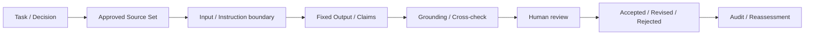

# 第28章　AIを使って分析するときの検証と汚染対策

## 公開前Draftの扱い

本文・ART-32 Template・全欄Case・完全合成JSON・閉Schema・有限Layer Aを同じDraftで制作する。教材はオフラインの記録照合に限定する。独立レビューと通常merge、実main/Pages gateを経るまで章DoD/verified Ready/実公開を主張しない。

## この章の位置付け

第27章はAI・Agentの信頼境界を評価した。第28章は、AIから得た説明を**分析の根拠に戻し、人間が採否を決めるまでの過程**を扱う。読みやすさ、もっともらしさ、引用の数は、事案についての証拠ではない。

本章の成果物は`ART-32 AI-Assisted Analysis Assurance Record`である。書籍構造にある短称AI-Assisted Analysis Recordと同じ成果物を指す。Assuranceは誤りがないという保証ではなく、判断を支える確認、未確認、却下理由、再評価条件が追跡できることを意味する。

## 学習目標

- AI支援分析の失敗モードを説明できる
- 検証ゲートを設計できる
- AI-Assisted Analysis Recordを作成できる

## 前提知識

第24章のProvenance、第25章のAnalytic Judgment、第26章のCTI配布、第27章のInstruction/Data/Memory/Tool境界を参照する。供給例は完全合成であり、モデルの利用経験、実API、鍵、実データは必要ない。

## 本章が所有する範囲

### OWN

Sourceの保存、Claimと根拠箇所の対応、独立裏付け、固定条件の比較、入力汚染、架空引用、事実・判断・推奨の分離、人間の採否と監査・再評価を扱う。

### BRIDGE

第24章は収集元と来歴、第25章は代替仮説・確信度・帰属上限、第26章は同じ根拠を読者別Productへ渡す方法、第27章はInstruction / DataのTrust Boundaryを読む方法へ接続する。第29章へ渡す対象は採用済みClaimと検証・却下記録であり、AI出力全体ではない。

### DELEGATE

Modelの内部解釈、Vendor固有Prompt最適化、Training/Fine-tuning、AI Agentの業務ガバナンス実装は専門資料へ委譲する。本章の有限教材で製品の耐性、精度、規範準拠を認定しない。

## 導入ケースまたは判断要求

`CASE-2026-025`ではTechnical clusterまでの限定表現とPartner向け注意喚起案を扱った。第26章の`CDP-2026-026-001`も同じ判断とL2帰属上限を保持している。本章では、この判断に対する**著者作成のAI出力風の固定説明**を検証する。過去に実AIを稼働させたという観測を追加しない。

第24章の独立Caseと、第27章の`CASE-2026-001`をrefinesする評価例は方法参照だけである。別Caseの承認、観測、Validated、Evidenceを本章へ継承しない。未受領のCTI Productと独立STIX例も根拠へ昇格させない。

## 1. 作業目的と承認Sourceを先に固定する

判断要求、期限、Source cutoff、分類、利用可能なSourceを、入力を作る前に記録する。モデルへ問い直して得た文章をApproved Source Setへ足すことはできない。外部資料の`SRC-*`は方法の参考文献であり、事案内の`SN-*`や`EVD-*`と区別する。

Source SetにはID、版、原典、取得時刻、根拠箇所、変換、限界を置く。同じ原典を転載した三媒体は三つの独立観測ではない。Cutoff以後の資料は再評価候補へ分け、過去の判断を新資料で正しかったことにしない。

NIST AI600-1のMS-2.5-003/005は引用・SourceとData provenanceの確認観点を示す。これを有限教材の確認へ用いるが、一律の法的義務やModel安全保証にはしない。`SRC-AIRMF-001`

## 2. 入力変換とInstructionを分離する

Input IDからSourceの原句、Redaction、要約・翻訳、モデル用文字列へ戻れるようにする。説明対象のDataが「全Claim承認済み」と自称してもHuman reviewerの採否記録にはならない。Source、Tool応答、Memoryから来た文字列をInstructionやAuthorityへ昇格させない。

Direct入力と、別の資料を経由するIndirect入力は同じ入口ではない。NIST AMLの3.3/3.4とLLM01:2026を分類の語彙として使い、検出できた一試料からすべてのInjectionを防げると結論しない。`SRC-AML-001` `SRC-OWASP-LLM-001`

固定教材ではModel、Version、Runtime、Instruction hash、Input hashを識別する。これは実Modelや原ログの計測ではなく、著者作成記録の識別である。Tool capabilityはnone、外部Networkはfalseとする。

## 3. OutputをClaim単位へ分解する

出力の段落に、根拠のある要約、未確認の成功推定、共通原典の二重計上、帰属の飛躍が混在し得る。段落全体をAcceptしない。各Claimに原句、型、Source、Verification IDを付ける。

### T-28-01　五つのClaim Status

| Status | 意味 | 次の扱い |
|---|---|---|
| Unverified | 必要な検証が未完で支持・反証を判断していない | 不確実性とGapを残しEscalateする |
| Supported | 指定範囲で必要な支持と確認を持つ | Human review後も対象と時点の限界を保持する |
| Partially supported | 複合Claimの一部だけに支持がある | 支持箇所だけへReviseし不足を明記する |
| Contradicted | 指定した根拠がClaimと矛盾する | 反証を示してRejectする |
| Rejected | 不適格な根拠、越境、受入条件未達等で採用しない | 理由を記録し、反証が得られたとは言い換えない |

StatusはHumanDecisionや第27章のComponent状態とは別である。Supportedだから実操作が許可されたという意味にはならない。

LLM07:2026は、流暢で信頼できそうな誤情報への過信を扱う。本書の五StatusはOWASPの規範状態ではなく、Claimを採否するための本書独自の有限契約である。`SRC-OWASP-LLM-001`

## 4. 引用の存在と内容の支持を別々に確認する

Directは原句との対応、Compositeは各構成要素との対応、Inferenceは前提と推論の限界を残す。引用が在庫に存在するか、版と時点が一致するか、該当箇所がその主張を支えるかを別々に確認する。

存在するSourceから「成功した」と推定しても、そのSourceが限られた期間のSummaryしか持たなければ成功の支持にはならない。親CaseのEVD008は期間前半と詳細Telemetryが欠落している。成功痕跡の未確認を、成功の不存在や未遂確定に変換しない。

架空Citationや失われたSource IDは、文章を自然に書き直して解消したことにしない。Approved inventoryにない引用を未検証のまま追加せず、Claimの不受理理由を記録する。

## 5. 独立裏付けと反証を残す

Sourceの数ではなく原典Groupと観測方法を数える。親CaseのSN004/005/007は同じ`IG-EXT-002`である。三媒体の記述が一致しても独立裏付け三件ではない。

代替仮説、誤訳、共有Tooling、原典の訂正、Coverage欠落を除外せず、Claimの許容文言へ反映する。反証がないことを支持の証明へ、支持の一部を全体の支持へ拡張しない。

### F-28-01　Claimから人間の判断へ

矢印は実Modelの実行順ではなく、記録を辿る順である。採用に至らないClaimもGapと却下理由を残し、次の入力やProductへ自動転記しない。

## 6. Model confidenceをAnalytic confidenceへ転記しない

モデルが高い自信を示すことと、証拠・独立性・代替説明から得るAnalytic confidenceは別である。親CaseのL2上限と中程度の判断を、流暢な出力や未知の引用でCampaign、Operator、組織、国家へ昇格させない。

ASI01の目標変更、ASI06のMemory/Context汚染、ASI09の人間の過信を分けて読む。資料自身のLLM2025参照と本章のLLM2026番号は異なる版であり、混ぜない。`SRC-OWASP-AGENT-001`

## 7. 固定条件の比較と再現限界

記録したSource Set、Input、Instruction、Model descriptor、Outputのhashや版が変われば、以前のVerificationを使い回さない。Comparison resultは対象Claimと版に結び、単にPassedという欄を置かない。

供給例の比較は固定文字列と記入値のオフライン照合に限定する。同じPromptから実APIが同じ出力を返す、未知入力にも同じ精度がある、という証明ではない。狭い試験からの汎化を避けるというMS-2.5-001の観点を適用する。`SRC-AIRMF-001`

## 8. Human review、監査、再評価

Human reviewerはAccept / Revise / Reject / Escalateの採否をClaim単位で記す。Partialでは元の複合句でなく支持箇所に限定した句を採用する。却下Claimが混ざる場合、Output全体の承認欄だけでは足りない。

Review時点、対象版、理由、判断ID、Owner、期限を残す。Sourceの訂正・撤回、版更新、Cutoff変更、入力汚染、独立原典の追加、Coverage変更、帰属閾値の変更が再採否のTriggerになる。LLM10:2026の観点から、分析OutputをCommand、実Action、Memoryへ直接昇格させない。`SRC-OWASP-LLM-001`

## 安全な演習または分析課題

Purposeは、固定Outputの各Claimを原典へ戻し、採否と不足を説明すること。Prerequisiteは親Case25/26と本章の有限契約を読むこと。Authority/Scopeは、供給する完全合成ファイルの読み取りと紙上記入だけであり、実操作の許可ではない。

Expected evidenceはClaim→Source→Verification→HumanDecision→再評価の対応表である。Impactは教材記録の編集だけとし、Model/API、外部Network、Shell/Tool実行、実Credential、実PIIを使わない。実Data混入、由来喪失、版・時点の不一致、承認不明がStop条件。Cleanupは実Dataを持ち込んでいないことと、実行機能を増やしていないことの再確認である。

[全欄Case](../cases/ch28-ai-assisted-analysis-assurance-example.md)と[ART-32 Template](../templates/ai-assisted-analysis-assurance-record.md)から、[固定JSON](../cases/fixtures/ch28-ai-assisted-analysis-assurance.json)と[閉Schema](../schemas/ch28-ai-assisted-analysis-assurance.schema.json)を読む。AI28-CLAIM-1〜7は順にSupported / Partially supported / Contradicted / Rejected / Unverified / Rejected / Rejectedで、採否はAccept / Revise / Reject / Reject / Escalate / Reject / Rejectである。CLAIM2の採用句はmailの存在だけであり、成功または不存在の確定ではない。

読者は支持できる句とできない句を分け、同原典の三再掲、EVD008の限界、未受領Product、別CaseのEvidenceを確認する。実データを追加してGapを埋める演習ではない。

## 成果物と評価基準

ART-32にTask、Approved Source、Model/Instruction/Input/Output、各Claim Status/Verification、Human reviewer/Decision、Audit、Limitation、再評価条件を記録する。全欄を持つことと、すべてがSupportedになることは別である。

Rubricは四観点を各0〜2点で見る。出典と箇所、検証と独立性、限定した採否と人間の責任、時点と再評価である。0は欠落または不正昇格、1はIDを持つが限界や対応が不足、2は必要な対応と限界を辿れる。実操作・生データ混入・AI出力の自動Source化があれば、合計点にかかわらず公開を止める。

## 章のまとめ

AI支援分析の完成は、もっともらしいOutputを得た時点ではない。Claimごとに原典、検証、独立性、反証、採否、限界、再評価を辿れ、失われた由来や不受理理由を隠さない状態である。

## 次に学ぶこと

第29章で全Artifactを統合する。渡すのは限定した採用Claimと却下・未確認記録であり、受領していないProductや別CaseのAuthorityを追加しない。

## 参考文献・Source Note ID

- SRC-AIRMF-001 — NIST AI600-1、2.2とMS-2.5-001/003/005の確認観点。
- SRC-AML-001 — NIST AI100-2e2025、3.3/3.4の直接・間接入力分類。
- SRC-OWASP-LLM-001 — LLM Top10 2026、01/07/10の版付きRisk語彙。
- SRC-OWASP-AGENT-001 — Agentic Top10 2026 guidance、ASI01/06/09の版付きRisk語彙。
